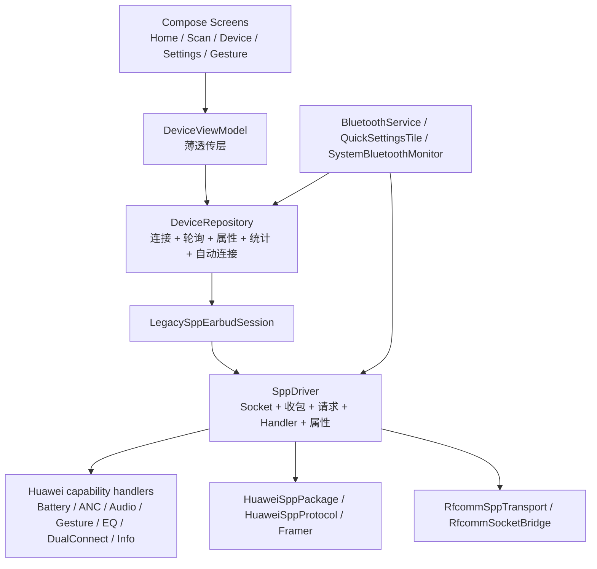

# UI 与蓝牙指令/连接重构规划

> 状态：执行中；BT-0 至 BT-4 已收口，当前重心转为 UI 全量重构（计划已核对，按错误报告继续实现）
>
> 历史基线：v4.2.6 / versionCode 87，2026-08-01
>
> 当前发布基线：v4.3.10 / versionCode 98，2026-08-14（BT 重构后的首个公开大版本；BT-0 至 BT-4 蓝牙阶段已完成；BT-4 定向实机门已通过）
>
> 当前发布版本：v4.6.0 / versionCode 103，2026-08-18（统一标准 Material 3 surface；深色模式壁纸 RGB 亮度缩放到 75%，不叠加黑色滤镜）
>
> 当前开发测试版本：v4.7.0 / versionCode 104，2026-08-22（有效壁纸 + Android 13 使用自研 AGSL 柔光玻璃；无壁纸、壁纸未完成加载和 Android 12 及以下使用优化后的标准 Material 3）
>
> 目标：把当前“能工作但边界偏大”的 UI、蓝牙连接和 SPP 指令实现整理成可持续迭代的结构。蓝牙阶段先稳定现有 HUAWEI / HONOR + RFCOMM SPP 路线；当前转入 UI 基本全量重构，统一视觉、交互、状态和导航，同时保留已经验证可用的美术资源。

> 测试模式日志约定：Debug“自动实机测试”每次启动都会清空旧缓存，测试期间不设日志行数上限，改用约 160,000,000 字节的 UTF-8 缓存预算；导出的最终报告在写文件前再限制为 190,000,000 字节以内，确保小于 200 MB。正常日志策略在报告构建完成后恢复。

> **唯一计划入口**：原 `docs/ARCHITECTURE_TODO.md` 的通用 Transport / Protocol / Capability / Adapter TODO 已合并到本文件；旧路径只保留跳转说明，不再维护第二份清单。

## 0. 执行状态、完成标记与版本基线

### 0.1 完成标记规则

每完成一个阶段，必须在本文件的阶段标题和下表同步更新状态：

```text
[ ] 未开始
[~] 进行中
[x] 已完成
```

阶段只有在代码/文档、自动化测试、实机回归和回退记录都齐备后，才能标记为 `[x] 已完成`。每次标记还要记录：

- 完成日期。
- 对应提交或发布版本。
- 自动化测试结果和实机型号/系统版本。
- 关键日志或耗时结论。
- 回退方式。

当前 **BT-0 至 BT-4 已完成**：`v4.3.10 / 98` 是 BT 重构后的首个公开大版本，主验证设备的蓝牙状态契约门已通过，但结论仍限定在已有型号/固件/系统证据范围内，不外推为所有型号和所有指令均已实机验证。旧第三方渲染路线已撤销；`v4.6.0 / 103` 保留为标准 Material 3 和深色模式壁纸亮度正式基线，`v4.7.0 / 104` 在该基线上加入集中式自研 AGSL 壁纸玻璃测试实现。玻璃只在有效壁纸且 Android 13+ 时启用，低版本和无效壁纸保持 MD3 fallback；UI 仍需通过设备截图/交互和无障碍定向门后再标记完成，不重复蓝牙全量矩阵。

### 0.1.1 定向实机测试规则

实机测试规模跟随本轮代码改动，不再默认启动完整 100 项矩阵：

| 改动类型 | 默认强度 | 适用场景 |
|---|---:|---|
| 日志字段、报告格式、状态判定 | 3 轮 | 核对字段存在、attempt 归属和终态输出 |
| 普通能力读写 | 5 轮 | ANC、低延迟、读回一致性等功能行为 |
| 重连、ACL、并发入口和连接耗时 | 每个相关场景 10 轮 | 需要观察竞态并计算 P50/P95 |
| 跨模块发布验收 | 100 项 | BT 阶段合并、Release 候选或多个模块同时改动 |

上一轮 `4.3.2 / 90` 的定向清单为 **36 项**；`4.3.3 / 91` 先针对 ANC 摘戴竞态进行修复和人工确认，`4.3.4 / 92` 已完成这组复测。报告曾显示 B、D、E 已通过，F 和应用入口初始化存在状态判定/热重连尾部问题；`4.3.5 / 93` 与 `4.3.6 / 94` 已针对这两个问题完成代码和实机复测，历史结果保留如下：

| 组别 | 轮次 | 覆盖内容 |
|---|---:|---|
| B | 10 | 系统已连接、discovery 关闭、自动低延迟开启 |
| F | 10 | 手动断开抑制、RFCOMM 重连和 ACL 清理/重连 |
| 初始化 | 10 | 应用入口，观察 10 秒后初始化是否继续推进 |
| D | 3 | discovery 完成入口、saved-fallback、endpoint/channel/source |
| E | 3 | 首次失败后的外层重试日志语义 |

合计 **36 项**。A/C、ANC 独立读写、自动低延迟读回和入口去重不在本轮重复执行；这些内容留给对应改动或完整 100 项发布验收。

`4.3.4 / 92` 报告 `/Users/chenhong/Downloads/fxxkHilife_hardware_regression_1786277130416.txt` 的结果为 **31/36**：B=10/10、F=7/10、初始化推进=8/10、D=3/3、E=3/3；endpoint 始终为 `rfcomm-channel=1`，source 始终为 `VerifiedModelConfig`。F1/F3/F9 的日志在同一 attempt 已出现 `CoreReady/Ready`，但结果快照仍出现 `InitializingDeferred` 或等待超时；初始化第 2、6 轮则在 RFCOMM 三次立即拒绝后失败。该报告因此同时暴露了状态流并发覆盖和第四次 Socket 创建不足两个独立问题。

`4.3.5 / 93` 的 `BT_STATE_RETRY_20` 与 `4.3.6 / 94` 的 Manager 运行时改动覆盖同一组 F/初始化风险；本轮使用更明确的 `BT_MANAGER_RUNTIME_20` 名称，避免只看版本号无法区分测试目的。该 profile 已完成，结果见下方回灌记录：

| 组别 | 轮次 | 覆盖内容 |
|---|---:|---|
| F | 10 | 手动断开抑制、RFCOMM/ACL 重连；验证 Ready 终态快照、attempt 归属和热重连排水 |
| 初始化 | 10 | 应用入口，观察 10 秒后初始化是否继续推进；验证同一 attempt、Ready/Degraded 和 pending 为空 |

合计 **20 项**。B、D、E 已在 `4.3.4 / 92` 通过，本轮不重复；若 F/初始化仍失败，只追加对应失败项，不恢复整套 36 项。

> **BT 阶段已收口并作为公开 Release 基线**：`v4.3.10 / 98` 的 `BT4_STATE_CONTRACT_5` 5 轮实机报告已通过。BT-4 只检查通用状态/能力契约，不重复 A-F 或 ANC/低延迟功能矩阵；UI-0 已进入基线和基础层实现，后续只安排 UI 定向验证。

### 0.2 本轮执行记录（先蓝牙，后实机测试）

本轮继续完成蓝牙组件重构、定向实机测试矩阵和本地验证；代码/CI 完成后，只安排与本轮改动对应的测试项。

- 当前发布基线为 `4.3.10 / 98`，对应 BT-4 通用状态/能力契约的 `BT4_STATE_CONTRACT_5` 定向门槛；`4.3.9 / 97` 为 BT-0 协议固定样本 follow-up 包，`4.3.8 / 96` 为上一版 BT-4 状态契约 follow-up 包，`4.3.7 / 95` 为首轮 BT-4 契约测试包，`4.3.6 / 94` 为已通过实机门的 BT-3 连接运行时包，`4.3.5 / 93` 为上一轮状态/重试修复包，`4.3.4 / 92` 为 36 项报告包，`4.3.3 / 91` 为 ANC 摘戴状态修复包，`4.3.2 / 90` 为上一轮热重连/初始化回归包，`4.3.1 / 89` 为更早的完整实机报告包，`4.3.0 / 88` 仅作为 BT-1 首轮实机报告包，`4.2.6 / 87` 仅保留为重构前基线。
- `4.3.10 / 98` 本轮补齐 BT 收尾：同一 attempt 内的状态映射串行化、兼容 pending 投影同步、失败连接资源断开、统计 ticker 断开前 flush、Manager command 边界串行化、Handler ID 去重和共享 Adapter Registry；代码验证后完成同一 `BT4_STATE_CONTRACT_5` 5 轮实机门。
- `/Users/chenhong/Downloads/fxxkHilife_hardware_regression_1786696542049.txt` 已回灌：FreeBuds 6i、Android API 36、固件 `HarmonyOS 6.0.0.292(F001H003C00)`，5/5 轮通过；`expectedOperations=5`、`completedOperations=5`、`reportValid=true`、`overall=PASS`。五轮均为同一轮内 `expectedAttempt=actualAttempt`、`stage=Ready`、`coreReady=true`、能力集合精确匹配、三方 pending 一致且为空、failed 为空、兼容投影一致；endpoint=`rfcomm-channel=1`、source=`VerifiedModelConfig`，契约检查 P50/P95=`2549/3573ms`，最大 `3573ms`。
- `4.3.10 / 98` 最终本地 CI 已通过：`diff-check`、Debug/Release 单元测试和 Debug/Release 构建均通过；Debug/Release 各 `94 tests`，均为 `0 failures / 0 errors / 0 skipped`。结果目录为 `ci-output-bt-connection-followup-4.3.10-98`；Debug APK SHA-256=`d36085bc37a271d99aa5d0575d9af36be63e93b8eec69af134d562740c72bfec`，Release APK SHA-256=`501df2aa286c19141407c83e926ade357f1b1f55ff5706b6851b19d54de78e54`。
- `4.3.8 / 96` 本地完整 CI 已通过：82 个 Debug 单元测试和 82 个 Release 单元测试均为 `0 failures / 0 errors / 0 skipped`；`diff-check`、Debug/Release 测试与构建均通过。Debug APK SHA-256=`c1441879f2c0a678f78d1dea33af5751e9ba6a610c6ae4fc90cde51857754927`，Release APK SHA-256=`0c3008501d51c0bbab1efe68a30284695051d7dad8c71dc870d7af2e3c2ad6d4`；结果目录为 `ci-output-bt4-state-contract-4.3.8-96`。
- 保留未跟踪的 `.DS_Store` 和 `对话历史记录.md`，不纳入代码提交。
- 2026-08-16 `v4.5.0 / 102`：移除第三方玻璃渲染依赖、source/effect 宿主、玻璃配置和显示模式入口；`SurfaceRenderer` 与页面公共卡片统一使用标准 Material 3。壁纸和现有美术资源保留，但壁纸仅作为普通背景图片。
- 本轮静态校验已通过：`python3 scripts/validate_ui_contract.py`、`git diff --check`；未执行本地 Gradle，等待 GitHub Actions 构建。
- 本轮重点：在 BT-4 状态契约实机门之前，先收口 Huawei 5A 协议边界；`HuaweiSppPackage` 现在按双字节长度、完整 checksum 帧和 payload 参数边界解析，`HuaweiSppFramer` 不再截断高字节长度或末尾校验字节。连接状态、活动地址、系统链路集合、连接/初始化/轮询 Job 句柄仍由 `EarbudConnectionManager` 持有；不新增第二套 Transport/Session。
- 2026-08-09 ANC 诊断回灌：`/Users/chenhong/Downloads/fxxkHilife_diagnostic_1786212455286.txt` 的 `2b2c` 在摘戴期间以短 burst 连续出现，旧 Handler 直接把它当成模式快照写入属性；日志只记录参数键，尚未形成可验证的 mode 值证据。
- 2026-08-09 ANC 状态修复：`2b2a` 保持唯一权威状态来源；`2b2c` 只作为变化提示，不直接更新 ANC 属性，并在 250ms 安静窗口后通过同一 command lane 发起一次无等待 `2b2a` 读取；收到权威 `2b2a` 后取消未执行的刷新任务。
- 2026-08-09 ANC 定向测试报告回灌：`/Users/chenhong/Downloads/fxxkHilife_hardware_regression_1786263762016.txt` 为 `format=2`、`profile=ANC_WEAR_STATE`、`4.3.3 / 91`，设备为 HUAWEI FreeBuds 6i；10 轮均已执行，但验收结果为 `pass=0 fail=10`。每轮均为 `notifications2b2c=0`、`accepted2b2c=0`、`refreshes=0`、`authoritative2b2a=0`、`exercised=false`、`refreshed=false`；因此没有形成一次有效的摘下/放置/双耳重新佩戴事件证据，尚不足以证明修复通过，也不足以判断模式稳定性回归。连接端点仍为 `rfcomm-channel=1 source=VerifiedModelConfig`，报告未显示连接路线本身失败。
- 2026-08-09 自动 ANC profile 报告标记为无效测试记录：10 轮窗口均未捕获实际摘戴事件；随后以人工诊断报告确认修复效果，并恢复 36 项定向 profile。
- 2026-08-09 ANC 人工验证报告回灌：`/Users/chenhong/Downloads/fxxkHilife_diagnostic_1786264858472.txt` 记录到 `2b2c` 通知 36 次、安静窗口刷新 20 次、权威 `2b2a` 接受 45 次，未出现 `State accepted source=2b2c`；16:40:30–16:40:32 期间滞后的 `mode=0` 被 `pending=1` 守卫丢弃，最终仍回到 `2b2a mode=1`。这支持“设备发送摘戴瞬时通知、旧软件错误采纳”的根因判断，ANC 修复人工通过。
- 2026-08-09 `4.3.4 / 92` 的 36 项实机报告回灌：B=10/10、F=7/10、初始化推进=8/10、D=3/3、E=3/3，总计 31/36；endpoint=`rfcomm-channel=1`、source=`VerifiedModelConfig`。F1/F3/F9 的阶段日志已到 `Ready`，但 Runner 最终快照出现 `InitializingDeferred` 或等待超时；初始化第 2、6 轮出现三次 RFCOMM immediate rejection 后失败。13 个完整 attempt 的阶段统计为 Transport→CoreReady P50/P95=`860/888ms`，CoreReady→Ready P50/P95=`1350/1429ms`；该报告未发现 handler 初始化失败，说明本轮优先修状态归并和立即拒绝尾部。
- 2026-08-09 本轮最小修复：`EarbudStateStore` 的 ControlChannel/DeviceProps 读改写改为原子 `StateFlow.update`，避免并发 handler 快照把 `Ready` 覆盖回 `InitializingDeferred`；`RfcommTransportConfig` 的 immediate retry 从 2 次提升到 3 次，最多创建 4 个 Socket，间隔 `250/500/750ms`，正常首连路径不增加延迟；新增并发状态回归测试和 20 项计划测试。
- 2026-08-09 `4.3.5 / 93` Debug 自动测试按钮切换为 `BT_STATE_RETRY_20`，执行顺序为 F10、初始化10；`BT_TARGETED_36` 保留用于历史 36 项门槛复现，`FULL_MATRIX` 仍保留给跨模块/发布验收，Release 不暴露测试按钮。
- 2026-08-09 `4.3.5 / 93` 本地 CI：`./scripts/run_ci_checks.sh ci-output-bt-state-retry-20` 通过（diff-check、Debug/Release 单元测试、Debug/Release 构建）；Debug APK SHA-256=`bd28b23cf6916bc141d66eef0f8b7fadff730161da0c07a62c5bcb0fd54b9b8f`，Release APK SHA-256=`13e498c7e55041b8778569c532a2aeb02c3dab773afcd9171e8cc8a6e90b3b9e`。这只是本地/静态证据，仍需同一设备的 20 项实机验证。
- GitHub Actions [31313780654](https://github.com/ct-yx/fxxkHilife/actions/runs/31313780654) 已通过；产物为 `fxxkHilife-debug-v4.3.5-93`、`fxxkHilife-v4.3.5-93` 和 `automated-test-report-v4.3.5-93`。CI 通过只证明构建/自动化测试通过，不替代主验证设备的 20 项实机报告。
- 2026-08-09 `4.3.6 / 94` BT-3 运行时所有权收敛：新增 `ConnectionLifecycle`，`EarbudConnectionManager` 现在持有兼容 `ConnectionState`、活动地址/连接时间、手动断开抑制、RFCOMM 排水窗口、系统链路集合以及连接/初始化/轮询 Job 句柄；Repository 通过 Manager 接口完成安装、取消和状态发布，断开时统一取消连接工作后再摘除 session。
- 2026-08-09 `4.3.6 / 94` Debug 自动测试按钮改为 `BT_MANAGER_RUNTIME_20`；执行范围仍为 F10 + 应用入口初始化10，不重复 B/D/E，也不把未收到的 `4.3.5 / 93` 实机结果默认为通过。
- 2026-08-09 `4.3.6 / 94` 本地 CI：`./scripts/run_ci_checks.sh ci-output-bt-manager-runtime-4.3.6-94` 通过；Debug APK SHA-256=`84bcca035c04eb5d3380ed343a20f5637a380e7b22ce6c7249307e85a2194efd`，Release APK SHA-256=`43f9bced10a1e24ef2600f7f7134bf04d2bea86b60eb030771f540275e5d396d`。这是静态/本地证据，仍需主验证设备的 20 项报告。
- 2026-08-14 `4.3.6 / 94` 实机报告回灌：`/Users/chenhong/Downloads/fxxkHilife_hardware_regression_1786655973008.txt`，`profile=BT_MANAGER_RUNTIME_20`，HUAWEI FreeBuds 6i / Xiaomi 24069RA21C / Android API 36 / firmware=`unknown`，endpoint=`rfcomm-channel=1`，source=`VerifiedModelConfig`。F=10/10、应用入口初始化=10/10；F 总耗时 P50/P95=`7562/8984ms`，Transport Connect=`289/300ms`，Transport→CoreReady=`833/978ms`，CoreReady→Ready=`1363/1443ms`；20 项均为同一 attempt，最终 Ready，pending/failed 为空，并验证手动断开抑制、RFCOMM 重连、ACL 清理/重连。A-E 未执行是定向 profile 设计，不计为失败。

- 2026-08-14 BT-4 契约校验收紧：`EarbudSnapshot` 作为通用状态、兼容 `DeviceProps` 和能力集合的原子读取面；`EarbudStateContractValidator` 要求同一 attempt、`Ready`、无 failed handler、pending 三方一致、能力集合精确匹配，以及已声明状态域均有读回。`Degraded` 只作为运行状态，不再作为 BT-4 通过条件。
- 2026-08-14 BT-4 适配器边界收紧：删除宽泛 `Earbuds -> BUDS_4I` 匹配，仅保留上游明确列出的 Honor Earbuds 2 系列；未知型号拒绝创建连接 attempt，未知型号能力为空且不注册全部 Handler；Logs 按 `LOGS` 能力注册，LongTap 同时支持 basic/split 能力。断开和 ACL 清理统一使用 `resetContract()`。
- 2026-08-14 BT-4 定向测试调整：默认 Debug profile 为 `BT4_STATE_CONTRACT_5`，固定 5 轮；报告新增 `expectedOperations`/`completedOperations`、`reportValid`、`overall` 和 `reportIssue`，异常中断或样本名/轮次不完整时报告标为无效。BT-4 报告不再输出 A-F 的零样本统计，每轮只验证状态契约，普通连接速度与功能读写不重复测试。

本轮新增的代码边界：

- `ConnectionAttemptCoordinator` 已独立出来并加入 JVM 单元测试：重复入口复用原 attempt、旧 attempt 不能清理替换 attempt、失败后的空闲重试生成新 attempt。
- `DeviceRepository` 在安装 session、接受 TransportReady 和写入失败状态时再次在 `connectionLock` 内校验 attempt/session，避免快速断开/重连时旧 session 覆盖新 session。
- `HuaweiCommandClient` 将等待同一 response key 的排队时间计入请求总 timeout，避免 ACK/读回超时预算被隐式翻倍；`HuaweiCommandScheduler` 已按优先级排队，并将 `sppQuietUntil` 作为实际发送前门控。
- `EarbudConnectionManager` 已成为 UI、Service、Tile、Terminal 和回归 Runner 的 typed command 边界；Repository 暂作为兼容实现，连接状态、活动地址、系统链路集合和生命周期 Job 句柄已移入 Manager 的 `ConnectionLifecycle`。
- `ConnectionLifecycle` 已将连接/初始化/轮询 Job 的注册、取消与当前 session/attempt 校验放在同一个 Manager 生命周期锁边界内；断开路径先取消连接工作，再摘除 session，避免新 attempt 被旧 Job 迟到回调覆盖。
- `ConnectionAutoConnectPolicy` 已从 BluetoothService 抽出，统一管理 force、backoff、失败指数退避和成功后重置，并有 JVM 单元测试。
- `ControlChannelStateReducer` 已抽出 attempt-aware 的 begin/stage/handler/link/reset 归约逻辑；旧 attempt 的迟到阶段回调会被状态层丢弃，并有 JVM 单元测试。
- `EarbudSessionRegistry` 已接管单一活动 session 的 install/detach/identity 校验；旧 session 的迟到 EOF/断开回调不会摘除替换 session，并有 JVM 单元测试。
- `ConnectionAttemptCoordinator` 的去重现在按设备地址匹配（忽略地址大小写）；不同地址不会继承当前设备的 attemptId，自动连接入口也会明确记录“另一设备控制通道占用”。
- `BluetoothScanner` 的终态回调增加一次性闸门；绑定设备回退、正常 discovery 完成和 stopScan 竞态不会重复触发 ScanCompleted 建连。
- `SystemBluetoothMonitor` 已从 `BluetoothService` 抽出，统一持有 ACL/A2DP/HEADSET 广播、Profile Proxy 和周期检查；Service 只负责生命周期与通知。
- `EarbudStateStore` 已接管 `ControlChannelState` 与 `DeviceProps` 的可变 StateFlow；Repository 只通过 store 发布 attempt-aware 阶段、能力 pending/failed 和属性兼容快照。
- 本轮将版本从 `4.3.5 / 93` 提升到 `4.3.6 / 94`；Debug 自动测试按钮切换为 `BT_MANAGER_RUNTIME_20`，不改变 Release 行为。
- 自动测试按钮默认使用 `BT_MANAGER_RUNTIME_20` profile，执行 F10、初始化持续推进10轮，合计20项；`BT_STATE_RETRY_20` 保留用于上一轮报告语义复现，`BT_TARGETED_36` 保留用于历史 36 项门槛复现，`ANC_WEAR_STATE` 保留用于 ANC 专项复测，`FULL_MATRIX` 仍保留给 Release 候选或跨模块验收。
- 2026-08-02 连接速度优化：已知型号首轮 Core 初始化使用 1 秒快速超时；3 秒恢复、自动低延迟重试和 Deferred 探测移到同一 command lane 的后台初始化任务，不再阻塞首轮 CoreReady；未知/兼容端点继续使用 3 秒首轮预算。
- 2026-08-02 实机报告回灌：调整前报告 `/Users/chenhong/Downloads/fxxkHilife_hardware_regression_1785615540067.txt` 的 A/B/C/E 各 10 轮为 PASS，但约 30 秒耗时是后续 `PeriodicCheck` 连接被旧 Runner 误归属；D 为 0/10（`startDiscovery=false` 未走绑定设备回退），F 为 0/10（ACL 断开后旧 session/连接入口未收敛），功能检查因同一归属问题未建立有效控制通道。每次有效 attempt 的 endpoint 均为 `rfcomm-channel=1 source=VerifiedModelConfig`；诊断阶段样本的 Transport→CoreReady P50/P95 约 `829/888ms`，CoreReady→Ready P50/P95 约 `2087/2163ms`。这些结果作为重构前基线，不作为新代码的通过证据。
- 2026-08-02 报告回灌后的代码修复：自动测试的自动连接结果现在从 `ConnectionCommandResult.Accepted.attemptId` 直接取得，不再在请求后读取易被周期检查覆盖的当前 attempt；空 attempt 不再接受后续后台连接作为样本结果。D 走 `startDiscovery=false` 的绑定设备回退并用一次性终态回调防重复建连；F 的真实 ACL 断开现在由 `SystemBluetoothMonitor` 发出 `SystemAclDisconnected` typed command，统一执行 session/reader/init 清理，再保留 250ms RFCOMM 重连排水窗口。报告新增 `TransportConnect`、`Transport→CoreReady`、`CoreReady→Ready` 的 P50/P95 字段。
- 2026-08-02 连接生命周期所有权继续收敛：`EarbudConnectionManager` 接管 `EarbudSessionRegistry` 和 `ConnectionAttemptCoordinator`，Repository 只通过 Manager 的 identity-aware 接口安装、摘除、校验 session 和 attempt；迟到的属性、EOF 和初始化回调不再直接比较 Repository 内部生命周期对象。
- 2026-08-02 本轮本地验证：`./scripts/run_ci_checks.sh ci-output-lifecycle-owner-fixed` 通过（diff-check、Debug/Release 单元测试、Debug/Release 构建）；Debug APK 为 `/Users/chenhong/Documents/fxxkhilife/fxxkHilife/app/build/outputs/apk/debug/app-debug.apk`，SHA-256=`b08090e1d64ffc3836eb3b823a52b7c1f4a51023c43ed131dca0cf32e81123e0`；Release SHA-256=`6ec9827fdccae5d5d0a08c7048ea9e1878bdb2407711bbfbcbd5960bc9794e15`。该次构建使用当时的 `4.2.6 / 87` 基线，未以本地构建代替实机验收。
- 2026-08-08 实机报告回灌：`/Users/chenhong/Downloads/fxxkHilife_hardware_regression_1786170584449.txt` 顶层仍为 `format=1`，只有嵌入的诊断段为 `format=2`，且只包含 3 条功能检查，不符合当前工作树中 A-F 60 项 + 功能 40 项、顶层 `format=2` 的报告契约，因此不能作为当前新 APK 的验收证据。它仍暴露出可复现的旧 Runner 问题：A/B/C/E 各 10/10 PASS 但耗时约 30 秒，D 为 0/10（扫描完成未返回保存设备），F 为 0/10（ACL 重连未稳定，后续轮次出现初始连接失败），功能检查均因控制通道归属失败而失败；有效 attempt 仍为 `rfcomm-channel=1 source=VerifiedModelConfig`，诊断样本 Transport→CoreReady 为 `866ms`、CoreReady→Ready 为 `2164ms`。日志还显示 `PeriodicCheck` 在矩阵中抢占连接槽。
- 2026-08-08 报告回灌后的修复：回归 Runner 在 discovery 成功但没有 `ACTION_FOUND` 时使用保存设备作为明确的 `saved-fallback`，并保留扫描终态一次性闸门；测试期间只暂停 `PeriodicCheck`/`AudioProfileConnected` 后台探测，Service/Tile/ACL/HardwareRegression 等显式入口仍走生产 command path；F 场景先等待 CoreReady，再执行手动断开、RFCOMM 重连和 ACL 清理，`SystemAclDisconnected` 改为同步清理旧 session/reader/init，避免立即 ACL 重连复用旧 attempt；ANC、低延迟和入口去重检查也先等待 CoreReady。
- 2026-08-08 修复后本地验证：`./scripts/run_ci_checks.sh ci-output-acl-sync-regression-escalated` 通过（diff-check、Debug/Release 单元测试、Debug/Release 构建）；Debug APK SHA-256=`f24f2ebde90055ed662f073771463b4cac77a153a2d67b25825caf73888c4309`，Release APK SHA-256=`d34186d03a9ccb6cf1081f1abc1f10c45ee570e7ff254fa6e91d046b24ec101f`。该次构建使用当时的 `4.2.6 / 87` 基线；D/F 和 100 项新报告仍需同一设备重新运行后才能更新阶段完成标记。
- 2026-08-08 版本区分后的本地验证：`./scripts/run_ci_checks.sh ci-output-bt-4.3.0-88-final` 通过（diff-check、Debug/Release 单元测试、Debug/Release 构建）；当前测试包为 `4.3.0 / 88`，Debug APK SHA-256=`ba4c0cc9ea8cbd6716d1bde7821e9b6d2b3b6488062782c1f7218ed5ae5a8500`，Release APK SHA-256=`4c584ff640e701a7a6eab91cc2051bf15ab3c83a25e5dbf2836e8107d9c45906`。仍需同一设备重新运行 D/F 和 100 项实机矩阵后更新阶段完成标记。
- 2026-08-09 ANC 定向包本地验证：`./scripts/run_ci_checks.sh ci-output-bt-4.3.3-91` 通过（diff-check、Debug/Release 单元测试、Debug/Release 构建）；Debug APK SHA-256=`dc770772ffb36ac5dc2a4dbbc4143e863406d96dca9d5193345ba7e61f9dbcbb`，Release APK SHA-256=`5b083d9242a07908d306d3fda66ba3200f0c27dc503328d5cb66bc8ad8269bb`。默认自动测试 profile 已切换为 `ANC_WEAR_STATE`，每轮 10 秒摘戴观察；仍需主验证设备实机回归。

- 2026-08-08 实机报告 `/Users/chenhong/Downloads/fxxkHilife_hardware_regression_1786177384365.txt` 回灌：顶层 `format=2`，包含 A-F 60 轮和功能 40 轮；endpoint=`rfcomm-channel=1`，source=`VerifiedModelConfig`。A-F 为 `7/10、5/10、5/10、5/10、10/10、9/10`，初始化持续推进 `5/10`，ANC/自动低延迟/入口去重均 `10/10`。A-D 失败在约 `240ms` 进入 `transport_connect_returned_false`，旧 Runner 却等待约 30 秒；E 的首次失败后重试全部恢复，支持在统一 Transport 边界增加一次有界重试。成功样本 Transport→CoreReady 约 `0.8s`，CoreReady→Ready 约 `1.3s`；F 的 `coreToReady=0` 属于旧 Runner 把 CoreReady 当完整 Ready 的统计语义问题。
- 2026-08-08 报告后的代码修复已落地到 `4.3.1 / 89`：立即非超时 RFCOMM 拒绝默认重试 1 次、间隔 `250ms`，真实连接超时不重复延长；Transport 增加 generation 检查、旧 socket 清理和底层 cause 日志；Runner 按当前 `attemptId` 将 `Failed` 作为终态，控制通道阶段失败也立即结束等待，ANC/低延迟/入口去重从 `CoreReady` 开始，F 必须达到完整 `Ready/Degraded`。本轮仍需同一设备运行新 Debug 包后才能更新实机阶段完成标记。
- 2026-08-08 `4.3.1 / 89` 本地 CI：`./scripts/run_ci_checks.sh ci-output-bt-4.3.1-89` 通过（Debug/Release 各 51 个 JVM 单元测试、diff-check、Debug/Release 构建）；Debug APK SHA-256=`8e2510ac44316c1a34eb5b86dc604d00ca40b56794501a7b656770813ce3f8d1`，Release APK SHA-256=`f3ca20a13ea9463ebd6bd8c5eaa84c5814cd13ca3268cc123c587f19a7002059`。这只是静态/本地构建证据，尚未替代同一设备的实机验收。
- 2026-08-08 新实机报告回灌：`/Users/chenhong/Downloads/fxxkHilife_hardware_regression_1786192207596.txt` 为顶层 `format=2` 的完整 100 项报告，设备为 HUAWEI FreeBuds 6i，endpoint=`rfcomm-channel=1`、source=`VerifiedModelConfig`。A-F 为 `10/10、9/10、10/10、10/10、10/10、9/10`，初始化持续推进、ANC、自动低延迟、入口去重均为 `10/10`。唯一两次失败（B-5、F-1）都在 `495/500ms` 内发生两次 RFCOMM immediate rejection，未进入真实连接超时；说明上一版仅 1 次重试仍不足以覆盖热断开后的系统排水窗口。成功样本的 Transport→CoreReady P50/P95 约 `850/3840ms`（A 的单个异常样本拉高 P95），CoreReady→Ready 各场景约 `1.3/1.6s`；A-F 的约 `10.5s` 总耗时是 Runner 保留的 10 秒观察窗口，不是 Socket 到 Ready 的实际耗时，日志阶段显示常规 Ready 约 `2.4–3.3s`。
- 2026-08-08 报告后的本轮修复已落地到 `4.3.2 / 90`：立即拒绝重试从 1 次提升为 2 次（最多 3 个 Socket 创建），重试等待采用 `250ms/500ms` 线性排水间隔；真实连接超时仍立即终止，不重复延长 10 秒预算。初始化持续推进检查收紧为“同一 attempt + Core 状态有效 + 最终到达 `Ready/Degraded`”，不再把仅到 `CoreReady` 视为通过。下一步需要同一设备重新执行回归矩阵验证第三次 Socket 创建和严格初始化判定。
- 2026-08-08 子代理并行复核确认：4.3.1 报告为 `98/100`（A-F `58/60`、功能 `40/40`），B-5/F-1 是两次 immediate rejection 后仍失败；E 的 10/10 主要是 Transport 内部恢复，不能证明 Runner 外层“首轮失败后重试”。报告的约 `10.5s` 主要是固定观察窗口，不能作为连接耗时；诊断 `meta.*` 可能混入不同 attempt，阶段统计必须以逐条 `RESULT/ConnPhase` 为准。
- 2026-08-08 本轮代码补齐：`RfcommTransportConfig` 默认允许最多 3 个 Socket，按 `250ms/500ms` 线性排水；`SppDriver → RfcommSppTransport` 传递外层 `attemptId`，每次 immediate rejection、timeout 和最终失败都带 `attemptId` 与 `attempt=n/3`；初始化持续推进功能项现在必须满足同一 attempt、`Ready/Degraded` 终态、核心状态有效且 pending 为空；报告补充手机型号、Android API、固件和各阶段有效样本数/`coreToTerminal` P50/P95。
- 2026-08-08 本轮本地 CI：`./scripts/run_ci_checks.sh ci-output-bt-4.3.2-90` 通过（diff-check、Debug/Release 单元测试、Debug/Release 构建）；4.3.2/90 Debug APK SHA-256=`85665804ecd3efd29635c2931acb01d4363300f5e4bb6467709a377e27ef9e67`，Release APK SHA-256=`7db4c5ee28ebb0767d4d77dddeecf6f2d8cbf6df307522d1db444d7c99de41c9`。这仍是本地/静态证据，不替代同一设备的实机验证。
- 2026-08-09 新报告 `/Users/chenhong/Downloads/fxxkHilife_hardware_regression_1786277130416.txt` 已完成只读回灌和并行复核：`BT_TARGETED_36` 为 31/36；成功阶段的 Transport→CoreReady P50/P95=`860/888ms`、CoreReady→Ready P50/P95=`1350/1429ms`，失败集中于 F 的结果层终态快照和两轮传输三次立即拒绝。E=3/3 只能证明外层第一次请求最终成功，不能证明没有内部 Transport 重试。

### 0.3 阶段总表

| 阶段 | 状态 | 当前记录/完成条件 |
|---|---|---|
| BT-0.1 协议/能力本地审计 | [x] 已完成 | 2026-08-14；完成 Kotlin 协议、能力表、上游快照和固定十六进制样本核对；协议样本已由 `HuaweiSppPackageFixtureTest`/`HuaweiSppFramerTest` 覆盖，未提升未经实机验证的能力状态 |
| BT-0.2 连接速度实机基线 | [x] 已完成 | 2026-08-14；FreeBuds 6i 定向复测 F/初始化20项通过；Transport Connect P50/P95=`289/300ms`，Transport→CoreReady=`833/978ms`，CoreReady→Ready=`1363/1443ms`；范围仅限该设备、Android 36、固件 unknown 和 `BT_MANAGER_RUNTIME_20` |
| BT-0.3 连接路线决策门 | [x] 已完成 | 2026-08-01；endpoint/channel 已被实机确认，优先改连接编排、attempt 归属、session 生命周期和命令调度；当前测试包为 4.3.10 / 98 |
| BT-1 唯一生产 Transport | [x] 已完成 | 2026-08-14；唯一 `RfcommSppTransport` 路径及 endpoint/source 在同设备定向回归中稳定；保留跨型号/固件未覆盖边界 |
| BT-2 CommandClient / Scheduler / Feature | [x] 已完成 | 2026-08-14；命令目录、单一 command lane、ANC 权威读回和低延迟路径已有 JVM/人工/定向实机证据；未验证能力仍按型号表标记 |
| BT-3 ConnectionManager 收敛入口 | [x] 已完成 | 2026-08-14；`ConnectionLifecycle`、session/attempt/Job 所有权收敛，并由 `BT_MANAGER_RUNTIME_20` F10+初始化10 实机确认；`4.3.10 / 98` 补齐统计 flush、失败 session 断开、command 串行边界和同 attempt 状态映射收尾 |
| BT-4 通用蓝牙状态输出 | [x] 已完成 | `4.3.10 / 98` 完成原子快照投影、canonical channel、pending/failed 语义收敛、空值规范化、metadata-only core readiness 防误报、严格 PASS 报告校验和 5A 协议边界修复；94/94 Debug、94/94 Release 单元测试、`git diff --check`、Debug/Release 构建通过；同一主验证设备 `BT4_STATE_CONTRACT_5` 实机 5/5 通过。页面尚未迁移消费 |
| UI-0 UI 基线与资源清点 | [~] 目标受阻：等待标准 Material 3 实测报告 | 2026-08-15；静态路由/状态/设置 key/资源基线已写入 `docs/UI_BASELINE.md`，新增更新 manifest 契约；等待标准 Material 3 截图和运行诊断门 |
| UI-1 设计令牌与渲染基础 | [~] 目标受阻：等待 AGSL 玻璃定向实测 | 2026-08-22；v4.7.0 统一卡片 profile、共享低分辨率壁纸纹理、AGSL 边缘折射/泛光和 MD3 fallback；等待 API 33+ 截图、API 32 fallback 与滚动性能证据 |
| UI-2 typed State / Event / Navigation | [~] 目标受阻：等待实测报告 | 2026-08-15；`AppUiState`/`DeviceUiState`/`SettingsUiState`、typed `DeviceEvent`/`SettingsEvent` 已接入核心页面，保留兼容层；等待动作状态矩阵 |
| UI-3 全局外壳与主路由 | [~] 目标受阻：等待 GitHub CI 与定向实测 | 2026-08-15；背景/外壳归属、稳定 key 和连接会话导航已收敛，仍需导航会话和外壳截图验证 |
| UI-4 设备功能页面 | [~] 目标受阻：等待定向卡片/展开交互实测 | 2026-08-22；v4.7.0 统一设备卡片、可展开选项卡、箭头旋转和玻璃采样节点；只需验证本页滑动、展开 10 次、状态更新和资源显示，不复跑 BT 矩阵 |
| UI-5 设置、持久化与兼容层收口 | [~] 目标受阻：等待实测报告 | 2026-08-15；SettingsRepository、更新检查/下载/安装状态和 UpdateCard 已接入，仍需持久化、无障碍和更新流程验证 |

### 0.4 应用版本号方案

当前正式发布版本为 **versionName `4.6.0` / versionCode `103`**；当前开发测试版本为 **`4.7.0 / 104`**。`4.6.0 / 103` 是标准 Material 3 与深色模式壁纸亮度正式基线；`4.4.0 / 99` 至 `4.4.2 / 101` 的第三方玻璃尝试只作为历史版本保留，`4.7.0 / 104` 则是独立的自研 AGSL 条件式玻璃测试门。更早的 BT 版本仍按下表保留，BT-0 的审计、研究、日志和测试准备不单独发版。

| 里程碑 | 计划 versionName | 计划 versionCode | 说明 |
|---|---:|---:|---|
| BT-0 文档/诊断基线 | 4.2.6 | 87 | 保持当前基线，不发布 |
| BT-1 Transport 统一 | 4.3.0 | 88 | 第一版可回归的蓝牙传输重构 |
| BT-2 指令调度与 Feature | 4.3.1 | 89 | 命令目录、队列和能力拆分 |
| BT-1/BT-2 热重连回归包 | 4.3.2 | 90 | 第三次 Socket 创建、线性排水和严格初始化验收 |
| BT-2 ANC 摘戴状态稳定性包 | 4.3.3 | 91 | `2b2c` 只作变化提示，安静窗口后以 `2b2a` 作为权威状态 |
| BT-2 修复后 36 项定向回归包 | 4.3.4 | 92 | B/F/初始化各 10 轮，D/E 各 3 轮 |
| BT-2 状态/重试 follow-up 定向包 | 4.3.5 | 93 | `BT_STATE_RETRY_20`：F10、初始化10；状态并发与第四次 Socket 创建 |
| BT-3 连接管理收敛 | 4.3.6 | 94 | Manager 持有连接运行时状态、session 与生命周期 Job 的兼容收敛 |
| BT-4 通用蓝牙状态输出 | 4.3.7 | 95 | 分层连接状态和通用状态输出 |
| BT-4 状态契约 follow-up | 4.3.8 | 96 | 并发投影、能力域、空值语义和定向报告严格校验 |
| BT-0 协议样本 follow-up / BT-4 测试包 | 4.3.9 | 97 | 5A 双字节长度、完整帧/参数/CRC 边界与固定上游样本；BT-4 5 轮实机门后续在 4.3.10 收口 |
| BT 重构首个公开大版本 / BT-4 follow-up | 4.3.10 | 98 | 状态映射串行化、断开前统计 flush、失败 session 清理、command/handler 边界；BT4_STATE_CONTRACT_5 已 5/5 通过 |
| UI-0 基线与资源清点 | — | — | 只改描述文件、清单和诊断基线，不发包、不提升版本 |
| UI-1 玻璃路线历史测试包 | 4.4.0 | 99 | `UI_ERROR_FIX_ALPHA05`：历史记录，不再作为当前生产方案 |
| UI-ERR-001/002 历史 follow-up | 4.4.1 | 100 | `UI_GLASS_VISIBILITY_PERF`：历史记录，不再作为当前生产方案 |
| UI-ERR-001/002 历史 follow-up | 4.4.2 | 101 | `UI_GLASS_SCROLL_FIX`：历史记录，不再作为当前生产方案 |
| UI-1 标准 Material 3 surface 基线 | 4.6.0 | 103 | `UI_MATERIAL3_BASELINE`：单一 Material 3 surface、普通壁纸背景、深色模式亮度处理和资源保留 |
| UI-1 自研 AGSL 壁纸玻璃测试包 | 4.7.0 | 104 | `UI_AGSL_GLASS_V1`：共享低分辨率壁纸纹理、卡片/顶部栏玻璃、边缘折射泛光和 API 32 MD3 fallback |
| UI-2 typed State / Event / Navigation | 4.7.1 | 105 | `UI_STATE_EVENT`：页面状态、动作反馈、导航事件和兼容投影 |
| UI-3 全局外壳与主路由 | 4.7.2 | 106 | `UI_SHELL_ROUTES`：Home/Scan/Permission 以及连接入口收敛 |
| UI-4 设备功能页面 | 4.7.3 | 107 | `UI_DEVICE_FEATURES`：Device/Gesture/ListeningStats/Terminal 迁移 |
| UI-5 设置、持久化、更新与无障碍收口 | 4.7.4 | 108 | `UI_SETTINGS_UPDATE`：Settings、更新流程、无障碍和 UI raw property 清零 |
| UI-RELEASE 最终验收 | 4.8.0 | 109 | 全 route、全状态、全部语言、资源和无障碍矩阵 |

版本规则：

- 只有能独立编译、测试、回归和回退的代码里程碑才提升版本号；只改本文件或只做诊断不提升版本。
- `versionCode` 每次发布递增 1；BT-1 测试包使用 `88`，BT-1/BT-2 首轮修复包使用 `89`，热重连回归包使用 `90`，ANC 摘戴状态稳定性包使用 `91`，36 项定向回归包使用 `92`，状态/重试 follow-up 使用 `93`，BT-3 连接运行时收敛使用 `94`，BT-4 首轮契约包使用 `95`，状态契约 follow-up 使用 `96`，协议样本 follow-up 使用 `97`，BT-3 收尾/BT-4 follow-up 使用 `98`；UI 从正式基线 `103` 和当前 AGSL 测试包 `104` 继续递增，并且必须同时使用 `UI_AGSL_GLASS_V1`、`UI_STATE_EVENT` 等明确构建标签。
- 统一使用 `python3 scripts/bump_version.py <versionName> <versionCode> "变更说明"` 更新应用版本、资源、README、`VERSION_MANAGEMENT.md` 和 `DEVELOPMENT_LOG.md`。
- GitHub Actions 的手动构建必须填写或保留阶段标签；当前默认 `UI_AGSL_GLASS_V1`，产物名、测试报告名和 metadata 都带该标签，避免只看版本号无法区分 UI 测试包。
- 阶段完成时，同时更新本文件的 `[x]`、`VERSION_MANAGEMENT.md` 的历史记录和 `DEVELOPMENT_LOG.md`；版本号不因提前勾选计划项而变更。

本节对应文件：`app/build.gradle.kts`、`app/src/main/res/values/strings.xml`、`VERSION_MANAGEMENT.md`、`scripts/bump_version.py`。

### 0.5 历史计划核对与迁移记录（2026-08-14 至 2026-08-16）

> 本节及其 0.5.1–0.5.10 子节是历史记录。它们保留旧构建标签、失败证据和第三方玻璃尝试，当前生产方案、版本状态和测试门以第 0.3、3.5、3.6、3.7 节为准。

本轮开始前核对计划，执行顺序和技术边界没有需要推翻的地方，但原文有三处需要校正：

1. **阶段位置**：当前不是“只做 UI-0 文档规划”，而是 UI-0 基线、UI-1 基础层以及 UI-2 至 UI-5 的第一轮结构迁移已经并行落地；各阶段仍保持 `[~]`，因为没有 CI、截图、无障碍和真实运行证据，不能提前标记 `[x]`。
2. **验收粒度**：UI 不复用 BT 的 36/100 项矩阵。先验证公共外壳、标准 Material 3 surface、状态事件、设置持久化和更新流程；设备功能只针对本轮迁移的组件做定向验证。
3. **当前实现缺口**：Device 的电量、后台同步、EQ 和双设备卡片需要从 route 文件拆出；更新卡片需要显示检查时间、渠道、发布日期和具体 Release 地址；所有 surface 必须继续经过唯一的 Material 3 `SurfaceRenderer`，不得恢复第三方渲染入口。
4. **本轮边界收口**：设置页已改为 `SettingsEvent` typed event，`AppUiState` 同时包含设备、扫描、设置和更新状态；安装 Intent 在 ViewModel/更新仓库生成，页面只发送事件，路由负责启动系统安装器。新增 `scripts/validate_ui_contract.py`，在 CI 的 Gradle 前检查单一渲染适配器、typed event 和页面持久化边界。版本号仍保持 `4.3.10 / 98`，等待 UI 定向 CI 与截图证据。

本轮实现顺序固定为：先清理第三方渲染依赖和静态边界，再验证 Material 3 surface、导航/更新边界和 UI-4 设备组件，随后交给 GitHub Actions 构建；在构建包和截图返回前，UI-0 至 UI-5 都只记录为“目标受阻”，不提前标记完成。

### 0.5.1 2026-08-15 UI-0 至 UI-5 静态收口记录（历史记录）

- `AppNavHost` 已固定为单一 `AppScaffold -> NavHost` 外壳；页面不再创建第二个背景 source。
- Settings 已统一为 `SettingsEvent`；`AppUiState` 现在同时投影设备、扫描、设置和更新状态，安装 Intent 由 ViewModel/更新仓库产生。
- Device 的通用选项、开关和设备信息卡已与电量、后台同步、EQ、双设备卡一起移入 `DeviceFeatureComponents.kt`。
- `scripts/validate_ui_contract.py` 已加入 CI 构建前置检查；手动构建默认使用 `UI_FOUNDATION_SMOKE` 标签，产物和报告不再只依赖版本号区分。
- `SettingsRepository` 已收敛主题、语言、壁纸、日志、低延迟和更新设置；UI 路由已改用生命周期感知的 Flow 收集，Home 保存设备刷新只绑定目标地址；`git diff --check`、UI contract、更新 manifest、Android XML、Workflow YAML 和 Kotlin 分隔符静态检查通过；未执行本地 Gradle，仍待 GitHub Actions、截图、无障碍和实际运行证据。

### 0.5.2 2026-08-15 UI-0 至 UI-5 编译前收口（历史记录）

- 计划核对结论保持不变：UI-0 至 UI-5 的顺序、版本边界和“先代码、再 CI、再定向运行验收”规则可执行；本轮不改蓝牙组件和应用版本号。
- 第一轮结构迁移已覆盖统一 `AppScaffold`/surface adapter、typed UI state/event、Home/Scan/Permission 主路由、Device 功能组件、SettingsRepository 和更新状态/下载安装边界。
- 编译前静态门已全部通过：`git diff --check`、`scripts/validate_ui_contract.py`、`scripts/validate_update_manifest.py`、Android XML、Workflow YAML 和 Kotlin 分隔符扫描。
- UI-0 至 UI-5 继续标记为 `[~]`：当前结果只证明源码边界和静态契约，不能替代 GitHub Actions 编译、Material 3 截图、无障碍和实际设备运行证据。
- 下一步固定为使用 `UI_ERROR_FIX_ALPHA05` 构建标签交给 GitHub Actions；包返回后只做 UI 定向验证，不重复 BT 36/100 项矩阵。

### 0.5.3 2026-08-15 第三方玻璃依赖路线复核（历史记录，不再采用）

- 计划原先把官方最新的 Haze `2.0.0-alpha05`、typed API、`haze-glass` 和 UI 页面迁移绑定在同一个阶段，这会把 UI 重构和 Android 构建工具链升级混成一个不可定位的变更，计划有问题。
- GitHub Actions `31819769359` 已给出明确阻断证据：alpha05 的 `haze`、`haze-blur`、`haze-glass` 要求 compileSdk 37；解析出的 Lifecycle Compose 2.11.0 同时要求 compileSdk 37 和 AGP 9.1，而项目当前基线是 compileSdk 36 / AGP 8.9.1。失败发生在 `checkDebugAarMetadata`，不是页面逻辑或 Haze 是否被调用。
- 当时的 UI-0 至 UI-5 暂用 Haze 2.0 `2.0.0-alpha03` 兼容基线，作为后续修复前的历史方案；该方案没有 `haze-glass`，不能作为当前实现或 Liquid 证据。
- 当时的开发包曾独立迁移至 alpha05 typed API；该路线随后在 `v4.5.0 / 102` 被整体移除，当前只保留标准 Material 3。

### 0.5.4 2026-08-15 CI 编译跟进（历史记录）

- `5c6e2d6` 对应的 GitHub Actions `31821253213` 已越过 AAR metadata 门，但暴露了第一轮结构迁移的 Compose import 缺口：`DeviceFeatureComponents` 缺少 `remember`/`mutableStateOf`/delegate import，`AppScaffold` 的返回图标引用方式不兼容；已在 `e073cab`、`df7bfd2` 修正。
- 随后的 CI 已进入 JVM 测试，98 个测试中只有 `UpdateManifestTest` 2 项失败，根因是本地单元测试使用 Android `org.json.JSONObject` stub，`getInt` 直接抛出 `Method ... not mocked`；这不是更新业务逻辑失败。已加入 test-only `org.json:json` 实现，生产 APK 不携带该依赖。
- 当时仍不标记 UI-0 至 UI-5 完成，也不提升版本号；本次 GitHub Actions 已通过，下一步进入 `UI_GLASS_RENDERING_TARGETED`、截图、无障碍和性能定向验收。

### 0.5.5 2026-08-15 UI_FOUNDATION_SMOKE 通过，进入定向实测门（历史记录）

- GitHub Actions [31822271929](https://github.com/ct-yx/fxxkHilife/actions/runs/31822271929) 已通过：`diff-check`、UI contract、Debug/Release 单元测试和 Debug/Release 构建均通过；Debug/Release 各 `98 tests`，`0 failures / 0 errors / 0 skipped`。
- Debug 包：`fxxkHilife-debug-UI_FOUNDATION_SMOKE-v4.3.10-98.apk`，SHA-256=`6a487c5d699f5fab65dcaa931a2aefd36ec8b8aac63917921b682b01d448169d`。
- Release 包：`fxxkHilife-UI_FOUNDATION_SMOKE-v4.3.10-98.apk`，SHA-256=`c4e6f68b5d2575610a93b4e150e6dddaec0f45ae722abc0df622c1a2d50d02b2`。本轮实测优先安装 Debug 包，Release 只做构建对照。
- 报告产物：`automated-test-report-UI_FOUNDATION_SMOKE-v4.3.10-98`。构建标签已用于区分本轮 UI 包，版本仍保持 `4.3.10 / 98`。
- UI-0 至 UI-5 已完成第一轮代码结构迁移，但因为尚无真实截图、渲染诊断、无障碍、性能和更新流程报告，阶段状态统一改为“目标受阻：等待实测报告”，不提前标记 `[x]`。

**本次只测 UI，不重复蓝牙 A-F/36/100 轮：**

1. `UI_GLASS_RENDERING_TARGETED`：Debug 包中分别在 `CLASSIC` 和 `LIQUID_GLASS` 下打开 Home、Device、Settings；各截一张非纯色背景截图，并记录 `renderer`、`sourceAttached`、`effectSurfaceCount`、`fallbackReason`。切换 route、旋转/重建后确认 source/effect 数量不累积、页面不出现透明空洞。
2. `UI_CONTROL_STATE_MATRIX`：针对 ANC、低延迟、音质各执行一次 Idle、Pending、ACK/读回、Failure/Retry；核对按钮文字、选中语义、不可用能力隐藏和返回后状态，不操作未改动的蓝牙全量矩阵。
3. `UI_SHELL_ROUTES`：Home → Scan → Permission → Device → Settings 各走一遍；从应用、Service/Tile 和扫描结束入口分别进入一次，确认只创建一个外壳、返回栈正确且没有重复建连入口。
4. `UI_SETTINGS_PERSISTENCE` + `UI_ACCESSIBILITY_MATRIX`：修改主题、显示模式、壁纸、语言/大字和 reduced motion，重启应用后各核对一次；检查 TalkBack、焦点顺序、44dp 触控目标和高对比度 opaque fallback。
5. `UI_UPDATE_CHECK_TARGETED`：执行同版本 manifest 的“已是最新”、无网络、manifest 读取失败各一次；只验证检查时间、渠道、版本比较和错误状态，不下载安装未知 APK。

实测报告返回前，UI-0 至 UI-5 保持“目标受阻”；报告只需包含上述对应标签、截图/诊断日志和失败步骤，不需要再次跑 BT 回归。
- 本次只修正依赖、适配器、静态契约和计划记录，版本仍为 `4.3.10 / 98`；UI-0 至 UI-5 继续保持 `[~]`，等待 GitHub Actions、截图、无障碍和实际运行证据。

### 0.5.6 2026-08-15 UI 错误报告修复包（v4.4.0 / 99）

- UI-ERR-001：依赖和 production adapter 已迁移到 alpha05 typed `hazeGlass`/`hazeBlur`、`GlassStyle`、`GlassOptics.Fixed`；`HazeGlass` 不再复用旧 `hazeEffect + blurEffect` 实现。
- UI-ERR-001：`AppScaffold` 只有在壁纸 URI 有效且图片加载成功后才绑定唯一 source；无壁纸、加载中或加载失败时，surface 解析为 Material 3，诊断同时记录 requested renderer、actual renderer、source 和 fallback reason。
- UI-ERR-002：保存设备、扫描设备和双连接设备使用地址稳定 key；长列表默认 Tint/Material 3，不逐行创建 glass/blur effect；展开内容只保留 `AnimatedVisibility` 尺寸动画；路由使用生命周期感知收集，Home 刷新只绑定目标地址。
- UI-ERR-003：设备详情自动进入绑定 `address + attemptId`，系统触发只消费一次；用户返回后同一会话不再自动重开，Home/Scan 点击设备都显式导航到详情页。
- 本轮版本为开发测试包 `4.4.0 / 99`，不修改 BT-0 至 BT-4 和既有蓝牙实机矩阵；GitHub Actions 构建标签改为 `UI_ERROR_FIX_ALPHA05`。
- 当前目标受阻点：`UI_MATERIAL3_BASELINE`、`UI_NAVIGATION_SESSION` 和无障碍/更新流程截图与运行诊断；GitHub Actions 构建已通过，未执行本地 Gradle，不将静态门当作 UI 完成证据。

### 0.5.7 2026-08-15 AGP 9.1 Kotlin 配置修复

- GitHub Actions `31832633710` 的失败根因为 AGP 9.1 拒绝模块级 `org.jetbrains.kotlin.android` 插件；错误发生在构建脚本应用阶段，尚未验证 alpha05 typed API 的源码编译。
- 已从 `app/build.gradle.kts` 和根 `build.gradle.kts` 移除多余 Kotlin Android 插件声明，保留 `org.jetbrains.kotlin.plugin.compose`，由 AGP 9.1 内置 Kotlin 提供 Android Kotlin 支持。
- 版本保持 `4.4.0 / 99`，构建标签保持 `UI_ERROR_FIX_ALPHA05`；静态 contract、manifest 和 XML 校验通过，下一步以定向 UI 实测结果为准。

### 0.5.8 2026-08-15 UI 错误修复包 CI 通过

- GitHub Actions `31833142274` 在 AGP 9.1 内置 Kotlin 配置下通过 `diff-check`、UI contract、102 个 JVM 测试（0 failures / 0 errors / 0 skipped）和 Debug/Release APK 构建。
- Debug SHA-256：`0aaa7353a39412cdc15ae80af3fcfcbcfa7340fdebb465e338ba44c9f764991f`；Release SHA-256：`853ffb596090289b89456d991c06769b59c94385e9d1e1603c4dc2a3d818e9a8`。
- CI 通过只关闭构建验证门；UI-0 至 UI-5 继续保持 `[~] 目标受阻`，下一阶段仅执行 `UI_MATERIAL3_BASELINE`、`UI_NAVIGATION_SESSION`、设置持久化、更新流程和无障碍定向验证。

### 0.5.9 2026-08-16 液态玻璃可见性与详情页滚动性能 follow-up（v4.4.1 / 100）

- **UI-ERR-001 可见性修复**：`AdaptiveCard` 增加显式 `SurfaceRole`；Home 扫描卡、连接横幅和 Device 电量卡进入有限的 `FeatureCard` glass 路径，保存设备、设置行和普通选项继续走 `TintOnly`，不把 effect 扩散到长列表。
- **真实 optics 参数修正**：`SurfaceRenderer` 使用 alpha05 typed `GlassStyle` 的 `SurfaceProfile`，提高边缘折射高度/位移和受控色散，并恢复 `expandLayerBounds=true`；无有效壁纸仍走 Material 3 fallback，没有用默认渐变制造伪输入。
- **UI-ERR-002 性能修复**：Tint-only surface 不再创建 `HazeInput.Sources`；Device 页面不再在顶层收集完整 `DeviceProps`，而是按电量、后台同步、ANC、音频、双连、手势和关于区域使用 `distinctUntilChanged` 的精简投影；双连卡片按设备地址保持稳定 key。
- **版本/构建标识**：应用版本提升为 `4.4.1 / 100`，GitHub Actions 默认构建标签改为 `UI_GLASS_VISIBILITY_PERF`。本轮不修改 BT-0 至 BT-4，不复跑蓝牙 A-F/36/100 轮。
- **已完成静态门**：`git diff --check`、`python3 scripts/validate_ui_contract.py`、`python3 scripts/validate_update_manifest.py docs/update.json` 通过；按约定未执行本地 Gradle，构建交给 GitHub Actions。
- **当前目标受阻**：只等待 `UI_GLASS_RENDERING_TARGETED`（Home/Device 有效壁纸与无壁纸 fallback）和 `UI_GLASS_PERFORMANCE`（Home/Device 滚动、effect 数量、P95/jank）实测；不要求本轮重新测试导航、设置更新流程或蓝牙矩阵。

### 0.5.10 2026-08-16 液态玻璃第二轮可见性与列表滑动修复（v4.4.2 / 101）

本轮针对上一版实测反馈“效果几乎没有、滑动仍卡顿”继续处理 UI-ERR-001/002；不修改 BT-0 至 BT-4，也不复跑蓝牙 A-F/36/100 项矩阵。

- **可见性根因**：上一版在没有用户壁纸时将 Liquid 请求硬门回退为 Material 3；普通 `TintOnly` 行的透明度又过低，导致页面大部分看起来没有玻璃层。
- **输入修复**：新增静态 `LiquidGlassBackdrop`，由主题色绘制低成本彩色输入；用户壁纸只作为增强层。Liquid 模式因此不再依赖文件选择器才能形成 Haze source。
- **性能修复**：`GlassScrollPerformance` 绑定所有 LazyColumn 的 `LazyListState`；拖动期间移除 source 采样并将 Haze effect surface 临时降级为 Tint-only，保留半透明填充与边框，停止拖动后恢复真实 glass/blur。
- **参数收口**：恢复 Haze `Adaptive` performance mode 和 `expandLayerBounds=false`，避免上一版为增强边缘采样而扩大滚动期间的 GPU layer；玻璃正文透明度和普通行边框提升到可辨识范围。
- **设置行为**：Liquid 模式不再因缺少壁纸弹出阻断式引导；壁纸是可选增强，不是渲染前置条件。
- **静态门**：本地仅执行 `git diff --check`、UI contract 和 update manifest 校验，不执行 Gradle；构建继续交给 GitHub Actions。
- **CI 门已通过**：GitHub Actions `31931436152` 已通过 diff-check、UI contract、Gradle 自动测试和 Debug/Release 构建；Debug SHA-256=`1ab62a8c823120783f459d2916dd654201df1d35ab484160b6bea0dbc7fd6731`，Release SHA-256=`0dc74de065a9380cb874b449c835879c1fea33fded65fd7719b4e44fac146dda`。
- **当前目标受阻**：只测 `UI_GLASS_SCROLL_FIX`：Home/Device 各 3 轮静止截图与滚动 P95/jank/effect 数量；同时各做一次无壁纸与有壁纸对照。回归报告返回前，UI-1/UI-4 继续保持 `[~]`。

## 1. 范围与原则

本次只规划两个大项：

1. **UI 规范与重构**：页面拆分、状态模型、导航、组件、主题/壁纸、文案和交互状态。
2. **蓝牙指令与连接重构**：系统蓝牙连接、RFCOMM/SPP 传输、5A 封包、请求响应、Handler、能力和状态映射。

两项不能一次性“大爆炸”重写，采用兼容层 + 小步迁移：

- 重构期间保持现有 UI 行为和设备控制能力。
- UI 不再知道厂商命令、`group/prop` 或原始参数。
- 蓝牙传输层不再知道 UI 状态；协议层不再负责页面导航和持久化。
- 未验证的设备能力继续降级隐藏，不因重构扩大误报范围。
- 每个阶段都能独立编译、测试和回退。

## 2. 当前结构基线



现有骨架已经具备 `core/transport`、`core/protocol`、`core/session` 和 `core/adapter`。BT-1 迁移后，生产 Socket、输入流、输出流和关闭逻辑统一由 `RfcommSppTransport` 承载；`SppDriver` 只保留 Huawei 分帧会话、请求响应、Handler 和属性兼容层。后续不再增加第二套并行 Socket 实现。

### 2.1 合并后的架构决策（唯一方案）

本节吸收原 `ARCHITECTURE_TODO.md` 的通用架构内容，并在每个子计划中明确当前采用的方案。选择标准是：先满足当前主验证设备的稳定性，再保留真实可用的扩展 seam；不为尚不存在的第二种 Transport、Protocol 或 Adapter 提前堆叠抽象。

| 子计划 | 候选方向 | 当前选择 | 选择理由与边界 | 验收证据 |
|---|---|---|---|---|
| Transport | RFCOMM、BLE GATT、Native bridge 并行抽象 | 保留小型 `EarbudTransport` seam；生产只使用 `RfcommSppTransport` | 当前设备只有 RFCOMM/SPP 实机证据；BLE/Native 先不实现，避免第二条 Socket/Reader 路径分叉 | `RfcommTransportConfigTest`、分帧/传输 JVM 测试、实机阶段耗时 |
| Protocol | 大一统厂商无关协议，或 Huawei 单协议深模块 | 采用 `ProtocolSession + HuaweiSppFramer + HuaweiCommandCatalog/Client/Scheduler` | 先把分帧、请求响应和 command lane 做深；厂商差异留在 Adapter，不让 UI 或 Transport 感知 | Framer/Session/Command 测试、ACK/读回结果、超时和重连报告 |
| Capability / State | 继续扩张 `DeviceProps`，或立即全量替换 | `EarbudCapability + EarbudState + ControlChannelState` 作为目标模型，`DeviceProps` 仅作兼容映射 | 页面只消费已映射且已确认的能力；迁移期间不破坏现有页面和通知 | StateStore/Mapper 测试、能力隐藏检查、逐页 UI 验证 |
| Adapter | 动态插件系统，或静态内置注册表 | 采用静态 `EarbudAdapterRegistry`，先维护 `HuaweiOpenFreebudsAdapter` | 当前只有一个真实 Adapter；静态注册更容易构建、回退和审计。出现第二个真实 Adapter 后再增加优先级匹配 | Adapter 匹配测试、独立日志标识、型号能力表 |
| Connection orchestration | Repository 继续全包，或 Manager/Repository 双重编排 | `EarbudConnectionManager` 作为唯一连接编排者；Repository 暂作兼容副作用门面 | Manager 持有 attempt/session/state/Job 生命周期，避免多个入口重复建连；下一阶段再收窄 host interface | `ConnectionLifecycleTest`、BT-3 `BT_MANAGER_RUNTIME_20` 实机报告 |
| Statistics / logging | 立即把所有统计和日志拆成多个 Repository，或继续堆进 Manager | 已抽出 `ListeningStatsRepository`；日志继续由 `LogBuffer + regression report` 负责 | 统计拆分不改变连接时序；断开前由 Repository flush 最后一段连接时长，暂不增加一层无行为收益的 `LogRepository` | 统计单元测试、报告格式检查、连接回归无行为变化 |
| UI state / rendering | 页面直接读 raw property，或先建立状态/事件再拆页面 | `Route -> ViewModel -> typed state/event -> Repository/UseCase`；统一 `AppScaffold` 和 Material 3 surface | 所有页面只使用标准 Material 3；壁纸是普通背景，不能成为控件渲染输入；不再维护显示模式和第三方 effect | UI-0 基线、UI-1/2 状态与事件测试、Material 3 截图与无障碍验证 |
| Hardware validation | 每轮都跑完整矩阵，或只测本轮影响面 | 按改动定向测试；当前仅 `BT4_STATE_CONTRACT_5` 5 轮 | 状态契约改动只验证同一 attempt、Ready、能力集合、读回投影和 pending/failed 终态；不重复无关场景 | Debug-only 自动测试报告；Release 不暴露测试按钮 |

### 2.2 合并后的执行顺序

```text
BT_MANAGER_RUNTIME_20 实机报告
  -> 收口 BT-1 / BT-2 / BT-3 的实机门
  -> BT-4：冻结通用连接状态、EarbudCapability、EarbudState 映射契约
  -> ListeningStatsRepository：从连接编排中移出统计
  -> UI-0：行为、状态、设置 key、美术资源和 DeviceProps 基线（已形成，等待截图/诊断）
  -> UI-1：设计令牌、主题、AppScaffold、surface adapter、UiAssetCatalog
  -> UI-2：AppUiState / DeviceUiState / typed event / NavigationEvent
  -> UI-3：全局外壳与 Home/Scan/Permission 主路由
  -> UI-4：Device/Gesture/ListeningStats/Terminal 功能页面
  -> UI-5：Settings / DataStore / 无障碍 / Material 3 / raw property 收口
  -> 第二个真实 Adapter 接入评估
```

每一步都按“代码 → JVM/静态测试 → GitHub Actions → 定向 UI 验证 → 文档回写 → 可回退提交”的顺序执行。当前处于 UI-0 基线和 UI-1 至 UI-5 第一轮结构迁移阶段；进入真实设备门后只追加本阶段对应的测试，不扩大为完整 BT 矩阵。

### 2.3 明确延后的方案

- `BleGattTransport`、`NativeBridgeTransport`：当前没有目标设备和协议证据，保留接口位置，不实现伪适配。
- 动态插件加载、多个 Adapter 试探匹配和多 SPP session：等第二个真实 Adapter 或多设备控制需求出现后再设计。
- 未验证的 Custom EQ payload：继续只读或按已验证能力展示。
- 第三方玻璃路线已取消：生产代码不声明或调用 Haze 等第三方 effect；当前 UI-1 使用集中式自研 AGSL renderer。有效壁纸且 API 33+ 时，卡片/顶部栏读取共享低分辨率柔化纹理并绘制折射、泛光和轻微扭曲；其余状态使用标准 Material 3 fallback。shader 只允许存在于 `foundation/surface`，页面不得直接创建。
- 全量 `LogRepository`：现有 `LogBuffer` 和报告导出已经满足诊断需求，避免先做无收益的转发层。

## 3. 大项一：UI 规范与重构

### 3.0 本轮 UI 重构范围、审计结论与资源保留边界

本轮采用“全量 UI 重构、分阶段替换”的方式，而不是继续在旧页面上叠加样式修补。重构对象包含页面布局、主题令牌、组件、状态展示、导航、设置持久化、文案和无障碍；蓝牙协议、连接时序和已经通过 BT-4 的状态契约作为稳定依赖，UI 只通过 typed state/event 消费它们。当前视觉路线明确收敛为标准 Material 3，不再保留第三方玻璃渲染分支。

#### 当前 UI 基线

当前 UI 目录共 14 个 Kotlin 文件、约 183 KB、4325 行；主要复杂度集中在以下文件：

| 文件 | 规模 | 当前职责 | 重构去向 |
|---|---:|---|---|
| `ui/DeviceScreen.kt` | 935 行 | 设备信息、ANC、音频、低延迟、双连、卡片布局和属性写入 | `device/route`、`device/state`、`device/components` |
| `ui/SettingsScreen.kt` | 1002 行 | 主题、语言、壁纸、连接偏好、调试、更新和关于 | `settings/route`、`settings/state`、`settings/components`、`SettingsRepository` |
| `ui/AppNavHost.kt` | 251 行 | 路由、自动跳转、主题/语言/壁纸和标准 Material 3 外壳 | `app/AppNavHost`、`AppUiState`、`AppScaffold` |
| `ui/HomeScreen.kt` | 382 行 | 首页设备列表、连接状态和自动跳转 | `home/route`、`home/components`、统一导航事件 |
| `ui/foundation/components/Material3Surfaces.kt` | 标准组件 | 公共 Material 3 卡片、面板和状态横幅 | `foundation/components`；无第三方 effect 适配器 |
| `ui/GestureScreen.kt`、`ScanScreen.kt`、`ListeningStatsScreen.kt` | 245/201/189 行 | 手势、扫描、统计页面各自维护布局和状态 | 各自 route + typed state + 公共组件 |
| `ui/TerminalActivity.kt`、`layout/*terminal*.xml` | 218 行及 XML | 终端调试入口和旧 View 布局 | 先保留调试能力，后迁移为统一终端 route |

已确认的重构触发点：页面直接使用 `DeviceProps` 和 `setProperty(group, prop, value)`；多个页面重复实现 `Scaffold`、TopBar、卡片和间距；`SharedPreferences` 在 Composable 内直接读写；旧显示模式与第三方渲染状态曾跨页面传递；连接成功后的跳转依赖异步调用返回瞬间的状态。上述问题全部纳入完全 UI 重构，旧页面和兼容 facade 不能继续作为 production fallback。

#### 应用更新能力纳入范围

检查更新和自动更新也纳入本次 UI 重构，但它属于“设置/关于 + 应用级状态”的独立能力，不进入 Bluetooth Manager、Service、Tile 或启动时的连接编排：

- 旧 `app/src/main/java/com/freebuds/controller/data/UpdateChecker.kt` 是未接入页面的最小 API 草稿，已在 UI-5 第一轮迁移中删除；当前由 `UpdateRepository` 负责 manifest、版本比较、缓存、校验、下载和安装状态。
- 当前 Settings 的“更新地址”按钮只打开 Release 页面；页面没有“检查中、已是最新、有新版本、下载中、待安装、失败/重试”等状态，也没有自动检查开关。
- `AndroidManifest.xml` 已加入更新网络、安装权限和受控 `FileProvider`；本轮仍不引入 WorkManager，自动检查只在应用前台生命周期合并触发，长期后台调度留给后续独立阶段。
- UI-0 盘点现有入口、版本字段、Release 资产、签名/安装约束和本地化 key；UI-2 冻结 typed state/event；UI-5 实现设置页、更新仓库、下载校验和系统安装交互。

更新功能的产品边界固定为：**自动检查可以后台执行，自动安装始终交给 Android 系统确认**。默认提供“手动检查”和“自动检查”两种开关；“自动下载并提醒安装”作为单独可选项，不在蓝牙服务启动、ACL 回调或每次页面重组时触发。

#### 美术资源保留清单

下列资源属于现有视觉资产，继续保留并在新 UI 中通过语义目录引用：

- `app/src/main/res/drawable/ic_anc_awareness.xml`
- `app/src/main/res/drawable/ic_anc_cancellation.xml`
- `app/src/main/res/drawable/ic_anc_normal.xml`
- `app/src/main/res/drawable/ic_earbuds_case.xml`
- `app/src/main/res/drawable/ic_tile.xml`
- `app/src/main/res/mipmap-hdpi/ic_launcher.png`
- `app/src/main/res/mipmap-mdpi/ic_launcher.png`
- `app/src/main/res/mipmap-xhdpi/ic_launcher.png`
- `app/src/main/res/mipmap-xxhdpi/ic_launcher.png`
- `app/src/main/res/mipmap-xxxhdpi/ic_launcher.png`

以下资源也继续保留，但分别按“文案/主题/兼容布局/运行配置”迁移，不把它们误判为可删除的旧美术资源：

- 多语言：`res/values/strings.xml`、`res/values-en/strings.xml`、`res/values-zh-rTW/strings.xml`。
- 主题与颜色基线：`res/values/colors.xml`、`res/values/styles.xml`、`res/values/themes.xml`；新主题完成验收前保留，之后仅清理已经无引用的定义。
- 旧终端布局：`res/layout/activity_terminal.xml`、`res/layout-land/activity_terminal.xml`；终端迁移完成前保留。
- 运行配置：`res/xml/file_paths.xml`；仅随功能需要调整，保持文件分享契约稳定。

资源迁移规则：

1. UI-0 建立 `UiAssetCatalog` 的语义映射，例如 `AncMode.Awareness -> R.drawable.ic_anc_awareness`；页面只引用语义资源，不散落 `R.drawable` 判断。
2. 新页面替换旧页面前，旧资源保持可编译、可回退；验证通过后再清理无引用资源，并在提交中记录删除清单。
3. 图标、启动图和本地化 key 保持现有语义与兼容名称；新文案只增加统一的 i18n key，不在 Composable 中硬编码用户可见文本。
4. 美术资源保留与布局规则重写分开处理：保留图形资产，不延续旧页面的颜色、圆角、阴影和间距组合。

#### UI 重构完成形态

```text
AppUiState
  ├─ AppScaffold / NavigationEvent
  ├─ ThemeState / DisplayStyle / WallpaperState
  └─ ConnectionSummary

Route -> ViewModel -> UiState / UiEvent -> UseCase -> Repository / Manager
                         └─ UiAssetCatalog + semantic UiTokens

EarbudState + capabilities -> feature sections
Material 3                       -> 唯一 surface adapter
```

完成后，页面可以整套替换而不改 Bluetooth Manager；所有 route 使用同一套 Material 3 内容、能力判定、交互状态和 surface 规则。

### 3.1 现存问题

#### A. 页面文件承担过多职责

- `DeviceScreen.kt`、`SettingsScreen.kt` 体积过大，页面布局、原始属性读写、选项中文映射、持久化和交互状态混在一起。
- `AppNavHost.kt` 同时持有导航、主题、语言、壁纸和连接态自动跳转；第三方渲染配置已从生产状态中移除。
- `DeviceViewModel` 基本是 Repository 的透传层，缺少面向页面的 UI 状态和用户事件。

#### B. UI 直接依赖底层属性协议

当前页面存在类似以下调用：

```kotlin
viewModel.setProperty("anc", "mode", value)
viewModel.setProperty("config", "low_latency", value)
viewModel.setProperty("dual_connect", "preferred_device", address)
```

这会导致：

- UI 必须知道厂商属性组、属性名和字符串值。
- 写入中的 loading、成功、失败、读回确认没有统一模型。
- `DeviceProps` 继续横向增加字段，功能越多页面越难维护。
- 选项显示值与原始值通过页面内 `chineseTap`、`chineseSwipe` 等函数映射，容易重复和错位。

#### C. 展示系统和配置状态分散

- 旧 `CLASSIC` / `LIQUID_GLASS`、`HazeState`、`LiquidGlassConfig` 参数曾在多个页面间层层传递；`v4.5.0` 已删除这条生产状态链，页面只接收 Material 3 组件参数和 typed UI 状态。
- 主题、语言、壁纸和显示模式直接在 Compose 页面中读取/写入 `SharedPreferences`。
- 每个页面自行实现 `Scaffold`、`TopAppBar`、卡片间距和 section header，规范难以统一。

#### D. 导航与连接状态耦合

- 连接成功后由 `AppNavHost` 通过 `LaunchedEffect` 自动跳转详情页。
- Home、Scan、Device 都有相似的“连接后进入详情”判断。
- 用户返回、手动断开、自动连接和系统 ACL 断开之间缺少统一的导航事件语义。

#### E. 连接入口存在异步时序差异

- `AppNavHost` 在调用连接方法后立即读取 `connectionState`，但 Repository 的连接工作在协程中执行；调用返回时通常还处于 `Connecting`。
- Scan 完成回调会尝试自动连接，设备行点击又可能再次发送连接意图；两个入口需要统一去重。
- `MainActivity.onCreate` 和 `onResume` 都会启动 Service 自动连接命令，Service 目前依靠状态检查降低重复建连风险，但 UI 没有统一的 `attemptId` 或触发来源。
- 页面只显示 Connected/Connecting 等粗粒度状态，无法表达“控制通道已建立但核心能力仍初始化中”。

重构后，导航应监听 `DeviceUiState` 中的稳定状态和一次性 `NavigationEvent`，不再依赖点击回调返回瞬间的状态快照。

### 3.2 目标 UI 分层

```text
ui/
  app/
    AppState.kt                 # 全局主题、语言、导航、连接摘要
    AppEvent.kt                 # 全局用户事件
    AppNavHost.kt               # 只负责路由和事件分发
    AppScaffold.kt              # 统一页面外壳
  device/
    DeviceRoute.kt              # collect 状态、调用 ViewModel
    DeviceScreen.kt             # 纯渲染
    DeviceUiState.kt            # 页面状态
    DeviceEvent.kt              # 页面事件
    components/                 # 电池、ANC、音频、双连、手势卡片
  settings/
    SettingsRoute.kt
    SettingsScreen.kt
    SettingsUiState.kt
    SettingsEvent.kt
  update/
    UpdateRoute.kt              # 检查、下载、安装状态的 UI 入口
    UpdateUiState.kt
    UpdateEvent.kt
  components/
    AppTopBar.kt
    SettingsSection.kt
    SettingRow.kt
    AsyncActionIndicator.kt
    ConnectionBanner.kt
  theme/
    Theme.kt
    UiTokens.kt
    DisplayStyle.kt
```

推荐依赖方向：

```text
Screen/Route -> ViewModel -> UseCase/Repository -> EarbudSession
Screen/Route -> UiState / UiEvent
UI components -> semantic tokens only
```

### 3.3 状态模型目标

短期保留 `DeviceProps` 作为兼容快照，新增通用模型并逐页迁移：

```kotlin
data class EarbudState(
    val identity: DeviceIdentity = DeviceIdentity(),
    val connection: ControlConnectionState = ControlConnectionState.Disconnected,
    val battery: BatteryState? = null,
    val noiseControl: NoiseControlState? = null,
    val audio: AudioState? = null,
    val gestures: GestureState? = null,
    val wearing: WearingState? = null,
    val dualConnect: DualConnectState? = null,
    val diagnostics: DiagnosticsState = DiagnosticsState(),
)

data class DeviceUiState(
    val state: EarbudState = EarbudState(),
    val screenStatus: ScreenStatus = ScreenStatus.Loading,
    val pendingAction: DeviceAction? = null,
    val actionError: UiError? = null,
)

sealed interface ControlUiState {
    data object Disconnected : ControlUiState
    data class Connecting(val trigger: ConnectionTrigger) : ControlUiState
    data object TransportReady : ControlUiState
    data class Initializing(val completed: Int, val total: Int) : ControlUiState
    data object Ready : ControlUiState
    data class Degraded(val failedCapabilities: Set<EarbudCapability>) : ControlUiState
    data class Failed(val reason: UiError) : ControlUiState
}
```

约定：

- `null` 表示设备没有提供该能力或尚未得到结果；不要用 `0`、空字符串代替未知。
- `capabilities` 决定是否展示功能；页面只消费已经映射好的 `EarbudState`。
- `ScreenStatus` 至少区分 `Loading`、`Ready`、`Degraded`、`Disconnected`、`Error`。
- `ControlUiState` 还要区分 `Connecting`、`TransportReady`、`Initializing` 和 `Ready`，避免把 RFCOMM 成功误显示成全部功能已经可用。
- 写操作必须有 `Pending/Success/Failure` 状态，并支持设备读回确认。
- 更新操作必须区分 `Checking`、`UpToDate`、`Available`、`Downloading`、`ReadyToInstall`、`Installing`、`Deferred` 和 `Error`；下载失败、哈希不匹配、签名/包名不符和系统安装设置均显示结构化原因。
- raw 值到展示文案的映射放到 `UiTextMapper` / `OptionPresenter`，不要散落在页面。
- 连接提示横幅只消费 `ControlUiState` 和结构化失败原因；页面不根据日志字符串猜测当前阶段。

### 3.4 UI 事件目标

把字符串写入改成有类型的事件：

```kotlin
sealed interface DeviceEvent {
    data class SetAncMode(val mode: AncMode) : DeviceEvent
    data class SetAncLevel(val level: AncLevel) : DeviceEvent
    data class SetLowLatency(val enabled: Boolean) : DeviceEvent
    data class SetGesture(val target: GestureTarget, val action: GestureAction) : DeviceEvent
    data object Refresh : DeviceEvent
    data object OpenTerminal : DeviceEvent
}
```

应用级更新事件单独放在 `AppEvent`/`UpdateEvent`，不混入 `DeviceEvent`：`CheckNow`、`EnableAutoCheck`、`EnableAutoDownload`、`Download`、`CancelDownload`、`Install`、`DismissVersion`、`OpenReleasePage` 和 `Retry`。ViewModel 只调用更新用例，不让 Composable 直接访问网络、文件或安装器。

ViewModel 负责把事件交给用例；用例再调用协议无关的控制接口。页面中不出现 `setProperty(group, prop, value)`。

### 3.5 UI 规范

- 采用 Apple/HIG-inspired 的清晰层级 + 标准 Material 3 语义组件；颜色只使用 `MaterialTheme.colorScheme` 和项目 token，不在页面硬编码近似色值。
- 生产 UI 只有一个视觉契约：`SurfaceRenderMode.Material3` / `UiDisplayMode.MATERIAL3`。不保留第三方玻璃、模糊、背景采样、折射、effect/source 宿主或显示模式切换。
- 统一 `AppScaffold`、顶部栏、section 标题、设置行、状态横幅、空状态和错误状态；可选壁纸只作为普通背景图片，不参与控件渲染。
- 交互目标至少 44dp；支持键盘焦点、TalkBack、较大文字、深色/浅色、高对比度和 reduced motion。
- 统一 loading、disabled、pending、失败重试和成功反馈，不用瞬时乐观值掩盖失败。
- 设置持久化迁移到 `SettingsRepository`，优先使用 DataStore；Composable 只读写状态，不直接操作 `SharedPreferences`。
- 所有用户可见文字走 i18n key；协议 raw 值只能出现在调试终端和日志页面。
- 更新状态、下载进度、待安装提示和失败原因使用同一套 `AsyncActionIndicator`/`ErrorState`；自动检查不弹出打断蓝牙控制的全屏页面。

#### 3.5.1 标准 Material 3 surface 契约

`SurfaceRenderer` 是唯一的 production surface adapter，所有页面通过 `Material3Card`、`Material3Panel`、`Material3Banner` 或 Material 3 原生 `Surface`/`Card` 渲染。它负责统一 shape、tonal elevation、语义色、内边距和内容层，并根据 `LocalWallpaperGlass` 的有效状态选择标准 Material 3 或集中式自研 AGSL 材料。

```kotlin
enum class SurfaceRenderMode { Material3, WallpaperGlass }

data class SurfaceSpec(
    val role: SurfaceRole = SurfaceRole.StandardCard,
    val renderMode: SurfaceRenderMode = SurfaceRenderMode.Material3,
    val tint: Color? = null,
    val cornerRadius: Dp? = null,
)
```

固定规则：

1. `SurfaceRenderer.Card` 的 fallback 必须使用 Material 3 `CardDefaults.cardColors`、`CardDefaults.cardElevation`、`surfaceContainerHigh` 和主题 shape；有效壁纸/API 33+ 才可选择 `WallpaperGlass`。
2. `AppScaffold` 先绘制可选壁纸，并在加载成功后生成共享低分辨率柔化纹理；壁纸加载失败、无壁纸或 Android 12 及以下保持不透明 Material 3 内容和对比度。
3. `SurfaceRole` 只表达层级，不表达渲染技术：`Hero` 使用较高 tonal elevation，`FeatureCard` 使用中等层级，`StandardCard`/`CompactRow` 使用低层级，`Dialog`/`AppBar` 遵循 Material 3 容器契约。
4. 长列表使用稳定 key 和生命周期感知收集；列表项只复用共享纹理并更新采样坐标，不创建独立位图或重复模糊任务；展开前后保持同一个玻璃节点。
5. `UiDisplayMode` 仅保留兼容类型 `MATERIAL3`，设置页不显示“经典/玻璃/显示风格”选择器，也不持久化已删除的渲染参数。
6. 标准 Material 3 的颜色、shape、padding、elevation、动效和无障碍语义必须由同一套 `UiTokens`/`MaterialTheme` 提供；页面不得复制一套私有卡片样式。

| `SurfaceRole` | Material 3 处理 | 典型位置 |
|---|---|---|
| `Hero` | `Card` + `primaryContainer` 或主题 surface + 较高 tonal elevation | 首页设备摘要、主要连接横幅 |
| `FeatureCard` | `Card` + 语义容器色 + 中等 tonal elevation | 电量、ANC、音频和更新摘要 |
| `StandardCard` | `Card` + `surfaceVariant` + 低 tonal elevation | 设备信息、统计和设置分组 |
| `CompactRow` | `Card`/`ListItem` 的低层级容器或父卡片内行 | 设置行、长列表项、开关和选择器 |
| `Dialog` / `AppBar` | Material 3 `AlertDialog` / `TopAppBar` 的标准容器 | 确认、错误、权限和页面标题 |

视觉验收记录 API 33+ AGSL 和 API 32 MD3 两条结果：首屏时间、滚动 P95 帧时间、jank、内存、截图、文字对比度、资源显示、采样纹理尺寸和 shader fallback 原因；不记录第三方 renderer/source/effect 数量。

#### 3.5.2 当前自研 AGSL 壁纸玻璃实现

`v4.7.0 / 104` 的玻璃测试门不改变业务页面 API。`Material3Card` 默认请求 `WallpaperGlass`，由 `SurfaceRenderer` 根据 `LocalWallpaperGlass`、壁纸加载状态和 API 级别决定实际 renderer：

```text
有效壁纸 + API 33+  -> 共享低分辨率纹理 + WallpaperGlass AGSL
无壁纸/加载失败/API 26-32 -> surfaceContainerHigh Material 3 Card
```

- 纹理长边约为原图的 `1/8`，限制为 `128–320px`，构建时执行三次小半径盒式混色；滚动和展开只更新卡片的 crop 矩阵。
- `WallpaperGlass.kt` 是唯一 shader 入口，使用 `RuntimeShader`、`BitmapShader` 和圆角 SDF；普通卡片折射带 `10dp`、Feature/Hero `12dp`、TopBar `16dp`。
- shader 只作用于材料背景，不扭曲文字、图标或按钮；边缘包含宽泛光、轻微采样位移、细轮廓和极弱色散。
- TopBar 使用更明显的主题黑/白偏置，并只在玻璃采样层加入约 `2–3dp` 的低频扭曲；内容层位置保持稳定。
- Android 12 及以下不做软件折射，直接回退标准 Material 3；无有效纹理时也不显示透明空洞。
- 可展开卡片保持单一卡片和单一 shader 节点，标题行最小高度 `64dp`，使用 `toggleable` 语义和 `AnimatedVisibility`，不使用 `animateContentSize`。

本轮定向测试标签为 `UI_AGSL_GLASS_V1`，必须分别记录 API 33+ 玻璃效果和 API 32 MD3 fallback；在截图、展开交互、无障碍和滚动性能证据返回前，UI-1/UI-4 维持“目标受阻”。

#### 3.5.3 统一按钮、选项与异步动作控件

所有页面必须使用同一套 typed 控件契约；业务页面只声明语义、状态和事件，不自行复制 Material 3 Button、Switch、Dropdown、Slider 的样式。业务控件统一使用 `Material3Card`/`Surface` 和主题 token。

**按钮类型：**

| 类型 | 用途 | 默认 Material 3 surface | 约束 |
|---|---|---|---|
| `PrimaryActionButton` | 页面主操作、保存、连接、确认 | `Button` / `FilledTonalButton` | 同一 surface 只允许一个主操作；Pending 时显示进度，不重复发送 |
| `SecondaryActionButton` | 次级操作、刷新、选择设备 | `OutlinedButton` / `FilledTonalButton` | 不与主操作竞争视觉层级 |
| `TertiaryActionButton` | 取消、稍后处理、打开详情 | `TextButton` | 保持 44dp 触控区域，文字和焦点可见 |
| `DestructiveActionButton` | 断开、删除、清除 | `Button` + `error` 语义色 | 必须有确认或可撤销反馈 |
| `IconActionButton` | 设置、返回、更多、终端入口 | `IconButton` / `FilledIconButton` | 必须有 `contentDescription`、焦点语义和最小触控尺寸 |
| `ToggleButton` | 模式、快速开关 | `Switch` / `FilterChip` / `SegmentedButton` | selected 状态不能只依赖颜色，必须有语义和图标/文字差异 |

**按钮状态：**

```kotlin
sealed interface UiActionState {
    data object Idle : UiActionState
    data object Disabled : UiActionState
    data class Pending(val label: UiText? = null) : UiActionState
    data object Success : UiActionState
    data class Failure(val error: UiError, val canRetry: Boolean) : UiActionState
}
```

- `Pending` 禁止重复提交；按钮保留原布局尺寸，使用进度指示器和明确文案。
- `Success` 提供短暂但可读的状态反馈；不能只闪烁颜色。
- `Failure` 显示结构化原因，并由 `Retry` 事件重新执行同一 typed action。
- `Disabled` 与“能力不存在/当前状态不可用”分开表达；能力隐藏使用 section 不渲染，业务错误使用 `Failure`。
- reduced motion 下不使用弹跳、连续 shimmer 或形变动画；状态变化保留文本和语义反馈。

**选项控件：**

| 控件 | 数据类型 | 适用场景 | 统一行为 |
|---|---|---|---|
| `BooleanOptionRow` | `Boolean` | 自动暂停、低延迟、自动检查 | Switch 只发送 typed event，写入显示 Pending→Readback→Success |
| `SingleChoiceOption` | enum/value | ANC 模式、音质、主题、语言 | 单选列表/菜单统一使用 `UiOption<T>`；当前值未知时不默认选中 |
| `DependentChoiceOption` | parent + child | ANC 模式与级别、手势目标与动作 | 父选项变化后清理无效子选项，等待设备读回后确认显示值 |
| `SegmentedOption` | sealed enum | ANC/音质等少量互斥值 | selected 由语义状态、文本和图标共同表达；不再承载显示渲染模式 |
| `SliderOption` | bounded numeric | ANC 级别、日志保留量等可调参数 | 显示当前值和范围；拖动结束后提交，避免每帧写设备 |
| `ActionPicker` | typed action | 双击、三击、长按、滑动 | 选项由能力集合过滤；未验证 action 不伪造为可用 |

统一选项模型：

```kotlin
data class UiOption<T>(
    val value: T,
    val title: UiText,
    val description: UiText? = null,
    val enabled: Boolean = true,
    val selected: Boolean = false,
    val unavailableReason: UiText? = null,
)

data class OptionUiState<T>(
    val options: List<UiOption<T>> = emptyList(),
    val selectedValue: T? = null,
    val pendingValue: T? = null,
    val error: UiError? = null,
)
```

`UiOption` 的 `title`/`description` 由 `UiTextMapper`/`OptionPresenter` 生成；页面不得继续维护 raw-to-text 映射。`enabled=false`、`unavailableReason`、`selectedValue=null` 和 `pendingValue` 必须分别表达，不能用空字符串、默认值或 0 混淆。

**统一组件目录：**

```text
ui/foundation/components/
  Material3Surfaces.kt
  PrimaryActionButton.kt
  SecondaryActionButton.kt
  TertiaryActionButton.kt
  DestructiveActionButton.kt
  IconActionButton.kt
  ToggleButton.kt
  BooleanOptionRow.kt
  SingleChoiceOption.kt
  DependentChoiceOption.kt
  SegmentedOption.kt
  SliderOption.kt
  ActionPicker.kt
  AsyncActionIndicator.kt
  OptionPresenter.kt
  UiTextMapper.kt
```

这些组件先在 UI-1 建立 visual/state contract，UI-2 接入 typed event 和 `OptionUiState`，UI-3/UI-4 替换 Home、Device、Gesture、Stats、Terminal 的局部控件，UI-5 替换 Settings 和更新流程中的所有按钮/选项。每个阶段只保留 Material 3 组件和语义 token，不新增第三方渲染适配层。

#### 3.5.3 Material 3 验收门

- 静态门：`app/build.gradle.kts` 不声明第三方玻璃依赖；`app/src/main/java/.../ui` 不出现第三方 renderer、effect、source、blur 或 refraction API；`SurfaceRenderMode` 只有 `Material3`。
- 视觉门：Home、Device、Settings 各截一张标准 Material 3 截图，覆盖浅色/深色、无壁纸/有壁纸和关键状态；壁纸只验证普通背景图片，不验证玻璃效果。
- 性能门：Home 保存设备列表和 Device 详情列表各滚动 3 轮，记录 P50/P95 帧时间、jank、内存和卡片数量；目标是无明显卡顿且状态更新不导致整列跳动。
- 交互门：验证 44dp 触控目标、TalkBack/键盘焦点、较大文字、reduced motion、更新流程和现有美术资源。
- 回退点：本版本回退到 `SurfaceRenderMode.Material3` 和 `UiDisplayMode.MATERIAL3`；不回退 `EarbudState`、连接管理或设备功能代码。

### 3.6 UI 迁移阶段

所有 UI 阶段都按“实现一层 → JVM/静态检查 → GitHub Actions 构建 → 定向界面/实机验证 → 文档回写 → 可回退提交”执行。阶段标题只有在该阶段的代码、测试、证据和回退记录齐备后才改为 `[x] 已完成`。当前已形成 UI-0 基线和 UI-1 至 UI-5 的第一轮结构迁移，以下阶段保持 `[~]`，不把代码已落地误记为验收完成。

#### UI-0：行为、状态、资源基线 `[~] 进行中`

交付物：

- 建立 Home、Scan、Device、Gesture、ListeningStats、Settings、PermissionGuide、Terminal 的路由和截图基线。
- 现有 `docs/screenshot_home.jpg`、`docs/screenshot_device.jpg` 作为初始视觉参照；补齐其余 route、Material 3、深浅色和状态截图，不把现有截图直接当作新 UI 验收通过。
- 增加 `UI_MATERIAL3_BASELINE` 基线：无壁纸/有壁纸、深浅色、连接和错误状态下的标准 Material 3 截图、滚动和资源显示记录；不记录 source/effect 或第三方 renderer。
- 记录断开、系统链路已连接、TransportReady、CoreInitializing、Ready、Degraded、Failed、无能力、动作 Pending/读回/失败等状态的显示矩阵。
- 列出全部 `DeviceProps` 字段、`EarbudState`/`EarbudCapability` 映射、页面读取位置、`setProperty` 入口、设置 key 和导航触发来源。
- 记录已删除的旧 `UpdateChecker` 草稿、Settings 的“更新地址”入口、`BuildConfig.VERSION_NAME/VERSION_CODE`、Release 资产和安装权限，并把有效能力迁移为 typed update state。
- 完成美术资源保留清单、`UiAssetCatalog` 映射表和旧 XML/主题资源的迁移边界。
- 为 `EarbudStateMapper`、能力展示、关键选项映射、更新 manifest 和导航去重补充基线测试；本阶段不提升应用版本。

退出条件：基线清单可逐项回溯，任何现有页面的功能和资源都有“保留、迁移或废弃”的明确结论。

#### UI-1：设计令牌、主题和渲染基础 `[~] 进行中`

交付物：

- 新增 `ui/foundation/tokens/UiTokens.kt`，按 `ref.*`、`sys.*`、`comp.*` 三层表达颜色、排版、间距、圆角、边框、层级和动效。
- 新增统一 `AppTheme`、`AppScaffold`、`AppTopBar`、`SectionHeader`、`SettingRow`、`PrimaryActionButton`、`SecondaryActionButton`、`TertiaryActionButton`、`DestructiveActionButton`、`IconActionButton`、`ToggleButton`、`BooleanOptionRow`、`SingleChoiceOption`、`DependentChoiceOption`、`SegmentedOption`、`SliderOption`、`ActionPicker`、`AsyncActionIndicator`、`ConnectionBanner`、`EmptyState`、`ErrorState`。
- 为按钮和选项建立统一 visual/state contract：`UiActionState`、`UiOption<T>`、`OptionUiState<T>`、`UiTextMapper`、`OptionPresenter`；所有控件支持 `Idle/Disabled/Pending/Success/Failure` 或选项 `selected/pending/unknown/unavailable` 语义。
- 将所有 route 收敛为同一内容树的 Material 3 surface；控件统一使用 `Material3Card`、`Surface`、`Button`、`Switch` 和 `SegmentedButton`，长列表只保留稳定 key 和窄状态订阅。
- 统一 8dp 间距节奏、至少 44dp 触控目标、动态字体、深浅色、对比度、TalkBack、键盘焦点和 reduced motion 的工程入口。

- 建立 `UiAssetCatalog`，将 ANC 三种图标、耳机盒、Tile 图标映射为 `AncVisual`、`DeviceVisual` 等语义资源。

退出条件：公共组件、按钮、选项和 token 有预览/单元基线，唯一 Material 3 surface adapter 可运行；旧页面的生产入口可暂时保留，但不再复制旧的页面级样式和状态逻辑。
#### UI-2：typed State、Event 与 Navigation `[~] 进行中`

交付物：

- 建立 `AppUiState`、`DeviceUiState`、`SettingsUiState`、`ControlUiState`、`UiActionState` 和一次性 `NavigationEvent`。
- `DeviceViewModel` 由字符串透传层改为 typed event 入口；先迁移 ANC、低延迟、音质偏好三个高频动作。
- 页面消费 `EarbudState` 和能力集合；`null` 表示未知/未提供，能力集合决定 section 是否出现。
- 按钮、开关、选择器和滑块全部使用 UI-1 的统一控件契约；页面只发送 typed event，不直接读写控件副作用或持久化存储。
- 每个写操作区分 `Pending → Ack/Readback → Success`、`Failure` 和重试；选项区分 `selectedValue`、`pendingValue`、未知和不可用原因；页面不从日志文本猜测状态。
- 连接发起、自动连接、设备点击、扫描完成、Service 和 Tile 统一使用 Manager command 与触发来源，导航只接收稳定状态和 `NavigationEvent`。

退出条件：迁移的三个高频动作具备 pending、ACK/读回、失败提示和重试测试；迁移页面中不再出现厂商 `group/prop` 或协议字节。

#### UI-3：全局外壳与主路由 `[~] 进行中`

交付物：

- `AppNavHost` 只维护 route、back stack 和事件分发；主题、语言、壁纸和连接摘要统一由 `AppUiState` 提供。
- 迁移 Home、Scan、PermissionGuide 和首页设备列表，统一设备行、空状态、扫描中、扫描结束、连接中和失败状态。
- 使用 `ConnectionSummary` 分开呈现 SystemLink、ControlChannel、CoreReady/Degraded；详情跳转由状态流驱动。
- 统一返回、手动断开、自动重连、用户离开详情页和 ACL 断开的导航语义，保留 `attemptId`/触发来源用于诊断。

退出条件：Home/Scan/Permission 的所有入口只产生一个连接命令和一个导航事件；旧 `AppNavHost` 的设置读写和重复连接判断全部移出。

#### UI-4：设备功能页面 `[~] 进行中`

交付物：

- 将 `DeviceScreen` 拆为 `BatteryCard`、`NoiseControlSection`、`AudioSection`、`LowLatencyRow`、`DualConnectSection`、`GestureEntryCard`、`DeviceInfoSection` 等独立组件；当前已将 `BatteryCard`、后台同步、EQ 状态、双设备卡片、通用选项/开关/设备信息卡放入 `ui/DeviceFeatureComponents.kt`，route 只保留布局和事件编排。
- 迁移 Gesture、ListeningStats 和 Terminal；Terminal 先保持 Debug/诊断能力，旧 XML 仅作为迁移期间的布局输入，完成统一 route 后删除生产入口中的旧布局依赖。
- 按 `EarbudCapability` 控制 section 可见性；未知、未验证和失败能力只显示结构化降级状态，不展示伪造的默认值。
- 所有设备功能使用同一 `SettingRow`、`PrimaryActionButton`/`SecondaryActionButton`、`BooleanOptionRow`、`SingleChoiceOption`、`DependentChoiceOption`、`SegmentedOption`、`ActionPicker`、确认反馈、错误重试和连接横幅；保留现有 ANC 美术资源并统一尺寸/语义。
- Device、Gesture、ListeningStats、Terminal 的按钮/选项必须通过 `OptionPresenter` 生成文案和可用状态；不再在各页面维护 raw 值映射。

退出条件：Device/Gesture/ListeningStats/Terminal 共用同一 Material 3 状态树；每个本轮改动的设备能力只做对应定向验证，不恢复无关的 36/100 项蓝牙矩阵。

#### UI-5：设置、持久化、无障碍与兼容层收口 `[~] 进行中`

交付物：

- 将 Settings 拆为主题、语言、壁纸、连接偏好、调试、关于和更新等 section；Composable 只发送事件，不直接读写 `SharedPreferences`。
- 集中迁移设置 key 到 `SettingsRepository`，按需要落到 DataStore；处理旧 key 读取、一次性迁移和进程重启后的状态恢复。
- 在“关于/应用详情”加入 `UpdateCard`：展示当前版本、最后检查时间、更新渠道、检查按钮、可用版本、发布日期、更新说明和下载/安装进度；保留 Release 页面入口作为人工兜底。
- 以 `UpdateRepository` 承担 `CheckForUpdateUseCase`/`DownloadUpdateUseCase` 的边界；页面只消费 `UpdateUiState`，更新请求不依赖蓝牙连接状态。后续若拆出独立 UseCase，只改变内部组织，不改变页面契约。
- 完成 light/dark、中文/English/繁體、横竖屏、较大文字、TalkBack/键盘焦点、对比度和 reduced motion 验收。
- 对标准 Material 3 的浅色/深色、无壁纸/有壁纸运行同一页面和状态矩阵；确认资源映射、能力隐藏、错误反馈和导航行为一致。
- `rg` 确认页面已无 raw `group/prop`、直接 `SharedPreferences` 和重复 option 映射后，才删除兼容 UI 代码；删除项单独记录，保证可回退。

退出条件：全部 UI route 通过统一外壳、状态、事件、持久化和资源目录；旧页面不再作为生产入口，第三方渲染调用、玻璃配置和兼容 facade 均已删除。

#### UI-5 附属能力：检查更新与自动更新设计 `[~] 结构已实现，等待验证`

**数据源与版本契约：**

- 首选读取 Pages 上的 `update.json`，避免每次启动直接依赖 Release API 的速率限制；GitHub Releases API 只作为临时 fallback 和“打开 Release 页面”的来源。
- `update.json` 固定包含 `schemaVersion`、`channel`、`versionName`、`versionCode`、`releaseUrl`、`apkUrl`、`sha256`、`publishedAt`、`minSdk` 和 `notesUrl`。CI 在 `v*` 标签发布时生成或校验它，`versionName`/`versionCode` 必须与 `app/build.gradle.kts` 一致。
- 稳定版默认只消费非 draft、非 prerelease 的 Release；Debug 不把开发测试包推入稳定更新渠道。下载地址只接受 HTTPS 和允许的仓库域名，禁止从 Release 正文或不明跳转地址猜测 APK。
- 版本比较以 `versionCode` 为主、`versionName` 为展示和回退；明确处理同版本、降级、预发布后缀、损坏字段和当前版本高于远端版本的情况。

**更新流程：**

```text
App start / Settings / 手动检查
        -> UpdateViewModel
        -> CheckForUpdateUseCase
        -> UpdateRepository (update.json -> Releases API fallback)
        -> UpdateUiState: UpToDate / Available / Error

Available + 用户允许自动下载
        -> DownloadUpdateUseCase
        -> HTTPS 临时文件 + 进度/取消/有限重试
        -> SHA-256 + packageName + versionCode + APK 签名校验
        -> ReadyToInstall
        -> Android Package Installer 的用户确认
```

**持久化与触发策略：**

- 设置 key 统一进入 `SettingsRepository`/DataStore：`update_channel`、`auto_check_enabled`、`auto_download_enabled`、`check_interval`、`last_check_at`、`last_notified_version_code`、`metered_network_allowed`。
- 默认开启低频自动检查，检查间隔至少 24 小时；手动检查绕过间隔但保留请求超时和退避。应用前台恢复、设置页进入和网络恢复只合并为一个检查任务。
- 自动下载默认关闭；开启后仅在新版本、网络条件和存储空间满足时下载，下载完成后显示明确的“准备安装”卡片。取消、稍后处理和忽略当前版本都可恢复。
- 更新任务与 Bluetooth Service、BootReceiver、ACL、扫描和连接 attempt 完全隔离；检查失败、限流、无网络或安装器被拒绝均不改变耳机状态。
- 安装前使用 `FileProvider`/受控缓存目录和 Android 系统 Package Installer；校验失败立即删除临时文件并保留可诊断错误，安装权限和用户确认由系统设置流程处理。

**UI 状态与退出条件：**

- Settings/About 具备当前版本、检查时间、渠道、可用版本、更新说明、下载百分比、暂停/取消、重试、稍后安装和打开 Release 页面等完整状态。
- 冷启动、前后台切换、进程重启、横竖屏、深浅色、三种语言、无网络、API 限流、manifest 损坏、下载中断、哈希错误、签名不符和系统安装确认均有可回溯状态。
- 自动下载不会阻塞首页、蓝牙连接或详情页；页面销毁后任务继续由 repository/worker 管理，回到页面时从持久化状态恢复。
- 只有远端 `versionCode` 更高、manifest 完整、APK 下载成功且哈希/包名/签名校验通过时，才把状态提升为 `ReadyToInstall`。

### 3.7 UI 阶段的定向测试与目标受阻点

> 当前执行决定（2026-08-16）：第三方玻璃路线已撤销，以下历史玻璃测试标签不再作为当前测试要求；当前只执行 `UI_MATERIAL3_BASELINE`。

UI 阶段不复用 BT 的 36/100 项完整矩阵，测试范围按实际改动选择：

| 测试标签 | 对应阶段 | 验证内容 | 默认强度 |
|---|---|---|---:|
| `UI_MATERIAL3_BASELINE` | UI-0/UI-1/UI-3/UI-4/UI-5 | 标准 Material 3 surface、深浅色、壁纸普通背景、滚动、公共卡片、现有美术资源和无障碍 | GitHub Actions 1 次；设备定向 1 轮 |
| `UI_NAVIGATION_SESSION` | UI-3 | 自动进入详情、返回后同会话不重开、Home/Scan 明确点击、attempt 替换和重复入口 | 每个会话场景 1 轮 |
| `UI_STATE_EVENT_TARGETED` | UI-2/UI-4 | ANC/低延迟/音质的 typed event、Pending、ACK/读回、失败重试和能力隐藏 | 每个改动能力 1 轮 |
| `UI_SETTINGS_PERSISTENCE` | UI-5 | 设置迁移、进程重启、语言/主题/壁纸、更新状态和横竖屏恢复 | 每个设置路径 1 轮 |
| `UI_ACCESSIBILITY_MATRIX` | UI-5 | TalkBack、较大文字、reduced motion、对比度、焦点顺序和 Material 3 surface | 每个 route 1 轮 |
| `UI_RELEASE_AUDIT` | UI-RELEASE | 全 route、全状态、全部语言、无障碍和资源保留的最终回归 | 1 个完整 UI 矩阵 |

验收证据分为三层：GitHub Actions 的 `diff-check`/JVM/构建报告、模拟状态/Compose 或截图基线、需要真实设备的定向报告。只有真实设备验证涉及蓝牙动作时，才收集 `attemptId`、endpoint、channel、source 和阶段耗时；UI 视觉和导航改动只保留对应截图/交互日志。

当某一阶段代码完成并进入真实设备或人工交互门时，将该阶段标题改为 `[~] 目标受阻：等待实测报告`，并在本文件记录测试标签、构建标签、设备/系统、步骤、期望结果和报告路径；报告返回后只修复该阶段对应问题，再把状态改为 `[x]` 或继续保持 `[~]`。当前 `v4.6.0 / 103` 已进入 Release 构建；UI 阶段仍按截图、运行诊断、无障碍和交互证据逐项收口，不把 Release 本身视为所有 UI 阶段完成。

## 4. 大项二：蓝牙指令与连接重构

### 4.1 现存问题

#### A. `SppDriver` 的命令边界仍需继续收敛

BT-1 已移除 `SppDriver` 对 Socket、输入输出流和原始收包循环的直接持有；当前它仍负责：

- 发送串行化、请求响应等待、超时和 pending response。
- Handler 注册、命令分发、属性仓库和初始化入口。
- 断开回调、日志和旧 Handler 兼容桥接。

这些职责将在 BT-2 迁移到 `CommandClient`、`CommandScheduler` 和按能力划分的 Feature；BT-1 不提前扩大修改范围。

#### B. 重复 Transport 路径（BT-1 已处理）

当前只有 `RfcommSppTransport` 建立/关闭 RFCOMM Socket、读原始字节和写输出流；`SppDriver` 通过 `ProtocolSession` 使用它。该项仍保留在问题清单中，是为了记录迁移前的风险，验收证据见 BT-1 进度记录。

#### C. 指令定义和 Handler 组织分散

- `HuaweiSppCommand.kt` 只收录了部分常量，仍有大量 `b(0x.., 0x..)` 散落在 `OpenFreebudsHandlers.kt`。
- 读、写、异步通知、ACK、读回确认、是否等待响应等语义靠调用位置推断。
- 多个功能 Handler 集中在一个约 800 行文件中，能力声明、解析、写入和兼容逻辑不易定位。
- Handler 接口直接接收 `SppDriver`，业务层无法替换协议会话。

#### D. 连接编排和轮询分散

- `DeviceRepository` 同时管理连接、ACL 广播、自动连接、初始化、前后台轮询、低延迟重试、统计和属性映射。
- `BluetoothService`、Quick Settings Tile 和页面都能触发控制动作。
- 系统蓝牙连接与 App 的 SPP 控制通道已经在 UI 中分开显示，但底层还没有明确的状态机。
- 双连目前是耳机侧能力，Android 仍只维护一个 active SPP session；该限制需要变成明确契约，而不是隐藏在实现里。

#### E. “连接慢”缺少阶段定义

当前至少存在三段不同的时间，页面和日志还没有稳定地区分它们：

```text
系统蓝牙链路建立
  -> RFCOMM/SPP Socket 建立
  -> 协议初始化和核心状态可用
```

当前实现中，Socket 成功后就在 `DeviceRepository` 标记 `Connected`，随后才开始初始化。用户看到的“连接完成”与“电量/ANC/低延迟可用”因此可能不是同一个时刻。

已确认的初始化等待来源（优化前基线与当前策略）：

- 初始稳定等待保留 250ms。
- 已知型号的首轮 Core Handler 单通道串行，每个请求最多 1 秒，命令之间间隔 80ms；未知/兼容端点首轮使用 3 秒预算。
- 3 秒恢复超时、核心失败重试、自动低延迟确认和 Deferred 探测进入后台初始化任务，不阻塞首轮 `CoreReady`。
- 自动低延迟仍经过同一 `HuaweiCommandScheduler` command lane；恢复任务不会创建第二套 Socket、Reader 或 response lane。
- 低延迟写入后的后台交接等待从固定 1 秒缩短为 250ms；写入自身的 ACK/读回 settle 仍由命令 Handler 保留。

因此，重构前必须先把 `TransportReady`、`CoreReady`、`Ready` 和 `Degraded` 分开统计；先优化阶段边界，再调整具体延迟值。

### 4.2 指令基线清单

以下是按当前代码整理出的第一版指令目录。迁移时以它为单一清单，逐条补齐：方向、参数、响应、通知、超时、重试、能力和验证状态。

| 功能 | 读取/状态 | 写入/动作 | 备注 |
|---|---|---|---|
| 电量 | `01 08` | — | `01 27` 为通知 |
| ANC | `2b 2a` | `2b 04` | `2b 2c` 只作摘戴/模式变化提示；不直接写入 UI，burst 安静后刷新 `2b 2a` |
| 低延迟 | `2b 6c` | `2b 6c` | 写入后读回确认 |
| 音质偏好 | `2b a3` | `2b a2` | 写入可能只收到异步 `2b a3` |
| 自动暂停 | `2b 11` | `2b 10` | ACK 后读回确认 |
| 双击 | `01 20` | `01 1f` | 左右参数 |
| 三击 | `01 26` | `01 25` | 左右参数 |
| 长按 | `2b 17` / `2b 19` | `2b 16` / `2b 18` | 基础/ANC 分路 |
| 滑动 | `2b 1f` | `2b 1e` | 参数编码需统一 |
| EQ | `2b 4a` | `2b 49` | Custom payload 仍按能力和验证情况限制 |
| 双连开关 | `2b 2f` | `2b 2e` | 耳机侧双连 |
| 双连设备 | `2b 31` / `2b 36` | `2b 32` / `2b 33` | 枚举和变化事件 |
| 语音语言 | `0c 02` | `0c 01` | 文本和语言参数 |
| 设备信息 | `01 07` | — | 固件、型号、序列等字段 |
| 佩戴检测 | `2b 03` | — | 主动推送 |

注：该表是代码基线，不代表所有型号都支持。每条指令都必须绑定型号能力和实机验证记录。

### 4.3 目标蓝牙分层

```text
BluetoothSystemLink
  └─ 只负责系统蓝牙状态、ACL/A2DP/HEADSET 观察和设备发现

EarbudTransport
  └─ 只负责 RFCOMM/BLE 等原始字节流的连接、收发和断开

ProtocolFramer / EarbudProtocol
  └─ 负责分帧、封包、解包、校验和协议包模型

CommandClient
  └─ 负责请求响应、串行队列、超时、重试、ACK、读回确认和取消

FeatureHandler
  └─ 按功能解析参数、生成命令、发布 typed state/event

EarbudSession
  └─ 组合 Transport + Protocol + CommandClient + FeatureHandlers

ConnectionManager / StateStore
  └─ 管理 session 生命周期和通用 EarbudState
```

#### 4.3.1 第三方连接逻辑对比结论

对 APP_A、APP_B、APP_C 的只读代码检查显示，它们虽然实现语言和平台不同，但连接边界基本一致：

| 方案 | 系统蓝牙前提 | RFCOMM 端点 | 连接编排 | 初始化关系 |
|---|---|---|---|---|
| APP_A | 先确认设备处于系统 connected | 标准 SPP UUID | 单一 `_connection`，失败最多 3 次，间隔约 50ms | Socket 成功后立即启动读流和协议层 |
| APP_B | Service 负责后台连接 | 支持固定 UUID / 动态 UUID | Android Service + 独立 Backend；读写和状态回调分开 | `connect()` 返回后再创建设备会话和状态初始化 |
| APP_C | 连接前显式取消 discovery | 型号声明的 Service UUID | 写队列 + 读线程；一个队列管理 Socket 生命周期 | Socket 完成后再排队执行初始化事务 |
| 当前项目 | ACL/A2DP/HEADSET/周期检查均可触发 | 隐藏 API + 固定 `port=1` | Service、Repository、页面和 Tile 多入口 | Repository 标记 Connected 后启动多阶段初始化 |

可吸收的共同原则：

1. **系统蓝牙连接和 App 控制通道是两个状态。** 系统 connected 只代表 RFCOMM 建连的前提，不代表协议已经 Ready。
2. **一个设备只有一个连接编排者。** UI、Tile 和广播只发送连接命令，不直接创建 Socket。
3. **端点选择必须进入型号配置。** 优先使用已验证的 Service UUID；只有有实机证据时才使用固定 channel/port，并记录 fallback 顺序。
4. **读流和写队列从协议 Handler 分离。** Socket 生命周期、EOF、写入失败和协议响应分别有自己的状态事件。
5. **初始化不能反向阻塞传输就绪。** Socket 可用后先发布 `TransportReady`，核心状态和可选能力在后续阶段完成。

这些项目没有证明“UUID 一定比固定端口快”。UUID 方案首先解决的是服务选择和型号兼容；速度是否改善，必须在同一设备、同一系统、同一连接前提下实测。

#### 4.3.2 连接状态与时间线

新增统一的连接事件模型，所有事件带同一个 `attemptId`：

```kotlin
enum class ConnectionPhase {
    Requested,
    SystemLinkObserved,
    DiscoveryStopped,
    TransportConnecting,
    TransportReady,
    Settling,
    CoreInitializing,
    CoreReady,
    DeferredInitializing,
    Ready,
    Degraded,
    Failed,
    Disconnecting,
    Disconnected,
}

data class ConnectionAttempt(
    val attemptId: String,
    val address: String,
    val trigger: ConnectionTrigger,
    val endpoint: RfcommEndpoint,
    val phase: ConnectionPhase,
    val retryIndex: Int,
    val startedAtElapsedMs: Long,
)
```

`ConnectionAttempt` 是诊断模型，不要求直接暴露给普通 UI。日志至少记录：

- 触发来源：手动选择、Service 命令、ACL、A2DP、HEADSET、周期检查。
- 系统链路状态、discovery 是否 active、选中的 UUID/port 和 endpoint 来源。
- `TransportConnecting -> TransportReady` 耗时。
- `TransportReady -> CoreReady` 耗时。
- `CoreReady -> Ready` 耗时。
- 每个请求的 command、response、排队等待、响应等待、重试次数和超时原因。
- 断开来源：ACL、EOF、写失败、初始化失败、手动断开或 Service 销毁。

用户可见状态只保留较少的语义：

```text
Connecting       = Requested / TransportConnecting / Settling
Connected        = TransportReady
Initializing     = CoreInitializing / DeferredInitializing
Ready            = Ready
Limited          = Degraded
Disconnected     = Failed / Disconnected
```

这样既能让页面尽快显示控制通道已建立，也能让电量、ANC 等功能明确显示“初始化中”，避免把协议初始化时间误判为 Socket 连接时间。

#### 4.3.3 RFCOMM 端点策略

端点由 `RfcommTransportConfig` 统一承载，并由型号适配器提供：

```kotlin
data class RfcommTransportConfig(
    val serviceUuid: UUID? = null,
    val channel: Int = 1,
    val source: EndpointSource,
    val connectTimeoutMs: Long = 10_000L,
)

enum class EndpointSource {
    VerifiedModelConfig,
    ServiceRecord,
    RuntimeDiscovery,
    CompatibilityFallback,
}
```

策略顺序：

1. 型号已有实机证据的 Service UUID。
2. 型号能力表明确记录且已验证的 channel/port。
3. Android Service Record 动态发现。
4. 兼容 fallback；每次使用都记录原因和结果。

当前实现状态与约束：

- `HuaweiModel.sppPort`、Service UUID 和最终 Transport 端点必须来自同一份配置，禁止表中有值但连接层继续硬编码。
- 已知型号的 channel 已通过 `RfcommTransportConfigProvider` 传入 Transport；未知名称使用 channel 1 的兼容 fallback，并在日志中记录 `source`。
- 当前 Android bridge 仍使用 channel API；`serviceUuid` 已进入配置契约并记录，Service Record/UUID 选择留待后续端点实机证据。
- 未验证端点不能静默覆盖已验证端点。
- UUID 与 channel 的对比测试必须固定设备、系统版本、蓝牙系统连接状态和 discovery 状态。
- `socket.connect()` 必须由 Transport 统一执行，并有取消和应用层超时；超时后关闭当前 Socket，再进入统一 backoff。

#### 4.3.4 初始化调度策略

将初始化拆成三个级别，避免所有能力都参与“连接完成”的判定：

| 级别 | 内容 | Ready 影响 | 失败处理 |
|---|---|---|---|
| Transport | Socket、输入输出流、接收循环 | 产生 `TransportReady` | 关闭 Socket，进入重试 |
| Core fast pass | 页面首屏需要的 ANC、电量、低延迟、音质等首轮状态 | 产生 `CoreReady`；已知型号优先缩短首屏可用时间 | 首轮 1 秒；失败能力进入后台恢复 |
| Core recovery / Action | 失败 Core 重试、自动低延迟 ACK/读回确认 | 更新最终 `Ready` 或 `Degraded`，不回退 Transport | 3 秒恢复预算，单一 command lane |
| Deferred | 设备信息、手势、EQ、双连枚举、语言等 | 不阻塞控制通道 | 后台 best-effort，按能力降级 |

自动低延迟需要单独建模为 `ConnectionAction`，不要和核心读取共享一个“初始化完成”标志：

- 先记录写入开始、ACK、读回确认和最终结果。
- 基线测试时分别比较“自动低延迟关闭”和“自动低延迟开启”。
- 低延迟写入放在首轮 `CoreReady` 之后的后台 action 中；它仍使用同一 Scheduler，不创建独立请求队列。
- 低延迟后续重试不能与 Deferred 初始化并行争用同一请求队列；应由一个 Scheduler 排队。
- `sppQuietUntil` 必须成为 Scheduler 的实际门控条件，不能只被 fast polling 检查。

当前已知型号首轮快速路径可按以下方式估算：

```text
250ms settle
+ 4 个请求 × 1000ms timeout
+ 5 个 80ms inter-command gap
≈ 4650ms 首轮超时上界

失败恢复、自动低延迟和 Deferred：后台继续执行，不计入首轮 CoreReady
```

该数字是超时上界，不是实测耗时；目标是让“Socket 已连接”和“首轮核心状态可用”先恢复到上一版速度，同时保留失败恢复和单队列时序保护。

#### 4.3.5 自动连接触发收敛

建立 `ConnectionTrigger` 和单一 `EarbudConnectionManager`：

```kotlin
enum class ConnectionTrigger {
    UserAction,
    ServiceCommand,
    AclConnected,
    AudioProfileConnected,
    PeriodicCheck,
}
```

Manager 负责：

- 合并同一地址短时间内的 ACL/A2DP/HEADSET 事件。
- 为同一地址创建唯一 `attemptId`，拒绝重复 active session。
- 统一处理手动断开抑制、取消、backoff、重试和失败原因。
- 只有系统蓝牙状态满足前提时才尝试打开控制通道。
- 连接失败后不立即被另一个广播入口重新拉起。

`MainActivity.onCreate`、`onResume`、Service profile callback、系统广播和周期检查都只调用 Manager；Repository 不再分别维护多组自动连接 Job。

### 4.4 指令模型目标

不要让业务 Handler 直接拼 `ByteArray`。先建立一个协议内的声明模型：

```kotlin
@JvmInline
value class CommandId(val hex: String)

data class CommandSpec(
    val id: CommandId,
    val responseId: CommandId? = id,
    val kind: CommandKind,
    val timeoutMs: Long,
    val retry: RetryPolicy = RetryPolicy.None,
    val confirmation: ConfirmationPolicy = ConfirmationPolicy.None,
)

enum class CommandKind { Read, Write, Notify, Ack, FireAndForget }

sealed interface ConfirmationPolicy {
    data object None : ConfirmationPolicy
    data class ReadBack(val command: CommandSpec) : ConfirmationPolicy
    data class AsyncState(val responseId: CommandId) : ConfirmationPolicy
}
```

实际实现可以比示例更简单，但必须明确这些语义：

- 命令 ID、响应 ID、通知 ID 不混用。
- 同一 RFCOMM 通道保持可控的请求顺序；不允许未知并发请求互相覆盖 response waiter。
- timeout、retry、quiet window 和初始化优先级由策略集中定义。
- `FireAndForget` 也必须经过发送队列，不能越过正在等待的请求。
- 写入结果分为“已发送”“收到 ACK”“读回确认”“超时/失败”，不能只返回 Boolean。
- 收到异步状态包时，按时间戳和 pending action 处理旧包覆盖问题。

### 4.5 Handler 拆分目标

将 `OpenFreebudsHandlers.kt` 拆成按能力组织的文件/包：

```text
adapter/huawei/features/
  battery/BatteryFeature.kt
  noise/AncFeature.kt
  audio/LowLatencyFeature.kt
  audio/SoundQualityFeature.kt
  audio/EqualizerFeature.kt
  gestures/TapFeature.kt
  gestures/SwipeFeature.kt
  gestures/LongPressFeature.kt
  connection/DualConnectFeature.kt
  device/InfoFeature.kt
  device/WearingFeature.kt
  device/VoiceLanguageFeature.kt
```

每个 Feature 只暴露：

```kotlin
interface EarbudFeature<S> {
    val id: String
    val capabilities: Set<EarbudCapability>
    suspend fun initialize(client: CommandClient): FeatureInitResult
    suspend fun onPacket(packet: ProtocolPacket): FeatureEvent?
    suspend fun execute(action: FeatureAction): CommandResult
}
```

旧 `HuaweiDeviceHandler` 可以先作为适配器保留；新 Feature 不应再直接依赖 `SppDriver`。

### 4.6 连接状态机目标

明确区分两种连接：

```text
SystemLinkState
  Disconnected -> Connected -> Disconnected

ControlChannelState
  Idle
    -> ConnectingTransport
    -> Settling
    -> InitializingCore
    -> Ready
    -> Degraded
    -> Disconnecting
    -> Failed
```

约定：

- 系统蓝牙已连接不等于 App 控制通道已连接。
- 手动断开只影响控制通道，并在策略窗口内抑制自动抢连。
- ACL 断开、Socket EOF、发送失败和初始化失败分别记录原因，再统一转成状态事件。
- 一个设备地址同一时间最多一个 active control session；多设备/双连扩展时再引入 `SessionRegistry`。
- Service、Tile 和 UI 只发送 `ConnectionCommand`，不直接创建 Socket 或调用 Handler。
- 所有连接重试使用统一 backoff 和取消规则，Repository 不再维护多套相互独立的 retry job。

### 4.7 蓝牙迁移阶段

#### BT-0：协议与连接基线 `[x] 已完成`

- 保存当前实机日志样本：连接、初始化、ANC 切换、低延迟切换、断开、重连、双连枚举。
- `[x]` 为 `HuaweiSppPackage` / `HuaweiSppFramer` 添加分片、粘包、跨读取 magic、嵌套包和非法长度测试；固定样本位于 `app/src/test/resources/fixtures/huawei_spp/`。
- `[x]` 明确 5A 双字节长度、完整帧（`length + 5`）、CRC 和参数边界的唯一解释，删除帧长计算与实现不一致的问题。
- 先不改变现有命令行为。

##### BT-0.1：当前本地协议/能力基线审计 `[x] 已完成`

> 完成记录：2026-08-14；已完成本地 Kotlin 协议/能力实现、型号表、上游逆向资料和固定十六进制样本核对。2026-08-10 固定了 OpenFreebuds commit `035bf2a87cdda9e9c8e8e90c662b7fa61270c6ee` 的 292 文件参考快照；该快照只用于研究，不进入 Android 构建。协议样本已由 `HuaweiSppPackageFixtureTest`/`HuaweiSppFramerTest` 闭环；实机能力证据表、跨型号实机门仍按各自验收条件补齐，未验证项继续保持 `PARTIAL`/`UNKNOWN`。

本地检查结果：原始上游资料已保存为 `reference/openfreebuds/`，来源、许可证、路径映射和更新流程固定在 [`docs/UPSTREAM_OPENFREEBUDS.md`](./UPSTREAM_OPENFREEBUDS.md) 与 [`THIRD_PARTY_NOTICES.md`](../THIRD_PARTY_NOTICES.md)。当前 Kotlin 是独立的 Android 派生实现；后续结论必须同时标记“上游来源”“当前代码实现”和“本项目实机证据”，不能把其中任一项单独写成已验证行为。

| 审计对象 | 当前状态 | 结论 |
|---|---|---|
| SPP 5A 封包、解析、分帧 | `HuaweiSppPackage`、`HuaweiSppProtocol`、`HuaweiSppFramer` 仍在 | 双字节长度、`length + 5` 完整帧、参数边界、可选 CRC 校验和固定上游样本已由 `HuaweiSppPackageFixtureTest`/`HuaweiSppFramerTest` 覆盖 |
| 主要控制指令 | `HuaweiCommandCatalog`、Handler 和 Scheduler 仍在使用 | 主验证设备的核心指令链路已有代码和部分实机证据，全部型号尚未完成复核 |
| 型号能力表 | `HuaweiModel` + `modelCapabilities` 仍在 | 属于兼容性基线；必须按型号、能力、命令方向和证据来源维护，不是全型号最终真值 |
| 原始逆向资料 | 已固定 `reference/openfreebuds/` 快照 | 以固定 commit 和 `docs/UPSTREAM_OPENFREEBUDS.md` 为唯一研究来源入口，不把分支 HEAD 或未记录网页内容当作可复核基线 |

已确认的结构性问题：

- `HuaweiModel.sppPort` 没有传入连接层，`SppDriver` 仍硬编码使用端口 `1`；表中的端口差异当前不会生效。
- 未识别型号会得到空能力集合，而当前 `has()` 将空集合解释为“全部能力”，与未知能力默认隐藏的原则相反。
- `HuaweiCapability` 中部分长按扩展能力只有枚举/表项，没有独立 Handler 或完整 UI 链路，需逐项标记为 `implemented`、`parsed-only` 或 `unverified`。
- 多个型号共用一个能力档案，部分型号在代码中明确属于临时保守适配，不能直接视作实机验证结论。
- 指令常量不完整，仍有裸 `byteArrayOf(...)` 分散在 Handler 中；迁移时需要建立唯一指令目录。
- 当前测试重点集中在初始化策略、pending response 和 i18n；协议固定样本/分片/粘包/CRC 边界已补齐，命令读回和型号能力表仍需逐型号测试证据。

BT-0.1 的资料和证据边界固定如下：

1. `docs/UPSTREAM_OPENFREEBUDS.md` 记录上游 commit、许可证、路径映射和快照更新流程；它证明来源可追溯，不证明 Android 行为已经验证。
2. `[x]` 协议固定样本已进入 Android 测试可读取的版本化 fixture，并覆盖分片、粘包、跨读取 magic、非法长度、CRC/参数边界、嵌套包、EOF 和重连清理；测试通过后协议样本闭环。`EOF`/重连清理仍由 `ProtocolSessionTest` 覆盖。
3. 能力证据表的 `VERIFIED` 只允许引用同一型号/固件的实机报告或可复核的本地测试证据；只有上游源码或 Kotlin 表项时最多标记 `PARTIAL`，没有可追溯证据时标记 `UNKNOWN`。
4. `BT_MANAGER_RUNTIME_20`、BT-0.2 和其他硬件 profile 的报告单独作为实机门证据；CI、JVM 测试、静态审计和上游快照都不能替代同一设备的 F10 + 初始化10 报告。

BT-0 必须产出一份能力证据表：

| 型号 | SPP 端口 | 能力 | 读取命令 | 写入命令 | 通知命令 | 证据 | 状态 |
|---|---:|---|---|---|---|---|---|
| MODEL | PORT | CAPABILITY | COMMAND | COMMAND | COMMAND | LOG / SOURCE / DEVICE | VERIFIED / PARTIAL / UNKNOWN |

证据字段必须能回到具体的上游路径、代码符号、测试 fixture/测试名或实机报告路径，并注明型号、固件、App 版本和 profile。能力证据表和协议固定样本完成前，新增型号能力默认使用保守策略；已有表项若没有实机日志或可追溯来源，标记为 `PARTIAL`，不直接提升为已验证能力。

##### BT-0.2：连接速度专项基线 `[x] 已完成`

> 完成记录：2026-08-14；`4.3.6 / 94` 的 `BT_MANAGER_RUNTIME_20` 已完成 F10 + 应用入口初始化10，主设备定向实机门通过。跨型号/固件仍不在本阶段结论内。

已收到主验证设备的 `a.txt`、`b.txt` 两份诊断报告，作为问题定位证据，不作为阶段完成证据：

| 报告 | Transport | Transport→CoreReady | 结果 | 关键现象 |
|---|---:|---:|---|---|
| a | 770ms | 7535ms | Degraded | 首轮 `anc_global`/`low_latency` 超时；后续 `sound`、`battery` 出现成功，说明初始化受时序影响 |
| b | 1009ms | 11823ms | Degraded | 自动低延迟重试与 Deferred 初始化并行，出现 `queueWait=749ms/800ms`，`2b6c` ACK 被当作读回结果的风险 |

调整前实机报告摘要（文件：`/Users/chenhong/Downloads/fxxkHilife_hardware_regression_1785615540067.txt`；HUAWEI FreeBuds 6i，Android API 36，应用基线 `4.2.6 / 87`）：

| 场景 | 结果 | 报告 P50/P95 | 结论 |
|---|---:|---:|---|
| A | 10/10 PASS | 29976 / 30288ms | 报告等待窗口通过；阶段日志显示实际 Transport/Core/Ready 分段明显更短 |
| B | 10/10 PASS | 29998 / 30260ms | 自动低延迟开启路径通过，但需继续确认 ACK/读回顺序 |
| C | 10/10 PASS | 29987 / 30194ms | ACL 入口通过 |
| D | 0/10 PASS | 0 / 0ms | `startDiscovery()` 返回 false，已列出的绑定设备未进入 runner 回退路径 |
| E | 10/10 PASS | 29979 / 30245ms | 失败后重试最终通过，但旧 runner 需要绑定首个 attempt，避免统计到 PeriodicCheck |
| F | 0/10 PASS | 0 / 0ms | 第 1 轮走到手动重连和 ACL 断开，但 ACL 重连失败；后续轮次在初始控制通道阶段失败 |

同一报告的每次成功连接明细确认：endpoint 为 `rfcomm-channel=1`，source 为 `VerifiedModelConfig`；连接慢的主因暂时不是 channel。对报告中可配对到完整阶段的 40 个 `PeriodicCheck` attempt 解析得到 Transport→CoreReady 中位数约 `829ms`、P95 `888ms`，CoreReady→Ready 中位数约 `2087ms`、P95 `2163ms`。A/B/C/E 的约 30 秒主要是旧 runner 等待到了后续 `PeriodicCheck` attempt，不能直接当作单次控制通道耗时；新报告已改为按请求返回的 attemptId 统计，且额外输出阶段 P50/P95。

本轮已落地的修复方向：

- `HuaweiCommandCatalog` 集中读/写/通知命令，`HuaweiCommandClient` 提供 ACK、读回确认、超时/失败结果，所有发送经过 `HuaweiCommandScheduler` 单一 command lane。
- `HuaweiHandlerRegistry` 支持同一命令由多个功能观察者接收，避免 `2b03` 的佩戴检测与旧 ANC 变化处理互相覆盖。
- `DeviceRepository.connect()` 在启动协程前同步保留 attemptId；重复入口复用同一 attempt，回归 runner 只接受自己请求的 attempt。
- `RfcommSppTransport` 增加 generation 防护，旧 read loop 的迟到异常不会关闭新 Socket；ACL/测试断开显式关闭旧 session。
- `BluetoothScanner` 在 `startDiscovery=false` 且已列出绑定设备时使用绑定设备回退，并继续记录真实 discovery 失败原因。
- 回归报告在最终断开后仍能从型号适配器恢复 endpoint/channel/source，避免报告头部显示 `endpoint=unavailable`。
- 自动连接请求现在返回 `accepted + attemptId`，回归 runner 对空 id、超时和后续周期连接严格隔离；F 的 ACL 重连通过 `AutoConnectKnownSystemConnected` typed command 进入同一入口。
- 手动/ACL/EOF 清理后仅对热重连增加 `250ms` RFCOMM 排水窗口，冷连接不增加等待；测试报告的场景明细与统计同步记录三个阶段耗时。

上一轮 `4.3.2 / 90` 的实机验收重点是第三次 RFCOMM Socket 创建、B/F 热断开排水窗口、D 回退和初始化终态；`4.3.3 / 91` 已完成 ANC 摘戴状态来源修复和人工验证；`4.3.4 / 92` 的 36 项报告为 31/36，B/D/E 已通过；`4.3.5 / 93` 的 F10/初始化10作为历史 follow-up 保留；`4.3.6 / 94` 已完成 F10/初始化10，验证 Manager 接管状态与 Job 后的断开/初始化生命周期。

该小阶段只增加观测和测试，不调整生产时序。每个测试场景至少执行 10 次，记录成功次数、P50、P95、最大值和失败原因：

| 场景 | 系统蓝牙状态 | discovery | 自动低延迟 | 目的 |
|---|---|---|---|---|
| A | 已 connected | 否 | 关 | 得到纯 Transport + 最小初始化基线 |
| B | 已 connected | 否 | 开 | 确认低延迟写入/回读的额外成本 |
| C | 刚收到 ACL connected | 否 | 关 | 观察系统链路到 RFCOMM 的稳定窗口 |
| D | 扫描结束后立即连接 | 是/刚结束 | 关 | 验证 discovery 取消和 Socket 建连耗时 |
| E | Socket 首次失败后重试 | 否 | 关 | 验证关闭、backoff 和重复连接抑制 |
| F | 手动断开后系统仍 connected | 否 | 任意 | 验证手动抑制不会被广播抢回 |

每次测试必须导出：

```text
device model / firmware / Android version / app version
trigger / attemptId / endpoint
systemConnectedAt
transportConnectingAt / transportReadyAt
coreInitStartAt / coreReadyAt
readyAt / disconnectedAt
```

当前版本的诊断报告会额外写入 `[ConnPhase]` 日志，包含 `attemptId`、触发来源和阶段相对耗时。可用以下脚本对导出的报告汇总 P50/P95：

```bash
python3 scripts/analyze_connection_timing.py /path/to/fxxkHilife_diagnostic.txt
```

脚本只使用每个阶段第一次出现的时间点；缺少阶段时显示 `-`，不把不完整连接伪装成成功样本。应用内可通过调试终端执行 `share` 导出报告；BT-0.2 基线测试期间建议关闭原始 SPP 十六进制抓包，除非该场景需要分析协议内容。

判读规则：

- `TransportReady - TransportConnecting` 高：优先检查系统蓝牙时序、discovery、endpoint 和 Socket 超时。
- `CoreReady - TransportReady` 高：优先检查初始化队列、请求 timeout、重试和低延迟动作。
- `Ready - CoreReady` 高：优先检查 Deferred Scheduler、自动低延迟后续重试和页面状态映射。
- 同一 attempt 出现多个 `TransportConnecting`：先修连接编排重复触发，再看底层速度。

##### BT-0.3：专项基线后的决策门 `[x] 已完成`

根据 60 轮主报告选择实现路径：

1. **不先改端点**：HUAWEI FreeBuds 6i 的实机日志稳定显示 `rfcomm-channel=1 source=VerifiedModelConfig`，当前证据不足以更换 UUID/channel。
2. **先改连接编排**：A/B/C/E 的总耗时主要被错误归属到后续 `PeriodicCheck` attempt；必须先让测试和生产状态绑定同一 attempt。
3. **先修 session 生命周期**：F 只有 2/10，通过旧 RFCOMM reader/session 可能在断开后残留，先用 generation 和显式关闭阻断竞态。
4. **再收敛命令调度**：ANC/低延迟/Deferred 共享单一 command lane，读回、ACK 和通知不能相互误认。
5. **D 走扫描回退**：`startDiscovery=false` 且系统已返回绑定设备时，使用绑定设备结果继续进入扫描完成连接路径，并在日志中保留回退原因。

#### BT-1：唯一生产传输路径 `[x] 已完成`

> 完成记录：2026-08-14；代码已将生产 RFCOMM Socket、输入输出流、读循环和关闭逻辑收敛到 `RfcommSppTransport`，并由 `BT_MANAGER_RUNTIME_20` 在主验证设备确认 endpoint=`rfcomm-channel=1`、source=`VerifiedModelConfig` 和阶段耗时稳定。跨型号/固件仍需另行验证。

已完成：

- `[x]` `RfcommSppTransport` 成为唯一生产 Socket 实现。
- `[x]` 将 `SppDriver` 的接收循环、Socket 关闭和原始发送路径迁移到 Transport + ProtocolSession。
- `[x]` 分帧层覆盖分片、粘包、噪声重同步、跨读取 magic 和重连清理；`ProtocolSession` 覆盖分片转发和重连重置。
- `[x]` 删除上层重复 TX 锁，保留请求队列串行化；fire-and-forget 仍不能越过正在等待的响应。

仍待完成：

- `[x]` 将 UUID、channel、连接超时、取消和重试收敛为 `RfcommTransportConfig`，移除生产路径中的固定 port 常量；已知型号使用型号端点，未知型号保留 channel 1 compatibility fallback，并将 endpoint/source 写入连接元数据和日志。
- `[x]` 在主验证设备上完成 ANC 人工验证、自动低延迟既有验证、初始化持续推进、断开/重连，并记录回退结果；BT-4 新增状态/能力映射仍需单独回归。
- `[x]` 已发布 `4.3.2 (90)` 作为热重连恢复和严格初始化判定的历史回归测试包；最终连接阶段证据由 `4.3.6 (94)` 主设备报告收口。
- `[x]` `4.3.3 (91)` 的 ANC 摘戴状态修复已通过人工诊断验证；报告确认 `2b2c` 未被当作最终状态，滞后状态被守卫过滤。
- `[x]` 已发布 `4.3.4 (92)` 并取得同一设备 36 项定向报告：31/36；B=10/10、D=3/3、E=3/3，F=7/10、初始化=8/10。阶段未因报告层假失败而提前完成。
- `[x]` 已发布 `4.3.5 (93)` 作为状态/重试 follow-up 测试包；其针对的 F/初始化风险由 `4.3.6 (94)` 的 Manager 运行时报告最终覆盖。
- `[x]` 已发布 `4.3.6 (94)` 作为 BT-3 连接运行时收敛测试包；同一设备已完成 `BT_MANAGER_RUNTIME_20`：F10、初始化10。

#### 实机回归待测队列（按当前改动定向收集）

以下项目只覆盖当前版本实际改动；每完成一个子阶段就在本文件回写 `[x]`、版本、测试轮次和报告路径：

1. `[x]` **B 场景**：`4.3.4 / 92`，10 轮通过；系统已连接、discovery 关闭、自动低延迟开启。
2. `[x]` **F 场景**：`4.3.6 / 94`，10 轮；报告 `/Users/chenhong/Downloads/fxxkHilife_hardware_regression_1786655973008.txt`，手动断开抑制、RFCOMM 重连和 ACL 清理/重连均通过，最终 Ready；总耗时 P50/P95=`7562/8984ms`。
3. `[x]` **应用入口初始化推进**：`4.3.6 / 94`，10 轮；同一报告通过。10 秒观察后仍继续推进，20 项均为同一 attempt，最终 Ready，pending/failed 为空。
4. `[x]` **D 场景**：`4.3.4 / 92`，3 轮通过；discovery 完成、saved-fallback、endpoint/channel/source。
5. `[x]` **E 场景**：`4.3.4 / 92`，3 轮通过；首轮失败后的外层重试语义仍需区分 Transport 内部重试。

当前 `BT_MANAGER_RUNTIME_20` 实机门已完成。36 项历史门槛的 B/D/E 已完成，ANC 摘戴专项由 `ANC_WEAR_STATE` 保留并已通过人工诊断验证；后续 BT-4 只增加通用状态/能力映射相关项目，不恢复完整矩阵。测试报告沿用小于 200 MB 的字节预算；出现新问题时，只在本表追加对应场景或功能项，保持定向范围。

定向运行输出与全量运行使用同一报告格式：每项输出 PASS/FAIL、P50/P95、最大耗时和失败详情；B/F 额外输出 Socket 尝试、排水间隔和 attemptId，初始化项额外输出观察前后 stage、pendingHandlers、failedHandlers 和最终 core 状态。完整 100 项矩阵只在跨模块验收、Release 候选或多个 BT 阶段同时变更时启用。激活测试模式后仍使用约 160,000,000 字节的 UTF-8 缓存预算，报告写入分享文件前限制为 190,000,000 字节以内，最终文件保持小于 200 MB；测试结束、取消、无设备和异常路径都会恢复正常日志策略。ACL 广播本身由系统触发，按钮中的 ACL 断开使用同一清理路径的 synthetic regression hook；报告会区分真实入口和 synthetic cleanup。

#### BT-2：CommandClient 与 Feature 拆分 `[x] 已完成`

> 完成记录：2026-08-14；代码已新增 `HuaweiCommandCatalog`、`HuaweiCommandClient`、`HuaweiCommandScheduler`，并将核心 Handler 的读写迁移到目录。`2b2a` 权威 ANC 快照、同 lane 刷新、低延迟 ACK/读回和连接初始化路径已有 JVM、人工诊断与主设备定向回归证据；未覆盖型号/固件仍按 `PARTIAL`/`UNKNOWN` 管理。

- `[x]` 建立 Huawei 命令目录和 `HuaweiCommandSpec`，消除主要 Handler 中散落的命令字节。
- `[~]` Battery、ANC、LowLatency、SoundQuality、Gesture、EQ、DualConnect 已经通过兼容 Handler 使用目录；ANC 的 `2b2c`/`2b2a` 状态来源修复已落地，按能力拆文件的 Feature 迁移留在后续小阶段。
- 把初始化顺序、核心/延迟能力、超时和重试从 Handler 本体移到策略配置。
- `[x]` 增加单一 `HuaweiCommandScheduler`，普通请求、写入确认、读回确认和 fire-and-forget 均经过同一 command lane；USER_ACTION 会优先于已排队的 Deferred/Background 请求，且不会越过已在执行的交换。
- `[x]` 将 `sppQuietUntil` 接入 Scheduler 的实际发送前门控，并让 disconnect 取消活动/排队命令。
- `[x]` 将“已发送”“ACK”“读回确认”“读回不匹配”“超时/失败”建模为 `HuaweiCommandPhase`，并把同 response key 的排队时间计入单一 timeout 预算；优先级队列已按 USER_ACTION、CORE、DEFERRED、BACKGROUND 生效。
- 保留旧 Handler 适配器，逐个 Feature 替换，不一次改完。

#### BT-3：连接编排拆分 `[x] 已完成`

> 完成记录：2026-08-14；UI、Service、Tile、Terminal 和回归 Runner 已改为 typed `ConnectionCommand`，Manager 接管 attempt、session、ACL 清理、连接状态和生命周期 Job；`BT_MANAGER_RUNTIME_20` 在 HUAWEI FreeBuds 6i 主设备完成 F10 + 初始化10，20/20 通过。BT-3 的后续统计仓库和 host 依赖收窄属于已验证门关闭后的结构性收尾，不改变生产连接时序。

- `SystemBluetoothMonitor`：系统蓝牙连接观察。
- `EarbudConnectionManager`：连接、断开、自动连接、backoff、手动抑制。
- `EarbudConnectionManager` 内的 `EarbudSessionRegistry`：按设备地址维护唯一 session，Repository 只能通过 identity-aware 方法操作。
- `EarbudStateStore`：状态流、失败能力、pending action 和连接原因。
- `ListeningStatsRepository`：从连接编排中移出统计逻辑。
- 统一 ACL、A2DP、HEADSET、Service 命令和周期检查的触发去重，所有触发都携带 `ConnectionTrigger`。
- 连接状态按 SystemLink、Transport、Core、Deferred 四层发布，禁止用单一 `Connected` 覆盖全部阶段。
- `BluetoothService` / Tile / UI / Terminal 改为消费 manager 的命令和状态；本轮已把 Repository 内的兼容连接状态、活动地址、系统链路集合和连接相关 Job 句柄迁移到 Manager 的 `ConnectionLifecycle`。
- `[x]` 入口去重的地址边界、扫描终态回调闸门、`SystemBluetoothMonitor`、ACL typed cleanup、session registry、attempt coordinator 以及连接运行时 Job/state 所有权已补齐；本轮继续将 Manager 依赖收窄为 `ConnectionManagerHost`，并将听音统计抽为 `ListeningStatsRepository`，不改变连接路径。
- `[x]` `4.3.10 / 98` 收尾了同一 attempt 的 `syncProps()` 串行化、失败 Transport 的 session 断开、断开前听音统计 flush 和 Manager command 边界串行化；这些改动只收紧生命周期，不改变已验证的 RFCOMM endpoint/channel。

#### BT-4：通用蓝牙状态输出（UI 接入前置） `[x] 已完成`

> 完成记录：`4.3.10 / 98` 在 `4.3.9 / 97` 基础上补齐同一 attempt 状态映射串行化、原子 snapshot 的 canonical channel、兼容 pending 投影、metadata-only core readiness 防误报，并加入 BT 收尾回归测试；Debug/Release 各 94 个单元测试、`git diff --check` 和 Debug/Release 构建均已通过，`BT4_STATE_CONTRACT_5` 5 轮实机报告也已通过。下一阶段以该状态契约驱动 UI，页面迁移尚未开始。

- `[x]` `DeviceProps` 只作为兼容映射；可变状态流已移入 `EarbudStateStore`，不再让 Repository/UI 直接持有状态写入器。
- `[x]` Huawei Adapter 输出通用 `EarbudState` 和能力集合；未知型号采用保守空能力集合，不再把未知型号解释为“全部能力”。
- `[x]` 通用 `EarbudState`、能力集合和分层连接状态的输出契约已完成，页面迁移从 UI-2 开始。
- UI-2 至 UI-4 通过 typed state/action 逐页消费该契约；UI-5 完成后删除 raw property 依赖。

## 5. 两项工作的依赖与执行顺序

执行顺序固定为**先完成蓝牙，再开始 UI**；BT-0 至 BT-4 已收口。当前 UI 进入自研 AGSL 玻璃定向验证，第三方玻璃依赖仍保持移除，后续只验证本轮实际变更：

1. **BT-0.1 至 BT-4 `[x]`**：保持既有蓝牙状态、能力、连接生命周期和实机证据边界，不因 UI 重构重跑或改写。
2. **UI-RESET `[x]`**：第三方 effect/source、旧玻璃配置和显示模式入口已清理；Haze 不进入新实现。
3. **UI-FOUNDATION `[~] 目标受阻：等待 CI 与截图`**：确认 `SurfaceRenderer`、公共卡片/横幅、主题 token、共享壁纸纹理、AGSL renderer 和 MD3 fallback。
4. **NAV-1 `[ ]`**：用状态驱动导航继续收口自动进入、返回、再次点击和连接会话去重。
5. **DEVICE-1 `[ ]`**：继续收口 Device/Gesture/ListeningStats/Terminal 页面，保持 typed state/event 和 Material 3 组件。
6. **SETTINGS-1 `[~] 目标受阻：等待定向 UI 实测`**：验证设置迁移、语言/主题/壁纸、更新能力和无障碍状态。
7. **LEGACY-CUTOVER `[ ]`**：清理旧页面 facade、无引用资源和历史生产入口；调试 Terminal XML 在迁移前保留。
8. **UI-RELEASE `[ ]`**：完成 Material 3、导航、无障碍、资源保留和更新流程的最终矩阵。

本轮代码完成后进入 `UI_AGSL_GLASS_V1` 测试门；测试返回前只保持上述受阻状态，不标记 UI 完成，也不重复 BT A-F/36/100 项矩阵。
## 6. 验收标准

### UI

- production graph 只允许 `AppScaffold`、`SurfaceRenderer`、typed route、统一控件和集中式 `WallpaperGlass.kt`；不得声明或调用第三方玻璃 effect/source/blur/refraction API，页面不得直接创建 AGSL shader。
- 所有页面使用同一套主题色、shape、padding、tonal elevation 和交互语义；有效壁纸/API 33+ 只增加集中式玻璃材料，不改变业务内容树。
- 无壁纸、加载失败和 Android 12 及以下使用不透明 Material 3；有效壁纸/API 33+ 使用共享柔化纹理和自研 AGSL，不能出现透明空洞。
- 页面文件只负责渲染和事件分发，不直接读取/写入 `SharedPreferences`、厂商 raw `group/prop` 或协议命令字节。
- 所有按钮、开关、选择器、滑块和手势选项继续使用统一组件目录、`UiActionState`/`OptionUiState` 和 `OptionPresenter`；页面不得重复定义 Pending/Failure 逻辑。
- Home、Scan、Device、Settings、Gesture 的返回、断开、自动连接路径有导航测试；用户点击设备卡片必须产生明确 `OpenDevice(address)` 事件。
- 连接页面可以分别呈现系统蓝牙已连接、控制通道已建立、核心能力初始化中、Ready 和 Degraded。
- 长列表使用稳定 key 和生命周期感知收集；所有可见卡片复用一张共享纹理，滚动只更新采样坐标，不重复构建纹理或 shader。
- UI 测试报告使用 `UI_AGSL_GLASS_V1`、`UI_API32_MD3_FALLBACK`、`UI_NAVIGATION_SESSION`、`UI_STATE_EVENT_TARGETED`、`UI_SETTINGS_PERSISTENCE`、`UI_ACCESSIBILITY_MATRIX` 和 `UI_RELEASE_AUDIT`；不以版本号单独作为阶段识别。
- 2026-08-22 定向修复：`CoreReady`/`Degraded` 不再映射为 connection error；`Degraded` 显示为“已连接，部分功能未完成”，只有 `Failed` 显示连接错误。
- 2026-08-22 定向修复：壁纸导入后复制到应用私有文件 `files/wallpapers/wallpaper-*`，每次导入使用新 URI 避免 Coil 缓存旧失败结果；预览和全局外壳使用同一本地文件引用，加载失败写入 `Wallpaper` 诊断日志。
- 2026-08-22 定向修复：壁纸范围固定为全部页面；旧版本保存的 `HOME`/`SETTINGS` 范围只保留作兼容数据，不再阻止其他页面绘制壁纸。
- 2026-08-22 定向修复：Home 连接状态卡片与顶部栏之间增加 8dp 间距，并统一 16dp 横向边距，避免圆角边框相互重叠。
- 2026-08-22 定向修复：控制通道回到 `Idle` 时显示本地化“未连接”，不再将内部阶段名 `Idle` 直接暴露到首页状态卡片。
- 2026-08-22 定向修复：壁纸纹理不再跟随视口变化重复重建，也不再手动 `recycle()` 仍可能被 Compose/RenderThread 使用的 BitmapShader 纹理；纹理构建和 AGSL 准备/绘制异常统一回退到 Material 3 并写入 `Wallpaper`/`WallpaperGlass` 日志，避免壁纸首帧出现后闪退。
- 2026-08-22 定向诊断：新增应用私有 `files/crash/latest.txt` 未捕获异常快照，并在下次导出的诊断报告中附带最近一次崩溃堆栈；系统 `logcat` 仍作为 Android 原生日志来源。
### 蓝牙指令/连接

- Transport、Framer、CommandClient、Feature、ConnectionManager 可以单独测试。
- 日志可以分别给出 `SystemLink -> TransportReady`、`TransportReady -> CoreReady` 和 `CoreReady -> Ready` 的 P50/P95；连接优化不能只看一个总耗时。
- 同一设备的连续连接尝试拥有唯一 `attemptId`，ACL/A2DP/HEADSET/周期事件不会产生并行 Socket。
- endpoint 选择来自型号配置或明确的 fallback，并记录 UUID/channel、来源和最终结果。
- `socket.connect()` 有取消、超时、关闭和统一 backoff；失败尝试不会遗留半开 Socket。
- 自动低延迟的写入、ACK、读回、后续重试不会阻塞或插队破坏 Core/Deferred Scheduler。
- 分片、粘包、嵌套包、非法长度和断开 EOF 有固定测试样本。
- 同一 response key 不发生 waiter 覆盖；发送队列不会被 fire-and-forget 插队破坏。
- 写入动作能区分发送成功、ACK、读回确认、异步通知和超时。
- 手动断开、ACL 断开、Socket 断开、初始化降级和自动重连都能得到明确状态与日志原因。
- FreeBuds 6i 作为主验证设备，至少回归电量、ANC、低延迟、音质、断连重连；其他型号按能力表逐项记录。
- 原有命令和 UI 行为没有因架构迁移产生未记录的变化。
- BT-0.1 的协议固定样本已纳入版本控制并覆盖分片、粘包、跨读取 magic、非法长度、CRC/参数边界、EOF 和重连清理；测试名称或 fixture 路径可从报告回溯。
- 型号能力证据表逐项记录型号、固件、端口、读/写/通知命令、证据路径和 `VERIFIED`/`PARTIAL`/`UNKNOWN`；只有同型号可复核实机或自动化证据才能标记 `VERIFIED`。
- OpenFreebuds 研究结论可回溯到固定 commit、快照路径和许可证说明；上游资料、CI/JVM 测试和静态审计均不替代硬件实机门。
- `BT_MANAGER_RUNTIME_20` 已在同一主验证设备完成 `4.3.6 / 94` 的 F10 + 初始化10；后续 BT 改动仍须使用对应 profile 和新报告，不把旧报告扩展到新代码。
- `BT4_STATE_CONTRACT_5` 已在 `4.3.10 / 98` 主验证设备完成 5/5；后续 UI 只消费已冻结的状态契约，UI 改动不重复蓝牙矩阵，除非同时修改 BT 状态映射。

- 暂不新增新的厂商协议或 BLE 控制通道。
- 暂不实现 Android 侧多条并发 SPP 控制 session。
- 暂不开放未经实机验证的 Custom EQ payload。
- 暂不在重构期更换产品视觉方向；当前统一为标准 Material 3，不再维护两套展示模式。
- 暂不把所有历史日志和终端调试文本做用户化改写，原始协议日志继续保留可检索性。

## 8. 一键自动测试与每次提交的最小检查

以后默认使用同一入口，不再要求手动拼接 Gradle 命令：

```bash
./scripts/run_ci_checks.sh ci-output
```

该入口会自动执行 `git diff --check`、`clean test assembleDebug assembleRelease`，并在 `ci-output/` 保留命令日志、JUnit XML、HTML 报告、版本/提交信息、APK 数量和 SHA-256 摘要；即使构建失败也会先收集报告再返回失败码。

GitHub 上点击 **Actions → Build & Release → Run workflow → Run workflow** 即可执行同一流程。运行结束后：

- 下载 `automated-test-report-*`：查看 `summary.md`、`gradle.log` 和测试报告。
- 下载 `fxxkHilife-*`：取得 Release APK；只有自动化检查成功时才上传 APK。
- 下载 `fxxkHilife-debug-*`：取得开发阶段实机回归 APK；其中包含“自动实机测试”按钮。该按钮由 `BuildConfig.DEBUG` 控制，Release APK 不显示此按钮。
- 自动化失败时先下载报告定位问题，不把失败构建当作可测试包。

蓝牙相关提交还应附：

- 影响的命令/状态清单。
- 至少一份分片或响应超时测试结果。
- 实机型号、系统版本、App 版本和关键日志摘要。
- 若改变连接或初始化时序，说明回退方式。

## 9. 历史文档维护规则

为避免计划、版本记录和开发日志互相漂移，后续按以下职责维护：

| 内容 | 唯一维护位置 | 维护时机 |
|---|---|---|
| 当前架构方案、阶段状态、目标受阻点、定向测试清单 | 本文件第 0–8 节 | 每完成一项代码/测试工作后同步 |
| 原始架构设计、已替代方案和旧阶段记录 | 本文件附录 A | 只追加历史说明，不改写原始语义 |
| 旧路径兼容说明 | `docs/ARCHITECTURE_TODO.md` | 仅在主计划入口变化时更新跳转 |
| 应用版本与 versionCode 历史 | `VERSION_MANAGEMENT.md` | 只有可独立构建、测试、回归和回退的应用里程碑才增加版本项 |
| 详细实现、日志和验证证据 | `DEVELOPMENT_LOG.md` | 每个代码里程碑或重要实测回灌后追加记录 |

维护约束：

1. 历史记录只追加，不删除已发布版本、测试结论或失败证据；新证据通过日期、版本、profile 和报告文件名关联旧记录。
2. 文档合并、格式修复和历史归档属于文档变更，不提升 `versionName`/`versionCode`，也不把实机门提前标记为通过。
3. 当前状态只看本文件前文；附录 A 中的 `[x]`/`[ ]` 和旧版本描述仅用于还原当时上下文。
4. 原始硬件报告、CI 输出和对话历史不复制进计划正文；正文只保留可检索的文件名、版本、profile、结论和证据路径。
5. 能力证据表、协议 fixture 和上游快照必须保持可回溯：每条结论至少关联代码符号/测试名、固定来源路径或实机报告路径；来源缺失时不得提升状态。
6. `BT_MANAGER_RUNTIME_20` 与 `BT4_STATE_CONTRACT_5` 的当前主验证门已经关闭；后续若修改 BT 状态/连接代码，重新建立对应的定向 profile 和报告，不把 UI 报告当成蓝牙证据。
7. 每次文档维护完成后执行 `git diff --check`，只提交明确的文档文件，不提交 `.DS_Store`、`ci-output-*` 或本地对话记录。

### 9.1 本次历史文档维护记录

- 2026-08-10：将合并前 `ARCHITECTURE_TODO.md` 的完整通用架构正文、接口示例、迁移步骤和 v4.1–v4.2.1 历史记录归档至本文件附录 A。
- 2026-08-10：`ARCHITECTURE_TODO.md` 改为旧路径跳转说明，停止维护第二份阶段清单、版本号和测试门。
- 2026-08-14：BT-0 至 BT-4 已收口，当前应用版本为 `4.3.10 / 98`；本次将下一阶段重心改为 UI 全量重构，新增 UI-0 至 UI-5 顺序、美术资源保留清单、构建标签和定向验收规则；版本号保持不变。
- 2026-08-15：根据 `docs/UI_ERROR_REPORT.md` 重置 UI 完全重构计划：第一轮 UI-0 至 UI-5 结构迁移不再视为完成；新增 BG-0、UI-FOUNDATION、FROSTED-1、LIQUID-1、NAV-1、DEVICE-1、SETTINGS-1、LEGACY-CUTOVER 和 UI-RELEASE 阶段。明确无有效导入背景时玻璃请求必须解析为标准 Material 3，且 source/effect 为 0；blur 不得称为 Liquid；旧页面/旧 facade 不得继续位于 production graph。
- 2026-08-15：`v4.4.0 / 99` 进入 UI 错误报告修复门：alpha05 typed glass/blur、无背景加载状态、列表稳定 key 和 address/attemptId 会话导航已落地；构建标签为 `UI_ERROR_FIX_ALPHA05`，等待 GitHub Actions、截图/运行诊断和定向交互报告。

---

## 附录 A：原架构 TODO（历史设计记录）

> 本附录完整保留合并前 `ARCHITECTURE_TODO.md` 中的通用架构方案、接口示例、迁移记录和历史版本记录。它用于保留设计上下文，不作为第二份执行清单；当前方案选择、完成状态、版本号和实机测试门均以本文第 0–8 节为准。附录中的 `[x]`/`[ ]` 是当时记录，不代表当前状态。

### 原始标题

> 架构重构 TODO：可插拔耳机协议与能力层

### 原始文件说明

专项重构规划见：[`REFACTOR_PLAN_UI_AND_BLUETOOTH.md`](./REFACTOR_PLAN_UI_AND_BLUETOOTH.md)。本文继续保留通用 Adapter / Protocol / Capability 架构 TODO；UI 与蓝牙指令/连接的阶段化执行、验收标准和迁移顺序以专项文档为准。

### 原始目标

> 目标：把当前偏 Huawei / OpenFreebuds 的实现，逐步整理成可接入更多逆向耳机项目的插件式架构。

### 背景

当前项目的协议、能力表、Handler 注册、UI 属性映射已经可以支撑 HUAWEI / HONOR Earbuds 的核心控制，但接口边界仍然偏“单厂商内聚”：

- `DeviceRepository` 同时承担连接编排、型号识别、Handler 注册、属性同步、统计状态等职责。
- `SppDriver` / `HuaweiDeviceHandler` / `OpenFreebudsHandlers` 与华为协议强绑定。
- UI 层直接消费 `DeviceProps`，其中字段也以当前华为能力为主。
- 后续如果接入其他逆向项目的耳机，容易把更多厂商分支继续塞进现有仓库和 Handler 注册逻辑。

### 分层目标

#### 1. Transport 层

抽象耳机通信通道，不关心具体协议语义。

候选接口：

```kotlin
interface EarbudTransport {
    val isConnected: Boolean
    suspend fun connect(): Boolean
    fun disconnect()
    suspend fun send(bytes: ByteArray)
    fun setPacketListener(listener: suspend (ByteArray) -> Unit)
}
```

实现方向：

- `RfcommSppTransport`：当前 Huawei / OpenFreebuds SPP 路线。
- `BleGattTransport`：预留给 BLE GATT 控制通道。
- `NativeBridgeTransport`：预留给未来 native daemon / vendor SDK / root bridge。

#### 2. Protocol 层

负责包格式、命令 ID、参数解析、请求响应匹配。

候选接口：

```kotlin
interface EarbudProtocol {
    val id: String
    fun decode(raw: ByteArray): ProtocolPacket?
    fun encode(packet: ProtocolPacket): ByteArray
    fun createSession(transport: EarbudTransport): ProtocolSession
}
```

当前可拆出：

- `HuaweiSppProtocol`
- `HuaweiSppPackage`
- pending response / ignore command 逻辑

后续可新增：

- `SamsungBudsProtocol`（如存在可用逆向资料）
- `XiaomiBudsProtocol`
- `GenericBleEarbudProtocol`

#### 3. Capability 层

把功能能力从厂商 Handler 中抽象成稳定能力接口。

候选能力：

```kotlin
enum class EarbudCapability {
    Battery,
    AncMode,
    AncLevel,
    AwarenessMode,
    LowLatency,
    SoundQuality,
    WearingState,
    AutoPause,
    GestureDoubleTap,
    GestureTripleTap,
    GestureLongPress,
    GestureSwipe,
    VoiceLanguage,
    Equalizer,
    DualConnect,
}
```

目标：

- UI 只关心通用能力与通用属性。
- 厂商插件负责把自己的协议字段映射成通用属性。
- 未确认能力默认不展示，避免 UI 误报。

#### 4. Plugin / Adapter 层

每个厂商或逆向项目作为一个插件式 Adapter。

候选接口：

```kotlin
interface EarbudAdapter {
    val id: String
    val displayName: String
    fun canHandle(device: DiscoveredEarbud): Boolean
    fun createController(device: DiscoveredEarbud): EarbudController
}
```

`EarbudController` 负责：

- 连接设备
- 暴露 `StateFlow<EarbudState>`
- 暴露 `capabilities`
- 执行 `setProperty()` / `invokeAction()`
- 导出调试日志

首个插件：

- `HuaweiOpenFreebudsAdapter`

后续插件：

- 按逆向资料成熟度逐个接入，不污染核心仓库。

#### 5. State 层

将 `DeviceProps` 演进为更通用的 `EarbudState`。

短期做法：保留 `DeviceProps`，新增 Adapter 内部映射。

长期目标：

```kotlin
data class EarbudState(
    val deviceName: String?,
    val modelName: String?,
    val firmwareVersion: String?,
    val battery: BatteryState?,
    val anc: AncState?,
    val audio: AudioState?,
    val gestures: GestureState?,
    val wearing: WearingState?,
    val pendingTasks: List<PendingTask>,
)
```

#### 6. Repository 层瘦身

当前 `DeviceRepository` 后续拆分方向：

- `EarbudConnectionManager`：扫描、连接、断开、自动连接。
- `EarbudAdapterRegistry`：管理可用插件与设备匹配。
- `EarbudStateStore`：通用状态仓库。
- `ListeningStatsRepository`：听音统计独立持久化。
- `LogRepository`：日志导出与调试。

### 迁移步骤

#### 阶段 1：不破坏现有功能的接口整理

- [x] 新建 `core/transport` 包，定义 `EarbudTransport`。
- [x] 将当前 SPP 连接能力包一层 `RfcommSppTransport`，先作为新架构 Transport 引入；生产路径暂不替换 `SppDriver`。
- [x] 新建 `core/adapter` 包，定义 `EarbudAdapter` / `EarbudController` 草案。
- [ ] 将 `HuaweiModel` / `HuaweiCapability` 移入 `protocol/huawei` 或 `adapter/huawei` 命名空间。
- [x] `DeviceRepository.registerHandlers()` 改为委托给 `HuaweiOpenFreebudsAdapter`。
- [x] 新建 `core/protocol` 包，定义 `EarbudProtocol` / `ProtocolFramer` / `ProtocolSession`。
- [x] 新增 `HuaweiSppProtocol` / `HuaweiSppFramer`，把 5A 包编码与流式解帧抽到协议层；生产路径暂不替换 `SppDriver`。
- [x] 新增 `HuaweiHandlerRegistry`，把 Handler 列表、命令路由、ignore command、属性路由和失败 Handler 集合从 `SppDriver` 中抽出。
- [x] 新增 `HuaweiPropertyStore`，把 Huawei Handler 属性仓库从 `SppDriver` 中抽出，为后续通用 `EarbudState` 映射做准备。

#### 阶段 2：能力与状态通用化

- [ ] 定义通用 `EarbudCapability`。
- [ ] 定义通用 `EarbudState`，先与 `DeviceProps` 并存。
- [ ] 给 Huawei Adapter 增加 `HuaweiStateMapper`，负责 Huawei 属性 → 通用状态。
- [ ] UI 层逐步从 `DeviceProps` 迁移到通用状态。
- [ ] 未迁移字段继续通过兼容层提供。

#### 阶段 3：统计与附加功能解耦

- [ ] 将听音统计从 `DeviceRepository` 独立为 `ListeningStatsRepository`。
- [ ] 支持统计来源策略：连接时长 / 佩戴时长 / 媒体播放状态。
- [ ] 为不同 Adapter 暴露是否支持稳定佩戴检测。

#### 阶段 4：新耳机项目接入准备

- [ ] 为 Adapter 增加独立测试入口和日志导出标识。
- [ ] 支持一个设备被多个 Adapter 试探匹配，但只激活优先级最高者。
- [ ] 新增“实验性适配”标记，UI 中提示风险。
- [ ] 允许插件声明自己的调试面板字段。

### 近期优先级

1. 先让 v3.8.0 听音统计通过 CI。
2. 下一版只做接口拆分，不新增大功能。
3. 优先把 Huawei/OpenFreebuds 现有能力包成第一个 Adapter。
4. 保持 UI 行为不变，避免在重构期引入用户可见退化。

### 设计原则

- 核心 UI 不直接依赖厂商协议字段。
- 新厂商接入不修改主 Repository 的大段逻辑。
- 未验证能力默认隐藏。
- 所有实验性能力必须能导出日志。
- 重构期间保持当前 Huawei / HONOR 功能稳定优先。

### v4.1.0 第三方接入边界
- 新增 `core/session/EarbudSession`，作为连接态耳机的通用运行时边界。
- 新增 `LegacySppEarbudSession`，把现有 Huawei `SppDriver` 包装成 session，避免 `DeviceRepository` 继续直接依赖具体驱动。
- 后续第三方耳机应优先实现自己的 `EarbudSession` / `EarbudAdapter.mapState()`，再按需接入 `EarbudTransport` 与 `EarbudProtocol`。


### v4.1.1 底层连接效率
- 新增 `core/transport/RfcommSocketBridge`，集中封装 Android 隐藏 RFCOMM socket API。
- 缓存 `createRfcommSocket`、`connect`、`close`、`getInputStream`、`getOutputStream` 反射 Method，减少重复连接开销。
- 建连前主动取消 Bluetooth discovery，避免扫描拖慢 RFCOMM 连接。
- `SppDriver` 与 `RfcommSppTransport` 共用同一建连路径，为后续迁移到通用 transport 降低差异。


### v4.1.2 稳定性审计
- `RfcommSocketBridge` 的 discovery 取消操作改为权限安全兜底，避免 Android 12+ 权限异常阻断建连。
- RFCOMM socket 在 `connect()` 失败时主动关闭，降低半开 socket 泄漏风险。
- `BluetoothScanner` 不再把所有已配对设备误标为已连接，改为读取系统 HEADSET/A2DP 连接状态与隐藏 `isConnected()` 结果。
- 扫描器对 `device.name/address/bondState` 增加安全读取，避免运行时蓝牙权限异常导致扫描页崩溃。
- `DeviceScreen` 设备型号/固件展示移除 `!!` 强制解包。


### v4.2.0 EQ 与双设备 MVP
- UI 层继续沿用 `DeviceProps`，新增 EQ preset、custom EQ 只读状态、dual-connect 设备列表和保存设备连接快照字段，后续迁移到通用 `EarbudState` 时应拆成 `AudioState` 与 `ConnectionState` 子结构。
- `EqualizerPresetHandler` 只写入 OpenFreebuds 已验证的 preset payload：内置 preset 使用 `2b49` 参数 1，已验证兼容预设使用 `mode_id/name/rows/action` 固定 payload。Custom EQ 行编辑需要用户自定义 `mode_id/name/rows/action` 组合 payload，目前只解析和展示耳机返回的 rows/saved/max-count，暂不开放写入。
- `DualConnectHandler` 管理耳机侧双连能力：读取开关、枚举设备、首选设备、连接/断开、自动连接和解绑命令。Android 本地仍只维护一个 active `EarbudSession`，避免在未知 ROM/蓝牙栈上强行创建两条并发 SPP 控制通道。
- 首页保存设备列表显示系统蓝牙连接与当前控制通道连接状态。若未来实现真正双 session，应先把 `DeviceRepository.session` 拆为按 address 管理的 session map，并明确通知/Tile/统计使用哪一个 active control target。
- Liquid Glass UI 增加 `AdaptiveGlassBanner`，Home / Scan / Device 的状态反馈走同一 Haze 2.0 卡片体系；经典模式仍使用低成本 Material3 Surface/Card。

### v4.2.1 OpenFreebuds 初始化对齐与后台控制连接
- Handler 初始化回到 OpenFreebuds 语义：注册后的 handler 顺序初始化，默认 3s × 5 次；`dual_connect` 使用独立短窗口和 6 次尝试；失败后作为能力降级展示，不再后台无限重试抢占 SPP。
- `HuaweiPendingResponseManager` 遇到相同 responseId 时等待前一个请求完成，不再取消旧 waiter；`sendPackage` 默认 timeout 恢复到秒级，只有已知异步/短窗口命令显式使用较短 timeout。
- `DualConnectHandler` 的成功条件以有效 `2b31` 设备列表写入为准，避免只收到开关状态或已写入列表后仍继续重试枚举。
- 后台保活服务监听系统 ACL/A2DP/HEADSET 连接事件，并周期检查已保存设备；系统蓝牙在线才尝试 App SPP 控制连接，失败按退避重试，手动断开后短期不自动抢回。
