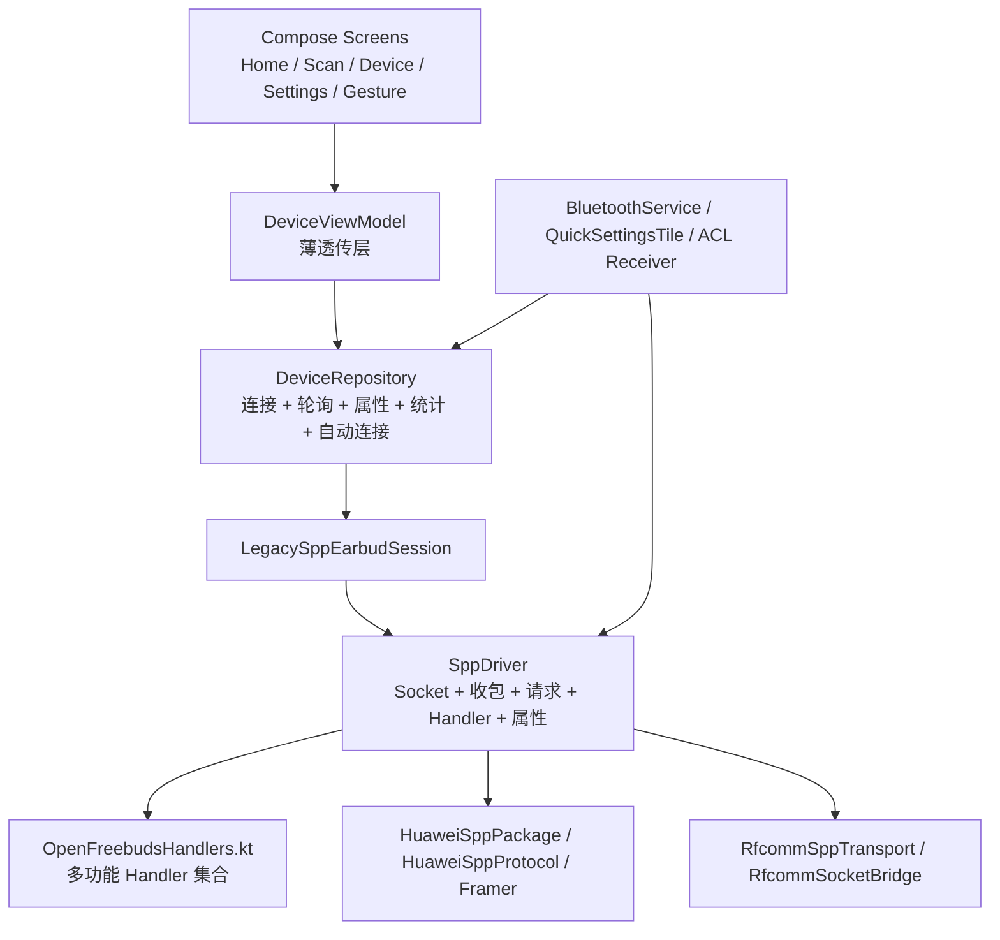

# UI 与蓝牙指令/连接重构规划

> 状态：执行中；当前按“先蓝牙、后 UI”的顺序推进
>
> 基线：v4.2.6，2026-08-01
>
> 当前测试包：v4.3.5 / versionCode 93，2026-08-09（BT 状态/重试修复后的 20 项定向回归门槛）
>
> 目标：把当前“能工作但边界偏大”的 UI、蓝牙连接和 SPP 指令实现整理成可持续迭代的结构。先稳定现有 HUAWEI / HONOR + RFCOMM SPP 路线，再为后续型号和协议扩展留出边界。

> 测试模式日志约定：Debug“自动实机测试”每次启动都会清空旧缓存，测试期间不设日志行数上限，改用约 160,000,000 字节的 UTF-8 缓存预算；导出的最终报告在写文件前再限制为 190,000,000 字节以内，确保小于 200 MB。正常日志策略在报告构建完成后恢复。

## 0. 执行状态、完成标记与版本基线

### 0.1 完成标记规则

每完成一个阶段，必须在本文件的阶段标题和下表同步更新状态：

```text
[ ] 未开始
[~] 进行中
[x] 已完成
```

阶段只有在代码/文档、自动化测试、实机回归和回退记录都齐备后，才能标记为 `[x] 已完成`。每次标记还要记录：

- 完成日期。
- 对应提交或发布版本。
- 自动化测试结果和实机型号/系统版本。
- 关键日志或耗时结论。
- 回退方式。

当前已完成的是 **BT-0.1 的本地协议/能力代码审计与资料存在性核对**；这不代表所有型号和所有指令都已经实机验证。BT-0.2 已取得主设备基线但等待重构后复测，BT-0.3 已完成路线决策。

### 0.1.1 定向实机测试规则

实机测试规模跟随本轮代码改动，不再默认启动完整 100 项矩阵：

| 改动类型 | 默认强度 | 适用场景 |
|---|---:|---|
| 日志字段、报告格式、状态判定 | 3 轮 | 核对字段存在、attempt 归属和终态输出 |
| 普通能力读写 | 5 轮 | ANC、低延迟、读回一致性等功能行为 |
| 重连、ACL、并发入口和连接耗时 | 每个相关场景 10 轮 | 需要观察竞态并计算 P50/P95 |
| 跨模块发布验收 | 100 项 | BT 阶段合并、Release 候选或多个模块同时改动 |

上一轮 `4.3.2 / 90` 的定向清单为 **36 项**；`4.3.3 / 91` 先针对 ANC 摘戴竞态进行修复和人工确认，`4.3.4 / 92` 已完成这组复测。报告显示 B、D、E 已通过，F 和应用入口初始化仍有状态判定/热重连尾部问题，因此 `4.3.5 / 93` 只复测受影响的 20 项：

| 组别 | 轮次 | 覆盖内容 |
|---|---:|---|
| B | 10 | 系统已连接、discovery 关闭、自动低延迟开启 |
| F | 10 | 手动断开抑制、RFCOMM 重连和 ACL 清理/重连 |
| 初始化 | 10 | 应用入口，观察 10 秒后初始化是否继续推进 |
| D | 3 | discovery 完成入口、saved-fallback、endpoint/channel/source |
| E | 3 | 首次失败后的外层重试日志语义 |

合计 **36 项**。A/C、ANC 独立读写、自动低延迟读回和入口去重不在本轮重复执行；这些内容留给对应改动或完整 100 项发布验收。

`4.3.4 / 92` 报告 `/Users/chenhong/Downloads/fxxkHilife_hardware_regression_1786277130416.txt` 的结果为 **31/36**：B=10/10、F=7/10、初始化推进=8/10、D=3/3、E=3/3；endpoint 始终为 `rfcomm-channel=1`，source 始终为 `VerifiedModelConfig`。F1/F3/F9 的日志在同一 attempt 已出现 `CoreReady/Ready`，但结果快照仍出现 `InitializingDeferred` 或等待超时；初始化第 2、6 轮则在 RFCOMM 三次立即拒绝后失败。该报告因此同时暴露了状态流并发覆盖和第四次 Socket 创建不足两个独立问题。

本轮 `BT_STATE_RETRY_20` 定向清单：

| 组别 | 轮次 | 覆盖内容 |
|---|---:|---|
| F | 10 | 手动断开抑制、RFCOMM/ACL 重连；验证 Ready 终态快照、attempt 归属和热重连排水 |
| 初始化 | 10 | 应用入口，观察 10 秒后初始化是否继续推进；验证同一 attempt、Ready/Degraded 和 pending 为空 |

合计 **20 项**。B、D、E 已在 `4.3.4 / 92` 通过，本轮不重复；若 F/初始化仍失败，只追加对应失败项，不恢复整套 36 项。

> **当前目标受阻**：`4.3.5 / 93` 的代码和 JVM 定向测试已完成，等待主验证设备运行 `BT_STATE_RETRY_20` 20 项并回传报告；在报告返回前不关闭 BT-1/BT-2 回归门。

### 0.2 本轮执行记录（先蓝牙，后实机测试）

本轮继续完成蓝牙组件重构、定向实机测试矩阵和本地验证；代码/CI 完成后，只安排与本轮改动对应的测试项。

- 当前测试包已切换为 `4.3.5 / 93`，对应 BT 状态/重试修复后的 `BT_STATE_RETRY_20` 定向回归门槛；`4.3.4 / 92` 为上一轮 36 项报告包，`4.3.3 / 91` 为 ANC 摘戴状态修复包，`4.3.2 / 90` 为上一轮热重连/初始化回归包，`4.3.1 / 89` 为更早的完整实机报告包，`4.3.0 / 88` 仅作为 BT-1 首轮实机报告包，`4.2.6 / 87` 仅保留为重构前基线。
- 保留未跟踪的 `.DS_Store` 和 `对话历史记录.md`，不纳入代码提交。
- 本轮重点：唯一命令 lane、优先级/静默窗口调度、命令目录、共享命令多路分发、typed connection command、连接 attempt 归属、旧 RFCOMM session 生命周期和 `startDiscovery=false` 的绑定设备回退；调整前实机报告已纳入，本轮修复后的 APK 仍需同设备复测。
- 2026-08-09 ANC 诊断回灌：`/Users/chenhong/Downloads/fxxkHilife_diagnostic_1786212455286.txt` 的 `2b2c` 在摘戴期间以短 burst 连续出现，旧 Handler 直接把它当成模式快照写入属性；日志只记录参数键，尚未形成可验证的 mode 值证据。
- 2026-08-09 ANC 状态修复：`2b2a` 保持唯一权威状态来源；`2b2c` 只作为变化提示，不直接更新 ANC 属性，并在 250ms 安静窗口后通过同一 command lane 发起一次无等待 `2b2a` 读取；收到权威 `2b2a` 后取消未执行的刷新任务。
- 2026-08-09 ANC 定向测试报告回灌：`/Users/chenhong/Downloads/fxxkHilife_hardware_regression_1786263762016.txt` 为 `format=2`、`profile=ANC_WEAR_STATE`、`4.3.3 / 91`，设备为 HUAWEI FreeBuds 6i；10 轮均已执行，但验收结果为 `pass=0 fail=10`。每轮均为 `notifications2b2c=0`、`accepted2b2c=0`、`refreshes=0`、`authoritative2b2a=0`、`exercised=false`、`refreshed=false`；因此没有形成一次有效的摘下/放置/双耳重新佩戴事件证据，尚不足以证明修复通过，也不足以判断模式稳定性回归。连接端点仍为 `rfcomm-channel=1 source=VerifiedModelConfig`，报告未显示连接路线本身失败。
- 2026-08-09 自动 ANC profile 报告标记为无效测试记录：10 轮窗口均未捕获实际摘戴事件；随后以人工诊断报告确认修复效果，并恢复 36 项定向 profile。
- 2026-08-09 ANC 人工验证报告回灌：`/Users/chenhong/Downloads/fxxkHilife_diagnostic_1786264858472.txt` 记录到 `2b2c` 通知 36 次、安静窗口刷新 20 次、权威 `2b2a` 接受 45 次，未出现 `State accepted source=2b2c`；16:40:30–16:40:32 期间滞后的 `mode=0` 被 `pending=1` 守卫丢弃，最终仍回到 `2b2a mode=1`。这支持“设备发送摘戴瞬时通知、旧软件错误采纳”的根因判断，ANC 修复人工通过。
- 2026-08-09 `4.3.4 / 92` 的 36 项实机报告回灌：B=10/10、F=7/10、初始化推进=8/10、D=3/3、E=3/3，总计 31/36；endpoint=`rfcomm-channel=1`、source=`VerifiedModelConfig`。F1/F3/F9 的阶段日志已到 `Ready`，但 Runner 最终快照出现 `InitializingDeferred` 或等待超时；初始化第 2、6 轮出现三次 RFCOMM immediate rejection 后失败。13 个完整 attempt 的阶段统计为 Transport→CoreReady P50/P95=`860/888ms`，CoreReady→Ready P50/P95=`1350/1429ms`；该报告未发现 handler 初始化失败，说明本轮优先修状态归并和立即拒绝尾部。
- 2026-08-09 本轮最小修复：`EarbudStateStore` 的 ControlChannel/DeviceProps 读改写改为原子 `StateFlow.update`，避免并发 handler 快照把 `Ready` 覆盖回 `InitializingDeferred`；`RfcommTransportConfig` 的 immediate retry 从 2 次提升到 3 次，最多创建 4 个 Socket，间隔 `250/500/750ms`，正常首连路径不增加延迟；新增并发状态回归测试和 20 项计划测试。
- 2026-08-09 `4.3.5 / 93` Debug 自动测试按钮切换为 `BT_STATE_RETRY_20`，执行顺序为 F10、初始化10；`BT_TARGETED_36` 保留用于历史 36 项门槛复现，`FULL_MATRIX` 仍保留给跨模块/发布验收，Release 不暴露测试按钮。
- 2026-08-09 `4.3.5 / 93` 本地 CI：`./scripts/run_ci_checks.sh ci-output-bt-state-retry-20` 通过（diff-check、Debug/Release 单元测试、Debug/Release 构建）；Debug APK SHA-256=`bd28b23cf6916bc141d66eef0f8b7fadff730161da0c07a62c5bcb0fd54b9b8f`，Release APK SHA-256=`13e498c7e55041b8778569c532a2aeb02c3dab773afcd9171e8cc8a6e90b3b9e`。这只是本地/静态证据，仍需同一设备的 20 项实机验证。
- GitHub Actions [31313780654](https://github.com/ct-yx/fxxkHilife/actions/runs/31313780654) 已通过；产物为 `fxxkHilife-debug-v4.3.5-93`、`fxxkHilife-v4.3.5-93` 和 `automated-test-report-v4.3.5-93`。CI 通过只证明构建/自动化测试通过，不替代主验证设备的 20 项实机报告。

本轮新增的代码边界：

- `ConnectionAttemptCoordinator` 已独立出来并加入 JVM 单元测试：重复入口复用原 attempt、旧 attempt 不能清理替换 attempt、失败后的空闲重试生成新 attempt。
- `DeviceRepository` 在安装 session、接受 TransportReady 和写入失败状态时再次在 `connectionLock` 内校验 attempt/session，避免快速断开/重连时旧 session 覆盖新 session。
- `HuaweiCommandClient` 将等待同一 response key 的排队时间计入请求总 timeout，避免 ACK/读回超时预算被隐式翻倍；`HuaweiCommandScheduler` 已按优先级排队，并将 `sppQuietUntil` 作为实际发送前门控。
- `EarbudConnectionManager` 已成为 UI、Service、Tile、Terminal 和回归 Runner 的 typed command 边界；Repository 暂作为兼容实现，后续再把连接状态/session 所有权移入 Manager。
- `ConnectionAutoConnectPolicy` 已从 BluetoothService 抽出，统一管理 force、backoff、失败指数退避和成功后重置，并有 JVM 单元测试。
- `ControlChannelStateReducer` 已抽出 attempt-aware 的 begin/stage/handler/link/reset 归约逻辑；旧 attempt 的迟到阶段回调会被状态层丢弃，并有 JVM 单元测试。
- `EarbudSessionRegistry` 已接管单一活动 session 的 install/detach/identity 校验；旧 session 的迟到 EOF/断开回调不会摘除替换 session，并有 JVM 单元测试。
- `ConnectionAttemptCoordinator` 的去重现在按设备地址匹配（忽略地址大小写）；不同地址不会继承当前设备的 attemptId，自动连接入口也会明确记录“另一设备控制通道占用”。
- `BluetoothScanner` 的终态回调增加一次性闸门；绑定设备回退、正常 discovery 完成和 stopScan 竞态不会重复触发 ScanCompleted 建连。
- `SystemBluetoothMonitor` 已从 `BluetoothService` 抽出，统一持有 ACL/A2DP/HEADSET 广播、Profile Proxy 和周期检查；Service 只负责生命周期与通知。
- `EarbudStateStore` 已接管 `ControlChannelState` 与 `DeviceProps` 的可变 StateFlow；Repository 只通过 store 发布 attempt-aware 阶段、能力 pending/failed 和属性兼容快照。
- 本轮将版本从 `4.3.4 / 92` 提升到 `4.3.5 / 93`；Debug 自动测试按钮切换执行 20 项 BT 状态/重试定向测试，不改变 Release 行为。
- 自动测试按钮默认使用 `BT_STATE_RETRY_20` profile，执行 F10、初始化持续推进10轮，合计20项；`BT_TARGETED_36` 保留用于历史 36 项门槛复现，`ANC_WEAR_STATE` 保留用于 ANC 专项复测，`FULL_MATRIX` 仍保留给 Release 候选或跨模块验收，执行 60 个 A-F 连接样本加 40 个功能检查。
- 2026-08-02 连接速度优化：已知型号首轮 Core 初始化使用 1 秒快速超时；3 秒恢复、自动低延迟重试和 Deferred 探测移到同一 command lane 的后台初始化任务，不再阻塞首轮 CoreReady；未知/兼容端点继续使用 3 秒首轮预算。
- 2026-08-02 实机报告回灌：调整前报告 `/Users/chenhong/Downloads/fxxkHilife_hardware_regression_1785615540067.txt` 的 A/B/C/E 各 10 轮为 PASS，但约 30 秒耗时是后续 `PeriodicCheck` 连接被旧 Runner 误归属；D 为 0/10（`startDiscovery=false` 未走绑定设备回退），F 为 0/10（ACL 断开后旧 session/连接入口未收敛），功能检查因同一归属问题未建立有效控制通道。每次有效 attempt 的 endpoint 均为 `rfcomm-channel=1 source=VerifiedModelConfig`；诊断阶段样本的 Transport→CoreReady P50/P95 约 `829/888ms`，CoreReady→Ready P50/P95 约 `2087/2163ms`。这些结果作为重构前基线，不作为新代码的通过证据。
- 2026-08-02 报告回灌后的代码修复：自动测试的自动连接结果现在从 `ConnectionCommandResult.Accepted.attemptId` 直接取得，不再在请求后读取易被周期检查覆盖的当前 attempt；空 attempt 不再接受后续后台连接作为样本结果。D 走 `startDiscovery=false` 的绑定设备回退并用一次性终态回调防重复建连；F 的真实 ACL 断开现在由 `SystemBluetoothMonitor` 发出 `SystemAclDisconnected` typed command，统一执行 session/reader/init 清理，再保留 250ms RFCOMM 重连排水窗口。报告新增 `TransportConnect`、`Transport→CoreReady`、`CoreReady→Ready` 的 P50/P95 字段。
- 2026-08-02 连接生命周期所有权继续收敛：`EarbudConnectionManager` 接管 `EarbudSessionRegistry` 和 `ConnectionAttemptCoordinator`，Repository 只通过 Manager 的 identity-aware 接口安装、摘除、校验 session 和 attempt；迟到的属性、EOF 和初始化回调不再直接比较 Repository 内部生命周期对象。
- 2026-08-02 本轮本地验证：`./scripts/run_ci_checks.sh ci-output-lifecycle-owner-fixed` 通过（diff-check、Debug/Release 单元测试、Debug/Release 构建）；Debug APK 为 `/Users/chenhong/Documents/fxxkhilife/fxxkHilife/app/build/outputs/apk/debug/app-debug.apk`，SHA-256=`b08090e1d64ffc3836eb3b823a52b7c1f4a51023c43ed131dca0cf32e81123e0`；Release SHA-256=`6ec9827fdccae5d5d0a08c7048ea9e1878bdb2407711bbfbcbd5960bc9794e15`。该次构建使用当时的 `4.2.6 / 87` 基线，未以本地构建代替实机验收。
- 2026-08-08 实机报告回灌：`/Users/chenhong/Downloads/fxxkHilife_hardware_regression_1786170584449.txt` 顶层仍为 `format=1`，只有嵌入的诊断段为 `format=2`，且只包含 3 条功能检查，不符合当前工作树中 A-F 60 项 + 功能 40 项、顶层 `format=2` 的报告契约，因此不能作为当前新 APK 的验收证据。它仍暴露出可复现的旧 Runner 问题：A/B/C/E 各 10/10 PASS 但耗时约 30 秒，D 为 0/10（扫描完成未返回保存设备），F 为 0/10（ACL 重连未稳定，后续轮次出现初始连接失败），功能检查均因控制通道归属失败而失败；有效 attempt 仍为 `rfcomm-channel=1 source=VerifiedModelConfig`，诊断样本 Transport→CoreReady 为 `866ms`、CoreReady→Ready 为 `2164ms`。日志还显示 `PeriodicCheck` 在矩阵中抢占连接槽。
- 2026-08-08 报告回灌后的修复：回归 Runner 在 discovery 成功但没有 `ACTION_FOUND` 时使用保存设备作为明确的 `saved-fallback`，并保留扫描终态一次性闸门；测试期间只暂停 `PeriodicCheck`/`AudioProfileConnected` 后台探测，Service/Tile/ACL/HardwareRegression 等显式入口仍走生产 command path；F 场景先等待 CoreReady，再执行手动断开、RFCOMM 重连和 ACL 清理，`SystemAclDisconnected` 改为同步清理旧 session/reader/init，避免立即 ACL 重连复用旧 attempt；ANC、低延迟和入口去重检查也先等待 CoreReady。
- 2026-08-08 修复后本地验证：`./scripts/run_ci_checks.sh ci-output-acl-sync-regression-escalated` 通过（diff-check、Debug/Release 单元测试、Debug/Release 构建）；Debug APK SHA-256=`f24f2ebde90055ed662f073771463b4cac77a153a2d67b25825caf73888c4309`，Release APK SHA-256=`d34186d03a9ccb6cf1081f1abc1f10c45ee570e7ff254fa6e91d046b24ec101f`。该次构建使用当时的 `4.2.6 / 87` 基线；D/F 和 100 项新报告仍需同一设备重新运行后才能更新阶段完成标记。
- 2026-08-08 版本区分后的本地验证：`./scripts/run_ci_checks.sh ci-output-bt-4.3.0-88-final` 通过（diff-check、Debug/Release 单元测试、Debug/Release 构建）；当前测试包为 `4.3.0 / 88`，Debug APK SHA-256=`ba4c0cc9ea8cbd6716d1bde7821e9b6d2b3b6488062782c1f7218ed5ae5a8500`，Release APK SHA-256=`4c584ff640e701a7a6eab91cc2051bf15ab3c83a25e5dbf2836e8107d9c45906`。仍需同一设备重新运行 D/F 和 100 项实机矩阵后更新阶段完成标记。
- 2026-08-09 ANC 定向包本地验证：`./scripts/run_ci_checks.sh ci-output-bt-4.3.3-91` 通过（diff-check、Debug/Release 单元测试、Debug/Release 构建）；Debug APK SHA-256=`dc770772ffb36ac5dc2a4dbbc4143e863406d96dca9d5193345ba7e61f9dbcbb`，Release APK SHA-256=`5b083d9242a07908d306d3fda66ba3200f0c27dc503328d5cb66bc8ad8269bb`。默认自动测试 profile 已切换为 `ANC_WEAR_STATE`，每轮 10 秒摘戴观察；仍需主验证设备实机回归。

- 2026-08-08 实机报告 `/Users/chenhong/Downloads/fxxkHilife_hardware_regression_1786177384365.txt` 回灌：顶层 `format=2`，包含 A-F 60 轮和功能 40 轮；endpoint=`rfcomm-channel=1`，source=`VerifiedModelConfig`。A-F 为 `7/10、5/10、5/10、5/10、10/10、9/10`，初始化持续推进 `5/10`，ANC/自动低延迟/入口去重均 `10/10`。A-D 失败在约 `240ms` 进入 `transport_connect_returned_false`，旧 Runner 却等待约 30 秒；E 的首次失败后重试全部恢复，支持在统一 Transport 边界增加一次有界重试。成功样本 Transport→CoreReady 约 `0.8s`，CoreReady→Ready 约 `1.3s`；F 的 `coreToReady=0` 属于旧 Runner 把 CoreReady 当完整 Ready 的统计语义问题。
- 2026-08-08 报告后的代码修复已落地到 `4.3.1 / 89`：立即非超时 RFCOMM 拒绝默认重试 1 次、间隔 `250ms`，真实连接超时不重复延长；Transport 增加 generation 检查、旧 socket 清理和底层 cause 日志；Runner 按当前 `attemptId` 将 `Failed` 作为终态，控制通道阶段失败也立即结束等待，ANC/低延迟/入口去重从 `CoreReady` 开始，F 必须达到完整 `Ready/Degraded`。本轮仍需同一设备运行新 Debug 包后才能更新实机阶段完成标记。
- 2026-08-08 `4.3.1 / 89` 本地 CI：`./scripts/run_ci_checks.sh ci-output-bt-4.3.1-89` 通过（Debug/Release 各 51 个 JVM 单元测试、diff-check、Debug/Release 构建）；Debug APK SHA-256=`8e2510ac44316c1a34eb5b86dc604d00ca40b56794501a7b656770813ce3f8d1`，Release APK SHA-256=`f3ca20a13ea9463ebd6bd8c5eaa84c5814cd13ca3268cc123c587f19a7002059`。这只是静态/本地构建证据，尚未替代同一设备的实机验收。
- 2026-08-08 新实机报告回灌：`/Users/chenhong/Downloads/fxxkHilife_hardware_regression_1786192207596.txt` 为顶层 `format=2` 的完整 100 项报告，设备为 HUAWEI FreeBuds 6i，endpoint=`rfcomm-channel=1`、source=`VerifiedModelConfig`。A-F 为 `10/10、9/10、10/10、10/10、10/10、9/10`，初始化持续推进、ANC、自动低延迟、入口去重均为 `10/10`。唯一两次失败（B-5、F-1）都在 `495/500ms` 内发生两次 RFCOMM immediate rejection，未进入真实连接超时；说明上一版仅 1 次重试仍不足以覆盖热断开后的系统排水窗口。成功样本的 Transport→CoreReady P50/P95 约 `850/3840ms`（A 的单个异常样本拉高 P95），CoreReady→Ready 各场景约 `1.3/1.6s`；A-F 的约 `10.5s` 总耗时是 Runner 保留的 10 秒观察窗口，不是 Socket 到 Ready 的实际耗时，日志阶段显示常规 Ready 约 `2.4–3.3s`。
- 2026-08-08 报告后的本轮修复已落地到 `4.3.2 / 90`：立即拒绝重试从 1 次提升为 2 次（最多 3 个 Socket 创建），重试等待采用 `250ms/500ms` 线性排水间隔；真实连接超时仍立即终止，不重复延长 10 秒预算。初始化持续推进检查收紧为“同一 attempt + Core 状态有效 + 最终到达 `Ready/Degraded`”，不再把仅到 `CoreReady` 视为通过。下一步需要同一设备重新执行回归矩阵验证第三次 Socket 创建和严格初始化判定。
- 2026-08-08 子代理并行复核确认：4.3.1 报告为 `98/100`（A-F `58/60`、功能 `40/40`），B-5/F-1 是两次 immediate rejection 后仍失败；E 的 10/10 主要是 Transport 内部恢复，不能证明 Runner 外层“首轮失败后重试”。报告的约 `10.5s` 主要是固定观察窗口，不能作为连接耗时；诊断 `meta.*` 可能混入不同 attempt，阶段统计必须以逐条 `RESULT/ConnPhase` 为准。
- 2026-08-08 本轮代码补齐：`RfcommTransportConfig` 默认允许最多 3 个 Socket，按 `250ms/500ms` 线性排水；`SppDriver → RfcommSppTransport` 传递外层 `attemptId`，每次 immediate rejection、timeout 和最终失败都带 `attemptId` 与 `attempt=n/3`；初始化持续推进功能项现在必须满足同一 attempt、`Ready/Degraded` 终态、核心状态有效且 pending 为空；报告补充手机型号、Android API、固件和各阶段有效样本数/`coreToTerminal` P50/P95。
- 2026-08-08 本轮本地 CI：`./scripts/run_ci_checks.sh ci-output-bt-4.3.2-90` 通过（diff-check、Debug/Release 单元测试、Debug/Release 构建）；4.3.2/90 Debug APK SHA-256=`85665804ecd3efd29635c2931acb01d4363300f5e4bb6467709a377e27ef9e67`，Release APK SHA-256=`7db4c5ee28ebb0767d4d77dddeecf6f2d8cbf6df307522d1db444d7c99de41c9`。这仍是本地/静态证据，不替代同一设备的实机验证。
- 2026-08-09 新报告 `/Users/chenhong/Downloads/fxxkHilife_hardware_regression_1786277130416.txt` 已完成只读回灌和并行复核：`BT_TARGETED_36` 为 31/36；成功阶段的 Transport→CoreReady P50/P95=`860/888ms`、CoreReady→Ready P50/P95=`1350/1429ms`，失败集中于 F 的结果层终态快照和两轮传输三次立即拒绝。E=3/3 只能证明外层第一次请求最终成功，不能证明没有内部 Transport 重试。

### 0.3 阶段总表

| 阶段 | 状态 | 当前记录/完成条件 |
|---|---|---|
| BT-0.1 协议/能力本地审计 | [x] 已完成 | 2026-08-01；完成现有 Kotlin 协议、能力表、上游资料快照存在性核对；未提升未经实机验证的能力状态 |
| BT-0.2 连接速度实机基线 | [~] 进行中 | 调整前主设备 A-F 各 10 轮已归档；报告中的 30 秒样本已判定为旧 Runner 误归属，D/F 失败已分别落到绑定设备回退和 ACL session 清理；需新 APK 在同设备比较 Transport→CoreReady、CoreReady→Ready 和最终可用时间 |
| BT-0.3 连接路线决策门 | [x] 已完成 | 2026-08-01；endpoint/channel 已被实机确认，优先改连接编排、attempt 归属、session 生命周期和命令调度；当前测试包为 4.3.5 / 93 |
| BT-1 唯一生产 Transport | [~] 进行中（目标受阻） | 已切换到唯一 `RfcommSppTransport` Socket 路径；`4.3.4 / 92` 的 B/D/E 已通过，`4.3.5 / 93` 只需 F10 和初始化10，确认第四次 Socket 创建、排水、状态终态和阶段 P50/P95 |
| BT-2 CommandClient / Scheduler / Feature | [~] 进行中（目标受阻） | 命令目录、单一优先级 command lane、quiet window、ACK/读回结果模型已落地；ANC 摘戴人工验证通过；等待 `4.3.5 / 93` 完成 `BT_STATE_RETRY_20` 20 项定向回归 |
| BT-3 ConnectionManager 收敛入口 | [~] 进行中 | UI/Service/Tile/Terminal/回归 Runner 已统一发送 typed command；Manager 已接管 session registry、attempt coordinator、ACL 清理和 identity check；Repository 的连接编排 job/state 迁移仍待后续收敛 |
| BT-4 通用蓝牙状态输出 | [~] 进行中 | 已新增 `ControlChannelState`、`ControlChannelStateReducer` 和 `DeviceViewModel.controlChannelState`，页面尚未迁移消费 |
| UI-0 UI 行为基线 | [ ] 未开始 | 截图、交互路径、字段读写清单和测试基线齐备 |
| UI-1 UI State / Event | [ ] 未开始 | 页面通过 typed state/event 工作，保留兼容层 |
| UI-2 页面与公共组件拆分 | [ ] 未开始 | Device/Settings 和公共外壳拆分完成 |
| UI-3 全局状态与持久化 | [ ] 未开始 | `AppUiState`、`SettingsRepository`/DataStore 和导航事件收敛 |
| UI-4 移除兼容层 | [ ] 未开始 | 页面不再依赖 raw property，classic/glass 共用同一能力判断 |

### 0.4 应用版本号方案

当前应用测试包为 **versionName `4.3.5` / versionCode `93`**；`4.3.4 / 92` 是 36 项定向回归包，`4.3.3 / 91` 是 ANC 摘戴状态修复包，`4.3.2 / 90` 是上一轮热重连/初始化回归包，`4.3.1 / 89` 是更早的完整实机报告包，`4.3.0 / 88` 是上一版 BT-1 实机报告包，`4.2.6 / 87` 仅作为本次重构的历史基线。BT-0 的审计、研究、日志和测试准备不单独发版。

| 里程碑 | 计划 versionName | 计划 versionCode | 说明 |
|---|---:|---:|---|
| BT-0 文档/诊断基线 | 4.2.6 | 87 | 保持当前基线，不发布 |
| BT-1 Transport 统一 | 4.3.0 | 88 | 第一版可回归的蓝牙传输重构 |
| BT-2 指令调度与 Feature | 4.3.1 | 89 | 命令目录、队列和能力拆分 |
| BT-1/BT-2 热重连回归包 | 4.3.2 | 90 | 第三次 Socket 创建、线性排水和严格初始化验收 |
| BT-2 ANC 摘戴状态稳定性包 | 4.3.3 | 91 | `2b2c` 只作变化提示，安静窗口后以 `2b2a` 作为权威状态 |
| BT-2 修复后 36 项定向回归包 | 4.3.4 | 92 | B/F/初始化各 10 轮，D/E 各 3 轮 |
| BT-2 状态/重试 follow-up 定向包 | 4.3.5 | 93 | `BT_STATE_RETRY_20`：F10、初始化10；状态并发与第四次 Socket 创建 |
| BT-3 连接管理收敛 | 4.3.6 | 94 | 单一连接编排入口 |
| BT-4 通用蓝牙状态输出 | 4.3.7 | 95 | 分层连接状态和通用状态输出 |
| UI-1 + UI-2 | 4.4.0 | 96 | UI State/Event 与页面组件拆分 |
| UI-3 全局状态与持久化 | 4.4.1 | 97 | 全局状态、设置仓库和导航收敛 |
| UI-4 移除兼容层 | 4.5.0 | 98 | 完成 UI 重构；若产生不兼容变更，再单独评估大版本 |

版本规则：

- 只有能独立编译、测试、回归和回退的代码里程碑才提升版本号；只改本文件或只做诊断不提升版本。
- `versionCode` 每次发布递增 1；BT-1 测试包使用 `88`，BT-1/BT-2 首轮修复包使用 `89`，热重连回归包使用 `90`，ANC 摘戴状态稳定性包使用 `91`，36 项定向回归包使用 `92`，状态/重试 follow-up 使用 `93`，后续以 `93` 为当前基准顺延。
- 统一使用 `python3 scripts/bump_version.py <versionName> <versionCode> "变更说明"` 更新应用版本、资源、README、`VERSION_MANAGEMENT.md` 和 `DEVELOPMENT_LOG.md`。
- 阶段完成时，同时更新本文件的 `[x]`、`VERSION_MANAGEMENT.md` 的历史记录和 `DEVELOPMENT_LOG.md`；版本号不因提前勾选计划项而变更。

本节对应文件：`app/build.gradle.kts`、`app/src/main/res/values/strings.xml`、`VERSION_MANAGEMENT.md`、`scripts/bump_version.py`。

## 1. 范围与原则

本次只规划两个大项：

1. **UI 规范与重构**：页面拆分、状态模型、导航、组件、主题/壁纸、文案和交互状态。
2. **蓝牙指令与连接重构**：系统蓝牙连接、RFCOMM/SPP 传输、5A 封包、请求响应、Handler、能力和状态映射。

两项不能一次性“大爆炸”重写，采用兼容层 + 小步迁移：

- 重构期间保持现有 UI 行为和设备控制能力。
- UI 不再知道厂商命令、`group/prop` 或原始参数。
- 蓝牙传输层不再知道 UI 状态；协议层不再负责页面导航和持久化。
- 未验证的设备能力继续降级隐藏，不因重构扩大误报范围。
- 每个阶段都能独立编译、测试和回退。

## 2. 当前结构基线



现有骨架已经具备 `core/transport`、`core/protocol`、`core/session` 和 `core/adapter`。BT-1 迁移后，生产 Socket、输入流、输出流和关闭逻辑统一由 `RfcommSppTransport` 承载；`SppDriver` 只保留 Huawei 分帧会话、请求响应、Handler 和属性兼容层。后续不再增加第二套并行 Socket 实现。

## 3. 大项一：UI 规范与重构

### 3.1 现存问题

#### A. 页面文件承担过多职责

- `DeviceScreen.kt`、`SettingsScreen.kt` 体积过大，页面布局、原始属性读写、选项中文映射、持久化和交互状态混在一起。
- `AppNavHost.kt` 同时持有导航、主题、语言、壁纸、玻璃配置和连接态自动跳转。
- `DeviceViewModel` 基本是 Repository 的透传层，缺少面向页面的 UI 状态和用户事件。

#### B. UI 直接依赖底层属性协议

当前页面存在类似以下调用：

```kotlin
viewModel.setProperty("anc", "mode", value)
viewModel.setProperty("config", "low_latency", value)
viewModel.setProperty("dual_connect", "preferred_device", address)
```

这会导致：

- UI 必须知道厂商属性组、属性名和字符串值。
- 写入中的 loading、成功、失败、读回确认没有统一模型。
- `DeviceProps` 继续横向增加字段，功能越多页面越难维护。
- 选项显示值与原始值通过页面内 `chineseTap`、`chineseSwipe` 等函数映射，容易重复和错位。

#### C. 展示系统和配置状态分散

- `CLASSIC` / `LIQUID_GLASS`、`HazeState`、`LiquidGlassConfig` 参数在多个页面间层层传递。
- 主题、语言、壁纸和显示模式直接在 Compose 页面中读取/写入 `SharedPreferences`。
- 每个页面自行实现 `Scaffold`、`TopAppBar`、卡片间距和 section header，规范难以统一。

#### D. 导航与连接状态耦合

- 连接成功后由 `AppNavHost` 通过 `LaunchedEffect` 自动跳转详情页。
- Home、Scan、Device 都有相似的“连接后进入详情”判断。
- 用户返回、手动断开、自动连接和系统 ACL 断开之间缺少统一的导航事件语义。

#### E. 连接入口存在异步时序差异

- `AppNavHost` 在调用连接方法后立即读取 `connectionState`，但 Repository 的连接工作在协程中执行；调用返回时通常还处于 `Connecting`。
- Scan 完成回调会尝试自动连接，设备行点击又可能再次发送连接意图；两个入口需要统一去重。
- `MainActivity.onCreate` 和 `onResume` 都会启动 Service 自动连接命令，Service 目前依靠状态检查降低重复建连风险，但 UI 没有统一的 `attemptId` 或触发来源。
- 页面只显示 Connected/Connecting 等粗粒度状态，无法表达“控制通道已建立但核心能力仍初始化中”。

重构后，导航应监听 `DeviceUiState` 中的稳定状态和一次性 `NavigationEvent`，不再依赖点击回调返回瞬间的状态快照。

### 3.2 目标 UI 分层

```text
ui/
  app/
    AppState.kt                 # 全局主题、语言、导航、连接摘要
    AppEvent.kt                 # 全局用户事件
    AppNavHost.kt               # 只负责路由和事件分发
    AppScaffold.kt              # 统一页面外壳
  device/
    DeviceRoute.kt              # collect 状态、调用 ViewModel
    DeviceScreen.kt             # 纯渲染
    DeviceUiState.kt            # 页面状态
    DeviceEvent.kt              # 页面事件
    components/                 # 电池、ANC、音频、双连、手势卡片
  settings/
    SettingsRoute.kt
    SettingsScreen.kt
    SettingsUiState.kt
    SettingsEvent.kt
  components/
    AppTopBar.kt
    SettingsSection.kt
    SettingRow.kt
    AsyncActionIndicator.kt
    ConnectionBanner.kt
  theme/
    Theme.kt
    UiTokens.kt
    DisplayStyle.kt
```

推荐依赖方向：

```text
Screen/Route -> ViewModel -> UseCase/Repository -> EarbudSession
Screen/Route -> UiState / UiEvent
UI components -> semantic tokens only
```

### 3.3 状态模型目标

短期保留 `DeviceProps` 作为兼容快照，新增通用模型并逐页迁移：

```kotlin
data class EarbudState(
    val identity: DeviceIdentity = DeviceIdentity(),
    val connection: ControlConnectionState = ControlConnectionState.Disconnected,
    val battery: BatteryState? = null,
    val noiseControl: NoiseControlState? = null,
    val audio: AudioState? = null,
    val gestures: GestureState? = null,
    val wearing: WearingState? = null,
    val dualConnect: DualConnectState? = null,
    val diagnostics: DiagnosticsState = DiagnosticsState(),
)

data class DeviceUiState(
    val state: EarbudState = EarbudState(),
    val screenStatus: ScreenStatus = ScreenStatus.Loading,
    val pendingAction: DeviceAction? = null,
    val actionError: UiError? = null,
)

sealed interface ControlUiState {
    data object Disconnected : ControlUiState
    data class Connecting(val trigger: ConnectionTrigger) : ControlUiState
    data object TransportReady : ControlUiState
    data class Initializing(val completed: Int, val total: Int) : ControlUiState
    data object Ready : ControlUiState
    data class Degraded(val failedCapabilities: Set<EarbudCapability>) : ControlUiState
    data class Failed(val reason: UiError) : ControlUiState
}
```

约定：

- `null` 表示设备没有提供该能力或尚未得到结果；不要用 `0`、空字符串代替未知。
- `capabilities` 决定是否展示功能；页面只消费已经映射好的 `EarbudState`。
- `ScreenStatus` 至少区分 `Loading`、`Ready`、`Degraded`、`Disconnected`、`Error`。
- `ControlUiState` 还要区分 `Connecting`、`TransportReady`、`Initializing` 和 `Ready`，避免把 RFCOMM 成功误显示成全部功能已经可用。
- 写操作必须有 `Pending/Success/Failure` 状态，并支持设备读回确认。
- raw 值到展示文案的映射放到 `UiTextMapper` / `OptionPresenter`，不要散落在页面。
- 连接提示横幅只消费 `ControlUiState` 和结构化失败原因；页面不根据日志字符串猜测当前阶段。

### 3.4 UI 事件目标

把字符串写入改成有类型的事件：

```kotlin
sealed interface DeviceEvent {
    data class SetAncMode(val mode: AncMode) : DeviceEvent
    data class SetAncLevel(val level: AncLevel) : DeviceEvent
    data class SetLowLatency(val enabled: Boolean) : DeviceEvent
    data class SetGesture(val target: GestureTarget, val action: GestureAction) : DeviceEvent
    data object Refresh : DeviceEvent
    data object OpenTerminal : DeviceEvent
}
```

ViewModel 负责把事件交给用例；用例再调用协议无关的控制接口。页面中不出现 `setProperty(group, prop, value)`。

### 3.5 UI 规范

- 采用 Apple/HIG-inspired 的清晰层级 + Material 3 语义组件；颜色只使用语义色，不在页面硬编码近似色值。
- 统一 `AppScaffold`、顶部栏、section 标题、设置行、状态横幅、空状态和错误状态。
- 普通/玻璃展示模式共享内容组件，只替换 surface/render profile；避免每个页面各写一份布局。
- 交互目标至少 44dp；支持键盘焦点、TalkBack、较大文字、深色/浅色和 reduced motion。
- 统一 loading、disabled、pending、失败重试和成功反馈，不用瞬时乐观值掩盖失败。
- 设置持久化迁移到 `SettingsRepository`，优先使用 DataStore；Composable 只读写状态，不直接操作 `SharedPreferences`。
- 所有用户可见文字走 i18n key；协议 raw 值只能出现在调试终端和日志页面。

#### 3.5.1 Haze 2.0 保留方案

继续使用当前 Haze 2.0，不在本次 UI 重构中替换或升级玻璃渲染依赖：

- 当前锁定 `haze:2.0.0-alpha03`、`haze-blur:2.0.0-alpha03`、`haze-blur-materials:2.0.0-alpha03`。
- `LIQUID_GLASS` 模式继续使用 Haze 2.0；`CLASSIC` 模式使用 Material 3 surface/render profile。
- Haze 只负责模糊、玻璃材质和渲染层，不参与连接、设备能力、页面导航或持久化状态。
- `HazeState` 集中由 `AppScaffold` / `AdaptiveGlassSurface` 管理，页面和业务 ViewModel 不直接创建或修改它。
- 普通模式与玻璃模式共享同一内容组件、`UiState` 和能力隐藏规则，只替换 surface/render profile。
- Haze 依赖升级另开独立变更；UI-1 至 UI-4 期间不与状态、导航、组件拆分混合升级，避免难以定位构建和视觉回归。

相关实现文件：

- `app/src/main/java/com/freebuds/controller/ui/glass/AdaptiveGlass.kt`
- `app/src/main/java/com/freebuds/controller/ui/glass/LiquidGlassConfig.kt`
- `app/build.gradle.kts`

### 3.6 UI 迁移阶段

#### UI-0：建立基线 `[ ] 未开始`

- 记录 Home、Scan、Device、Gesture、Settings 的截图和主要交互路径。
- 列出所有 `DeviceProps` 字段、页面读取位置和写入入口。
- 为 `EarbudStateMapper`、导航和关键选项映射补充单元测试。

#### UI-1：先抽状态和事件 `[ ] 未开始`

- 新增 `DeviceUiState`、`DeviceEvent` 和 `DeviceViewModel` 的事件入口。
- 保留 `DeviceProps` 与旧 `setProperty` 作为兼容层。
- 先迁移 ANC、低延迟、音质偏好三个高频控制项，验证 pending/读回/失败状态。
- 增加 `ControlUiState` 和一次性 `NavigationEvent`；连接发起后由状态流驱动页面反馈，成功后由事件驱动导航。
- 统一设备行点击、扫描完成自动连接、Service 自动连接和 Tile 连接命令的触发来源与去重规则。

#### UI-2：拆页面与公共组件 `[ ] 未开始`

- 将 `DeviceScreen` 拆成 `BatteryCard`、`NoiseControlSection`、`AudioSection`、`DualConnectSection`、`GestureEntryCard` 等独立组件。
- 将 `SettingsScreen` 拆成主题、语言、壁纸、连接偏好、调试、关于等 section。
- 抽出公共 `AppScaffold`、`AppTopBar`、`SettingsSection` 和 `SettingRow`。

#### UI-3：收拢全局状态与持久化 `[ ] 未开始`

- `AppNavHost` 只保留 route 和导航事件，不再管理具体设置写入。
- 建立 `AppUiState`，统一主题、语言、壁纸、显示风格和连接摘要。
- 将各类 `SharedPreferences` key 集中管理，迁移到 `SettingsRepository` / DataStore。
- 连接摘要只展示当前设备的 SystemLink、ControlChannel 和 CoreReady 三个必要层级；详细阶段耗时放到诊断页。

#### UI-4：移除兼容依赖 `[ ] 未开始`

- 所有页面改为消费 `EarbudState` 和 typed event。
- 删除 UI 中的 raw group/prop、中文协议值映射和重复 option 组件。
- 对 classic/glass 两种展示模式做同一组 UI 测试，确认能力隐藏规则一致。

## 4. 大项二：蓝牙指令与连接重构

### 4.1 现存问题

#### A. `SppDriver` 的命令边界仍需继续收敛

BT-1 已移除 `SppDriver` 对 Socket、输入输出流和原始收包循环的直接持有；当前它仍负责：

- 发送串行化、请求响应等待、超时和 pending response。
- Handler 注册、命令分发、属性仓库和初始化入口。
- 断开回调、日志和旧 Handler 兼容桥接。

这些职责将在 BT-2 迁移到 `CommandClient`、`CommandScheduler` 和按能力划分的 Feature；BT-1 不提前扩大修改范围。

#### B. 重复 Transport 路径（BT-1 已处理）

当前只有 `RfcommSppTransport` 建立/关闭 RFCOMM Socket、读原始字节和写输出流；`SppDriver` 通过 `ProtocolSession` 使用它。该项仍保留在问题清单中，是为了记录迁移前的风险，验收证据见 BT-1 进度记录。

#### C. 指令定义和 Handler 组织分散

- `HuaweiSppCommand.kt` 只收录了部分常量，仍有大量 `b(0x.., 0x..)` 散落在 `OpenFreebudsHandlers.kt`。
- 读、写、异步通知、ACK、读回确认、是否等待响应等语义靠调用位置推断。
- 多个功能 Handler 集中在一个约 800 行文件中，能力声明、解析、写入和兼容逻辑不易定位。
- Handler 接口直接接收 `SppDriver`，业务层无法替换协议会话。

#### D. 连接编排和轮询分散

- `DeviceRepository` 同时管理连接、ACL 广播、自动连接、初始化、前后台轮询、低延迟重试、统计和属性映射。
- `BluetoothService`、Quick Settings Tile 和页面都能触发控制动作。
- 系统蓝牙连接与 App 的 SPP 控制通道已经在 UI 中分开显示，但底层还没有明确的状态机。
- 双连目前是耳机侧能力，Android 仍只维护一个 active SPP session；该限制需要变成明确契约，而不是隐藏在实现里。

#### E. “连接慢”缺少阶段定义

当前至少存在三段不同的时间，页面和日志还没有稳定地区分它们：

```text
系统蓝牙链路建立
  -> RFCOMM/SPP Socket 建立
  -> 协议初始化和核心状态可用
```

当前实现中，Socket 成功后就在 `DeviceRepository` 标记 `Connected`，随后才开始初始化。用户看到的“连接完成”与“电量/ANC/低延迟可用”因此可能不是同一个时刻。

已确认的初始化等待来源（优化前基线与当前策略）：

- 初始稳定等待保留 250ms。
- 已知型号的首轮 Core Handler 单通道串行，每个请求最多 1 秒，命令之间间隔 80ms；未知/兼容端点首轮使用 3 秒预算。
- 3 秒恢复超时、核心失败重试、自动低延迟确认和 Deferred 探测进入后台初始化任务，不阻塞首轮 `CoreReady`。
- 自动低延迟仍经过同一 `HuaweiCommandScheduler` command lane；恢复任务不会创建第二套 Socket、Reader 或 response lane。
- 低延迟写入后的后台交接等待从固定 1 秒缩短为 250ms；写入自身的 ACK/读回 settle 仍由命令 Handler 保留。

因此，重构前必须先把 `TransportReady`、`CoreReady`、`Ready` 和 `Degraded` 分开统计；先优化阶段边界，再调整具体延迟值。

### 4.2 指令基线清单

以下是按当前代码整理出的第一版指令目录。迁移时以它为单一清单，逐条补齐：方向、参数、响应、通知、超时、重试、能力和验证状态。

| 功能 | 读取/状态 | 写入/动作 | 备注 |
|---|---|---|---|
| 电量 | `01 08` | — | `01 27` 为通知 |
| ANC | `2b 2a` | `2b 04` | `2b 2c` 只作摘戴/模式变化提示；不直接写入 UI，burst 安静后刷新 `2b 2a` |
| 低延迟 | `2b 6c` | `2b 6c` | 写入后读回确认 |
| 音质偏好 | `2b a3` | `2b a2` | 写入可能只收到异步 `2b a3` |
| 自动暂停 | `2b 11` | `2b 10` | ACK 后读回确认 |
| 双击 | `01 20` | `01 1f` | 左右参数 |
| 三击 | `01 26` | `01 25` | 左右参数 |
| 长按 | `2b 17` / `2b 19` | `2b 16` / `2b 18` | 基础/ANC 分路 |
| 滑动 | `2b 1f` | `2b 1e` | 参数编码需统一 |
| EQ | `2b 4a` | `2b 49` | Custom payload 仍按能力和验证情况限制 |
| 双连开关 | `2b 2f` | `2b 2e` | 耳机侧双连 |
| 双连设备 | `2b 31` / `2b 36` | `2b 32` / `2b 33` | 枚举和变化事件 |
| 语音语言 | `0c 02` | `0c 01` | 文本和语言参数 |
| 设备信息 | `01 07` | — | 固件、型号、序列等字段 |
| 佩戴检测 | `2b 03` | — | 主动推送 |

注：该表是代码基线，不代表所有型号都支持。每条指令都必须绑定型号能力和实机验证记录。

### 4.3 目标蓝牙分层

```text
BluetoothSystemLink
  └─ 只负责系统蓝牙状态、ACL/A2DP/HEADSET 观察和设备发现

EarbudTransport
  └─ 只负责 RFCOMM/BLE 等原始字节流的连接、收发和断开

ProtocolFramer / EarbudProtocol
  └─ 负责分帧、封包、解包、校验和协议包模型

CommandClient
  └─ 负责请求响应、串行队列、超时、重试、ACK、读回确认和取消

FeatureHandler
  └─ 按功能解析参数、生成命令、发布 typed state/event

EarbudSession
  └─ 组合 Transport + Protocol + CommandClient + FeatureHandlers

ConnectionManager / StateStore
  └─ 管理 session 生命周期和通用 EarbudState
```

#### 4.3.1 第三方连接逻辑对比结论

对 APP_A、APP_B、APP_C 的只读代码检查显示，它们虽然实现语言和平台不同，但连接边界基本一致：

| 方案 | 系统蓝牙前提 | RFCOMM 端点 | 连接编排 | 初始化关系 |
|---|---|---|---|---|
| APP_A | 先确认设备处于系统 connected | 标准 SPP UUID | 单一 `_connection`，失败最多 3 次，间隔约 50ms | Socket 成功后立即启动读流和协议层 |
| APP_B | Service 负责后台连接 | 支持固定 UUID / 动态 UUID | Android Service + 独立 Backend；读写和状态回调分开 | `connect()` 返回后再创建设备会话和状态初始化 |
| APP_C | 连接前显式取消 discovery | 型号声明的 Service UUID | 写队列 + 读线程；一个队列管理 Socket 生命周期 | Socket 完成后再排队执行初始化事务 |
| 当前项目 | ACL/A2DP/HEADSET/周期检查均可触发 | 隐藏 API + 固定 `port=1` | Service、Repository、页面和 Tile 多入口 | Repository 标记 Connected 后启动多阶段初始化 |

可吸收的共同原则：

1. **系统蓝牙连接和 App 控制通道是两个状态。** 系统 connected 只代表 RFCOMM 建连的前提，不代表协议已经 Ready。
2. **一个设备只有一个连接编排者。** UI、Tile 和广播只发送连接命令，不直接创建 Socket。
3. **端点选择必须进入型号配置。** 优先使用已验证的 Service UUID；只有有实机证据时才使用固定 channel/port，并记录 fallback 顺序。
4. **读流和写队列从协议 Handler 分离。** Socket 生命周期、EOF、写入失败和协议响应分别有自己的状态事件。
5. **初始化不能反向阻塞传输就绪。** Socket 可用后先发布 `TransportReady`，核心状态和可选能力在后续阶段完成。

这些项目没有证明“UUID 一定比固定端口快”。UUID 方案首先解决的是服务选择和型号兼容；速度是否改善，必须在同一设备、同一系统、同一连接前提下实测。

#### 4.3.2 连接状态与时间线

新增统一的连接事件模型，所有事件带同一个 `attemptId`：

```kotlin
enum class ConnectionPhase {
    Requested,
    SystemLinkObserved,
    DiscoveryStopped,
    TransportConnecting,
    TransportReady,
    Settling,
    CoreInitializing,
    CoreReady,
    DeferredInitializing,
    Ready,
    Degraded,
    Failed,
    Disconnecting,
    Disconnected,
}

data class ConnectionAttempt(
    val attemptId: String,
    val address: String,
    val trigger: ConnectionTrigger,
    val endpoint: RfcommEndpoint,
    val phase: ConnectionPhase,
    val retryIndex: Int,
    val startedAtElapsedMs: Long,
)
```

`ConnectionAttempt` 是诊断模型，不要求直接暴露给普通 UI。日志至少记录：

- 触发来源：手动选择、Service 命令、ACL、A2DP、HEADSET、周期检查。
- 系统链路状态、discovery 是否 active、选中的 UUID/port 和 endpoint 来源。
- `TransportConnecting -> TransportReady` 耗时。
- `TransportReady -> CoreReady` 耗时。
- `CoreReady -> Ready` 耗时。
- 每个请求的 command、response、排队等待、响应等待、重试次数和超时原因。
- 断开来源：ACL、EOF、写失败、初始化失败、手动断开或 Service 销毁。

用户可见状态只保留较少的语义：

```text
Connecting       = Requested / TransportConnecting / Settling
Connected        = TransportReady
Initializing     = CoreInitializing / DeferredInitializing
Ready            = Ready
Limited          = Degraded
Disconnected     = Failed / Disconnected
```

这样既能让页面尽快显示控制通道已建立，也能让电量、ANC 等功能明确显示“初始化中”，避免把协议初始化时间误判为 Socket 连接时间。

#### 4.3.3 RFCOMM 端点策略

端点由 `RfcommTransportConfig` 统一承载，并由型号适配器提供：

```kotlin
data class RfcommTransportConfig(
    val serviceUuid: UUID? = null,
    val channel: Int = 1,
    val source: EndpointSource,
    val connectTimeoutMs: Long = 10_000L,
)

enum class EndpointSource {
    VerifiedModelConfig,
    ServiceRecord,
    RuntimeDiscovery,
    CompatibilityFallback,
}
```

策略顺序：

1. 型号已有实机证据的 Service UUID。
2. 型号能力表明确记录且已验证的 channel/port。
3. Android Service Record 动态发现。
4. 兼容 fallback；每次使用都记录原因和结果。

当前实现状态与约束：

- `HuaweiModel.sppPort`、Service UUID 和最终 Transport 端点必须来自同一份配置，禁止表中有值但连接层继续硬编码。
- 已知型号的 channel 已通过 `RfcommTransportConfigProvider` 传入 Transport；未知名称使用 channel 1 的兼容 fallback，并在日志中记录 `source`。
- 当前 Android bridge 仍使用 channel API；`serviceUuid` 已进入配置契约并记录，Service Record/UUID 选择留待后续端点实机证据。
- 未验证端点不能静默覆盖已验证端点。
- UUID 与 channel 的对比测试必须固定设备、系统版本、蓝牙系统连接状态和 discovery 状态。
- `socket.connect()` 必须由 Transport 统一执行，并有取消和应用层超时；超时后关闭当前 Socket，再进入统一 backoff。

#### 4.3.4 初始化调度策略

将初始化拆成三个级别，避免所有能力都参与“连接完成”的判定：

| 级别 | 内容 | Ready 影响 | 失败处理 |
|---|---|---|---|
| Transport | Socket、输入输出流、接收循环 | 产生 `TransportReady` | 关闭 Socket，进入重试 |
| Core fast pass | 页面首屏需要的 ANC、电量、低延迟、音质等首轮状态 | 产生 `CoreReady`；已知型号优先缩短首屏可用时间 | 首轮 1 秒；失败能力进入后台恢复 |
| Core recovery / Action | 失败 Core 重试、自动低延迟 ACK/读回确认 | 更新最终 `Ready` 或 `Degraded`，不回退 Transport | 3 秒恢复预算，单一 command lane |
| Deferred | 设备信息、手势、EQ、双连枚举、语言等 | 不阻塞控制通道 | 后台 best-effort，按能力降级 |

自动低延迟需要单独建模为 `ConnectionAction`，不要和核心读取共享一个“初始化完成”标志：

- 先记录写入开始、ACK、读回确认和最终结果。
- 基线测试时分别比较“自动低延迟关闭”和“自动低延迟开启”。
- 低延迟写入放在首轮 `CoreReady` 之后的后台 action 中；它仍使用同一 Scheduler，不创建独立请求队列。
- 低延迟后续重试不能与 Deferred 初始化并行争用同一请求队列；应由一个 Scheduler 排队。
- `sppQuietUntil` 必须成为 Scheduler 的实际门控条件，不能只被 fast polling 检查。

当前已知型号首轮快速路径可按以下方式估算：

```text
250ms settle
+ 4 个请求 × 1000ms timeout
+ 5 个 80ms inter-command gap
≈ 4650ms 首轮超时上界

失败恢复、自动低延迟和 Deferred：后台继续执行，不计入首轮 CoreReady
```

该数字是超时上界，不是实测耗时；目标是让“Socket 已连接”和“首轮核心状态可用”先恢复到上一版速度，同时保留失败恢复和单队列时序保护。

#### 4.3.5 自动连接触发收敛

建立 `ConnectionTrigger` 和单一 `EarbudConnectionManager`：

```kotlin
enum class ConnectionTrigger {
    UserAction,
    ServiceCommand,
    AclConnected,
    AudioProfileConnected,
    PeriodicCheck,
}
```

Manager 负责：

- 合并同一地址短时间内的 ACL/A2DP/HEADSET 事件。
- 为同一地址创建唯一 `attemptId`，拒绝重复 active session。
- 统一处理手动断开抑制、取消、backoff、重试和失败原因。
- 只有系统蓝牙状态满足前提时才尝试打开控制通道。
- 连接失败后不立即被另一个广播入口重新拉起。

`MainActivity.onCreate`、`onResume`、Service profile callback、系统广播和周期检查都只调用 Manager；Repository 不再分别维护多组自动连接 Job。

### 4.4 指令模型目标

不要让业务 Handler 直接拼 `ByteArray`。先建立一个协议内的声明模型：

```kotlin
@JvmInline
value class CommandId(val hex: String)

data class CommandSpec(
    val id: CommandId,
    val responseId: CommandId? = id,
    val kind: CommandKind,
    val timeoutMs: Long,
    val retry: RetryPolicy = RetryPolicy.None,
    val confirmation: ConfirmationPolicy = ConfirmationPolicy.None,
)

enum class CommandKind { Read, Write, Notify, Ack, FireAndForget }

sealed interface ConfirmationPolicy {
    data object None : ConfirmationPolicy
    data class ReadBack(val command: CommandSpec) : ConfirmationPolicy
    data class AsyncState(val responseId: CommandId) : ConfirmationPolicy
}
```

实际实现可以比示例更简单，但必须明确这些语义：

- 命令 ID、响应 ID、通知 ID 不混用。
- 同一 RFCOMM 通道保持可控的请求顺序；不允许未知并发请求互相覆盖 response waiter。
- timeout、retry、quiet window 和初始化优先级由策略集中定义。
- `FireAndForget` 也必须经过发送队列，不能越过正在等待的请求。
- 写入结果分为“已发送”“收到 ACK”“读回确认”“超时/失败”，不能只返回 Boolean。
- 收到异步状态包时，按时间戳和 pending action 处理旧包覆盖问题。

### 4.5 Handler 拆分目标

将 `OpenFreebudsHandlers.kt` 拆成按能力组织的文件/包：

```text
adapter/huawei/features/
  battery/BatteryFeature.kt
  noise/AncFeature.kt
  audio/LowLatencyFeature.kt
  audio/SoundQualityFeature.kt
  audio/EqualizerFeature.kt
  gestures/TapFeature.kt
  gestures/SwipeFeature.kt
  gestures/LongPressFeature.kt
  connection/DualConnectFeature.kt
  device/InfoFeature.kt
  device/WearingFeature.kt
  device/VoiceLanguageFeature.kt
```

每个 Feature 只暴露：

```kotlin
interface EarbudFeature<S> {
    val id: String
    val capabilities: Set<EarbudCapability>
    suspend fun initialize(client: CommandClient): FeatureInitResult
    suspend fun onPacket(packet: ProtocolPacket): FeatureEvent?
    suspend fun execute(action: FeatureAction): CommandResult
}
```

旧 `HuaweiDeviceHandler` 可以先作为适配器保留；新 Feature 不应再直接依赖 `SppDriver`。

### 4.6 连接状态机目标

明确区分两种连接：

```text
SystemLinkState
  Disconnected -> Connected -> Disconnected

ControlChannelState
  Idle
    -> ConnectingTransport
    -> Settling
    -> InitializingCore
    -> Ready
    -> Degraded
    -> Disconnecting
    -> Failed
```

约定：

- 系统蓝牙已连接不等于 App 控制通道已连接。
- 手动断开只影响控制通道，并在策略窗口内抑制自动抢连。
- ACL 断开、Socket EOF、发送失败和初始化失败分别记录原因，再统一转成状态事件。
- 一个设备地址同一时间最多一个 active control session；多设备/双连扩展时再引入 `SessionRegistry`。
- Service、Tile 和 UI 只发送 `ConnectionCommand`，不直接创建 Socket 或调用 Handler。
- 所有连接重试使用统一 backoff 和取消规则，Repository 不再维护多套相互独立的 retry job。

### 4.7 蓝牙迁移阶段

#### BT-0：协议与连接基线 `[~] 进行中`

- 保存当前实机日志样本：连接、初始化、ANC 切换、低延迟切换、断开、重连、双连枚举。
- 为 `HuaweiSppPackage` / `HuaweiSppFramer` 添加分片、粘包、嵌套包、非法 magic、非法长度测试。
- 明确 5A 帧长度、CRC、参数边界的唯一解释，删除注释与实现不一致的地方。
- 先不改变现有命令行为。

##### BT-0.1：当前本地协议/能力基线审计 `[x] 已完成`

> 完成记录：2026-08-01；已完成本地 Kotlin 协议/能力实现、型号表和上游逆向资料快照存在性核对。实机证据表仍按型号和能力逐项补齐，未验证项继续保持 `PARTIAL`/`UNKNOWN`。

本地检查结果：从上游逆向资料整理出的**派生代码仍然存在**，但原始 `OpenFreebuds/` 快照目录当前不在工作区。因此后续重构不能只依赖现有 Kotlin 文件推断来源，应该重新固定上游提交或保存一份可追溯的协议资料快照。

| 审计对象 | 当前状态 | 结论 |
|---|---|---|
| SPP 5A 封包、解析、分帧 | `HuaweiSppPackage`、`HuaweiSppProtocol`、`HuaweiSppFramer` 仍在 | 主协议实现仍保留，需补齐固定测试样本 |
| 主要控制指令 | 常量和 Handler 仍在使用 | 主验证设备的核心指令链路延续有效，全部型号尚未完成复核 |
| 型号能力表 | `HuaweiModel` + `modelCapabilities` 仍在 | 属于兼容性基线，不是全型号最终真值 |
| 原始逆向资料 | `OpenFreebuds/` 当前缺失且被 gitignore | 需要固定来源版本或保存引用快照 |

已确认的结构性问题：

- `HuaweiModel.sppPort` 没有传入连接层，`SppDriver` 仍硬编码使用端口 `1`；表中的端口差异当前不会生效。
- 未识别型号会得到空能力集合，而当前 `has()` 将空集合解释为“全部能力”，与未知能力默认隐藏的原则相反。
- `HuaweiCapability` 中部分长按扩展能力只有枚举/表项，没有独立 Handler 或完整 UI 链路，需逐项标记为 `implemented`、`parsed-only` 或 `unverified`。
- 多个型号共用一个能力档案，部分型号在代码中明确属于临时保守适配，不能直接视作实机验证结论。
- 指令常量不完整，仍有裸 `byteArrayOf(...)` 分散在 Handler 中；迁移时需要建立唯一指令目录。
- 当前测试重点集中在初始化策略、pending response 和 i18n，协议分片、粘包、CRC、命令读回和型号能力表尚需补充测试。

BT-0 必须产出一份能力证据表：

| 型号 | SPP 端口 | 能力 | 读取命令 | 写入命令 | 通知命令 | 证据 | 状态 |
|---|---:|---|---|---|---|---|---|
| MODEL | PORT | CAPABILITY | COMMAND | COMMAND | COMMAND | LOG / SOURCE / DEVICE | VERIFIED / PARTIAL / UNKNOWN |

在证据表完成前，新增型号能力默认使用保守策略；已有表项若没有实机日志或可追溯来源，标记为 `PARTIAL`，不直接提升为已验证能力。

##### BT-0.2：连接速度专项基线 `[~] 进行中`

> 当前记录：2026-08-09；`4.3.4 / 92` 已完成 36 项定向实机报告，但结果为 31/36，F 与应用入口初始化仍需修复后定向复测；`4.3.5 / 93` 已进入 `BT_STATE_RETRY_20` 目标受阻状态。

已收到主验证设备的 `a.txt`、`b.txt` 两份诊断报告，作为问题定位证据，不作为阶段完成证据：

| 报告 | Transport | Transport→CoreReady | 结果 | 关键现象 |
|---|---:|---:|---|---|
| a | 770ms | 7535ms | Degraded | 首轮 `anc_global`/`low_latency` 超时；后续 `sound`、`battery` 出现成功，说明初始化受时序影响 |
| b | 1009ms | 11823ms | Degraded | 自动低延迟重试与 Deferred 初始化并行，出现 `queueWait=749ms/800ms`，`2b6c` ACK 被当作读回结果的风险 |

调整前实机报告摘要（文件：`/Users/chenhong/Downloads/fxxkHilife_hardware_regression_1785615540067.txt`；HUAWEI FreeBuds 6i，Android API 36，应用基线 `4.2.6 / 87`）：

| 场景 | 结果 | 报告 P50/P95 | 结论 |
|---|---:|---:|---|
| A | 10/10 PASS | 29976 / 30288ms | 报告等待窗口通过；阶段日志显示实际 Transport/Core/Ready 分段明显更短 |
| B | 10/10 PASS | 29998 / 30260ms | 自动低延迟开启路径通过，但需继续确认 ACK/读回顺序 |
| C | 10/10 PASS | 29987 / 30194ms | ACL 入口通过 |
| D | 0/10 PASS | 0 / 0ms | `startDiscovery()` 返回 false，已列出的绑定设备未进入 runner 回退路径 |
| E | 10/10 PASS | 29979 / 30245ms | 失败后重试最终通过，但旧 runner 需要绑定首个 attempt，避免统计到 PeriodicCheck |
| F | 0/10 PASS | 0 / 0ms | 第 1 轮走到手动重连和 ACL 断开，但 ACL 重连失败；后续轮次在初始控制通道阶段失败 |

同一报告的每次成功连接明细确认：endpoint 为 `rfcomm-channel=1`，source 为 `VerifiedModelConfig`；连接慢的主因暂时不是 channel。对报告中可配对到完整阶段的 40 个 `PeriodicCheck` attempt 解析得到 Transport→CoreReady 中位数约 `829ms`、P95 `888ms`，CoreReady→Ready 中位数约 `2087ms`、P95 `2163ms`。A/B/C/E 的约 30 秒主要是旧 runner 等待到了后续 `PeriodicCheck` attempt，不能直接当作单次控制通道耗时；新报告已改为按请求返回的 attemptId 统计，且额外输出阶段 P50/P95。

本轮已落地的修复方向：

- `HuaweiCommandCatalog` 集中读/写/通知命令，`HuaweiCommandClient` 提供 ACK、读回确认、超时/失败结果，所有发送经过 `HuaweiCommandScheduler` 单一 command lane。
- `HuaweiHandlerRegistry` 支持同一命令由多个功能观察者接收，避免 `2b03` 的佩戴检测与旧 ANC 变化处理互相覆盖。
- `DeviceRepository.connect()` 在启动协程前同步保留 attemptId；重复入口复用同一 attempt，回归 runner 只接受自己请求的 attempt。
- `RfcommSppTransport` 增加 generation 防护，旧 read loop 的迟到异常不会关闭新 Socket；ACL/测试断开显式关闭旧 session。
- `BluetoothScanner` 在 `startDiscovery=false` 且已列出绑定设备时使用绑定设备回退，并继续记录真实 discovery 失败原因。
- 回归报告在最终断开后仍能从型号适配器恢复 endpoint/channel/source，避免报告头部显示 `endpoint=unavailable`。
- 自动连接请求现在返回 `accepted + attemptId`，回归 runner 对空 id、超时和后续周期连接严格隔离；F 的 ACL 重连通过 `AutoConnectKnownSystemConnected` typed command 进入同一入口。
- 手动/ACL/EOF 清理后仅对热重连增加 `250ms` RFCOMM 排水窗口，冷连接不增加等待；测试报告的场景明细与统计同步记录三个阶段耗时。

上一轮 `4.3.2 / 90` 的实机验收重点是第三次 RFCOMM Socket 创建、B/F 热断开排水窗口、D 回退和初始化终态；`4.3.3 / 91` 已完成 ANC 摘戴状态来源修复和人工验证；`4.3.4 / 92` 的 36 项报告为 31/36，B/D/E 已通过；当前 `4.3.5 / 93` 只复测 F10 和初始化10，验证原子状态更新与第四次 Socket 创建。

该小阶段只增加观测和测试，不调整生产时序。每个测试场景至少执行 10 次，记录成功次数、P50、P95、最大值和失败原因：

| 场景 | 系统蓝牙状态 | discovery | 自动低延迟 | 目的 |
|---|---|---|---|---|
| A | 已 connected | 否 | 关 | 得到纯 Transport + 最小初始化基线 |
| B | 已 connected | 否 | 开 | 确认低延迟写入/回读的额外成本 |
| C | 刚收到 ACL connected | 否 | 关 | 观察系统链路到 RFCOMM 的稳定窗口 |
| D | 扫描结束后立即连接 | 是/刚结束 | 关 | 验证 discovery 取消和 Socket 建连耗时 |
| E | Socket 首次失败后重试 | 否 | 关 | 验证关闭、backoff 和重复连接抑制 |
| F | 手动断开后系统仍 connected | 否 | 任意 | 验证手动抑制不会被广播抢回 |

每次测试必须导出：

```text
device model / firmware / Android version / app version
trigger / attemptId / endpoint
systemConnectedAt
transportConnectingAt / transportReadyAt
coreInitStartAt / coreReadyAt
readyAt / disconnectedAt
```

当前版本的诊断报告会额外写入 `[ConnPhase]` 日志，包含 `attemptId`、触发来源和阶段相对耗时。可用以下脚本对导出的报告汇总 P50/P95：

```bash
python3 scripts/analyze_connection_timing.py /path/to/fxxkHilife_diagnostic.txt
```

脚本只使用每个阶段第一次出现的时间点；缺少阶段时显示 `-`，不把不完整连接伪装成成功样本。应用内可通过调试终端执行 `share` 导出报告；BT-0.2 基线测试期间建议关闭原始 SPP 十六进制抓包，除非该场景需要分析协议内容。

判读规则：

- `TransportReady - TransportConnecting` 高：优先检查系统蓝牙时序、discovery、endpoint 和 Socket 超时。
- `CoreReady - TransportReady` 高：优先检查初始化队列、请求 timeout、重试和低延迟动作。
- `Ready - CoreReady` 高：优先检查 Deferred Scheduler、自动低延迟后续重试和页面状态映射。
- 同一 attempt 出现多个 `TransportConnecting`：先修连接编排重复触发，再看底层速度。

##### BT-0.3：专项基线后的决策门 `[x] 已完成`

根据 60 轮主报告选择实现路径：

1. **不先改端点**：HUAWEI FreeBuds 6i 的实机日志稳定显示 `rfcomm-channel=1 source=VerifiedModelConfig`，当前证据不足以更换 UUID/channel。
2. **先改连接编排**：A/B/C/E 的总耗时主要被错误归属到后续 `PeriodicCheck` attempt；必须先让测试和生产状态绑定同一 attempt。
3. **先修 session 生命周期**：F 只有 2/10，通过旧 RFCOMM reader/session 可能在断开后残留，先用 generation 和显式关闭阻断竞态。
4. **再收敛命令调度**：ANC/低延迟/Deferred 共享单一 command lane，读回、ACK 和通知不能相互误认。
5. **D 走扫描回退**：`startDiscovery=false` 且系统已返回绑定设备时，使用绑定设备结果继续进入扫描完成连接路径，并在日志中保留回退原因。

#### BT-1：唯一生产传输路径 `[~] 进行中`

> 进度记录：2026-08-01；代码已将生产 RFCOMM Socket、输入输出流、读循环和关闭逻辑收敛到 `RfcommSppTransport`，`SppDriver` 通过 `ProtocolSession` 使用 `HuaweiSppFramer`。本地和 GitHub Actions 自动流程均已通过：Debug/Release 各 23 个单元测试、0 failure、Debug/Release 构建成功；验证运行是 [run 30693967119](https://github.com/ct-yx/fxxkHilife/actions/runs/30693967119)，生成 `automated-test-report-v4.2.6-87`、`fxxkHilife-debug-v4.2.6-87` 与 `fxxkHilife-v4.2.6-87`。由于当前没有新的主设备实机回归日志，暂不标记为 `[x]`，版本仍冻结为 `4.2.6 (87)`。

已完成：

- `[x]` `RfcommSppTransport` 成为唯一生产 Socket 实现。
- `[x]` 将 `SppDriver` 的接收循环、Socket 关闭和原始发送路径迁移到 Transport + ProtocolSession。
- `[x]` 分帧层覆盖分片、粘包、噪声重同步、跨读取 magic 和重连清理；`ProtocolSession` 覆盖分片转发和重连重置。
- `[x]` 删除上层重复 TX 锁，保留请求队列串行化；fire-and-forget 仍不能越过正在等待的响应。

仍待完成：

- `[x]` 将 UUID、channel、连接超时、取消和重试收敛为 `RfcommTransportConfig`，移除生产路径中的固定 port 常量；已知型号使用型号端点，未知型号保留 channel 1 compatibility fallback，并将 endpoint/source 写入连接元数据和日志。
- `[ ]` 在主验证设备上回归 ANC、自动低延迟、初始化持续推进、断开/重连，并记录回退结果。
- `[~]` 已发布 `4.3.2 (90)` 作为热重连恢复和严格初始化判定的实机回归测试包；BT-1 仍等待同一设备的连接阶段汇总。
- `[x]` `4.3.3 (91)` 的 ANC 摘戴状态修复已通过人工诊断验证；报告确认 `2b2c` 未被当作最终状态，滞后状态被守卫过滤。
- `[x]` 已发布 `4.3.4 (92)` 并取得同一设备 36 项定向报告：31/36；B=10/10、D=3/3、E=3/3，F=7/10、初始化=8/10。阶段未因报告层假失败而提前完成。
- `[~]` 已发布 `4.3.5 (93)` 作为状态/重试 follow-up 测试包，等待同一设备执行 `BT_STATE_RETRY_20`：F10、初始化10。

#### 实机回归待测队列（按当前改动定向收集）

以下项目只覆盖当前版本实际改动；每完成一个子阶段就在本文件回写 `[x]`、版本、测试轮次和报告路径：

1. `[x]` **B 场景**：`4.3.4 / 92`，10 轮通过；系统已连接、discovery 关闭、自动低延迟开启。
2. `[ ]` **F 场景**：`4.3.5 / 93`，10 轮；手动断开抑制、RFCOMM 重连和 ACL 清理/重连，重点验证 Ready 终态快照、attempt 归属和第四次 Socket 创建。
3. `[ ]` **应用入口初始化推进**：`4.3.5 / 93`，10 轮；连续观察 10 秒后的 stage、pendingHandlers 和最终终态。
4. `[x]` **D 场景**：`4.3.4 / 92`，3 轮通过；discovery 完成、saved-fallback、endpoint/channel/source。
5. `[x]` **E 场景**：`4.3.4 / 92`，3 轮通过；首轮失败后的外层重试语义仍需区分 Transport 内部重试。

当前待测合计 20 项（F10 + 初始化10）。36 项历史门槛的 B/D/E 已完成，ANC 摘戴专项由 `ANC_WEAR_STATE` 保留并已通过人工诊断验证；`4.3.5 / 93` 默认使用 `BT_STATE_RETRY_20`，按钮自动完成连接、计时、阶段、attempt、endpoint/source 和报告导出；`BT_TARGETED_36` 仅用于复现历史门槛，`FULL_MATRIX` 保留给发布验收。测试报告沿用小于 200 MB 的字节预算。出现新问题时，只在本表追加对应场景或功能项，保持定向范围。

定向运行输出与全量运行使用同一报告格式：每项输出 PASS/FAIL、P50/P95、最大耗时和失败详情；B/F 额外输出 Socket 尝试、排水间隔和 attemptId，初始化项额外输出观察前后 stage、pendingHandlers、failedHandlers 和最终 core 状态。完整 100 项矩阵只在跨模块验收、Release 候选或多个 BT 阶段同时变更时启用。激活测试模式后仍使用约 160,000,000 字节的 UTF-8 缓存预算，报告写入分享文件前限制为 190,000,000 字节以内，最终文件保持小于 200 MB；测试结束、取消、无设备和异常路径都会恢复正常日志策略。ACL 广播本身由系统触发，按钮中的 ACL 断开使用同一清理路径的 synthetic regression hook；报告会区分真实入口和 synthetic cleanup。

#### BT-2：CommandClient 与 Feature 拆分 `[~] 进行中（目标受阻）`

> 本轮进度：2026-08-09；代码已新增 `HuaweiCommandCatalog`、`HuaweiCommandClient`、`HuaweiCommandScheduler`，并将核心 Handler 的读写迁移到目录。针对诊断日志暴露的 ANC 摘戴竞态，`2b2a` 被固定为权威快照，`2b2c` 只触发 250ms 安静窗口后的同 lane 刷新；`AncStatePolicyTest` 和人工诊断已确认该路径。`4.3.4 / 92` 的 36 项报告已回灌，当前目标受阻点转为 `4.3.5 / 93` 的 `BT_STATE_RETRY_20` 20 项定向回归。

- `[x]` 建立 Huawei 命令目录和 `HuaweiCommandSpec`，消除主要 Handler 中散落的命令字节。
- `[~]` Battery、ANC、LowLatency、SoundQuality、Gesture、EQ、DualConnect 已经通过兼容 Handler 使用目录；ANC 的 `2b2c`/`2b2a` 状态来源修复已落地，按能力拆文件的 Feature 迁移留在后续小阶段。
- 把初始化顺序、核心/延迟能力、超时和重试从 Handler 本体移到策略配置。
- `[x]` 增加单一 `HuaweiCommandScheduler`，普通请求、写入确认、读回确认和 fire-and-forget 均经过同一 command lane；USER_ACTION 会优先于已排队的 Deferred/Background 请求，且不会越过已在执行的交换。
- `[x]` 将 `sppQuietUntil` 接入 Scheduler 的实际发送前门控，并让 disconnect 取消活动/排队命令。
- `[x]` 将“已发送”“ACK”“读回确认”“读回不匹配”“超时/失败”建模为 `HuaweiCommandPhase`，并把同 response key 的排队时间计入单一 timeout 预算；优先级队列已按 USER_ACTION、CORE、DEFERRED、BACKGROUND 生效。
- 保留旧 Handler 适配器，逐个 Feature 替换，不一次改完。

#### BT-3：连接编排拆分 `[~] 进行中`

> 本轮进度：2026-08-02；UI、Service、Tile、Terminal 和回归 Runner 已改为向 `EarbudConnectionManager` 发送 typed `ConnectionCommand`，由 Repository 提供兼容实现；BluetoothService 的触发 backoff 已迁移到 `ConnectionAutoConnectPolicy`/Manager；ACL/A2DP/HEADSET 广播、Profile Proxy 和周期检查已抽到 `SystemBluetoothMonitor`，Service 只保留生命周期与通知。在完整 Manager 拆出前，先修复最影响实机结果的边界：`connect()` 同步生成并保留 attemptId，重复入口只复用同一地址的 active attempt，不同地址不会被错误报告为已去重；Manager 已接管 `ConnectionAttemptCoordinator` 和 `EarbudSessionRegistry`，Repository 只能通过 Manager 的 reserve/clear/isCurrent 与 install/detach/identity 接口操作活动生命周期；Transport 使用 generation 防护旧 reader；ACL/测试断开显式关闭旧 session；回归 runner 按 expected attempt 等待。报告回灌后，真实 ACL 断开统一由 `SystemBluetoothMonitor -> SystemAclDisconnected -> EarbudConnectionManager -> DeviceRepository` 清理，删除 Repository 内重复 ACL receiver，避免只更新 system-link 而遗留 RFCOMM reader。下一轮实机需同时确认新 Monitor 的 ACL/周期入口没有重复建连。

- `SystemBluetoothMonitor`：系统蓝牙连接观察。
- `EarbudConnectionManager`：连接、断开、自动连接、backoff、手动抑制。
- `EarbudConnectionManager` 内的 `EarbudSessionRegistry`：按设备地址维护唯一 session，Repository 只能通过 identity-aware 方法操作。
- `EarbudStateStore`：状态流、失败能力、pending action 和连接原因。
- `ListeningStatsRepository`：从连接编排中移出统计逻辑。
- 统一 ACL、A2DP、HEADSET、Service 命令和周期检查的触发去重，所有触发都携带 `ConnectionTrigger`。
- 连接状态按 SystemLink、Transport、Core、Deferred 四层发布，禁止用单一 `Connected` 覆盖全部阶段。
- `BluetoothService` / Tile / UI / Terminal 改为消费 manager 的命令和状态；本轮已完成命令入口迁移，下一步迁移 Repository 内的连接状态/session 所有权。
- `[x]` 入口去重的地址边界、扫描终态回调闸门、`SystemBluetoothMonitor`、ACL typed cleanup、session registry 和 attempt coordinator 所有权已补齐；仍待把连接编排 job 和状态发布从 Repository 中继续抽离。

#### BT-4：通用蓝牙状态输出（UI 接入前置） `[~] 进行中`

> 本轮进度：已新增 `ControlChannelStage`、`SystemLinkState`、`ControlChannelState`、`ControlChannelStateReducer` 和 `EarbudStateStore`；Store 现在拥有 `ControlChannelState`/`DeviceProps` 状态流，Repository 在 Transport/Core/Deferred/Ready/Degraded/断开阶段通过 attempt-aware reducer 发布 typed state，旧 `ConnectionState` 与 `DeviceProps` 保留兼容。下一阶段将以该状态契约驱动 UI，不在本轮改页面。

- `[x]` `DeviceProps` 只作为兼容映射；可变状态流已移入 `EarbudStateStore`，不再让 Repository/UI 直接持有状态写入器。
- Huawei Adapter 输出通用 `EarbudState` 和能力集合。
- 先稳定通用 `EarbudState`、能力集合和分层连接状态的输出契约，不在 BT-4 直接改页面。
- UI-1 再通过 typed state/action 消费该契约；UI-4 完成后删除 raw property 依赖。

## 5. 两项工作的依赖与执行顺序

执行顺序固定为**先完成蓝牙，再开始 UI**，不交叉推进会改变连接时序的 UI 代码：

1. **BT-0.1 `[x]`**：完成协议/能力本地审计，冻结 `v4.2.6 / versionCode 87` 基线。
2. **BT-0.2 `[~]`**：已在主验证设备上完成 A-F 各 10 轮基线并记录 P50/P95；下一大轮代码完成后复测修复结果。
3. **BT-0.3 `[x]`**：依据数据决定不先换端点，优先处理连接入口、attempt/session 生命周期和命令调度。
4. **BT-1 `[~]`**：让 `RfcommSppTransport` 成为唯一生产 Socket 路径，发布 `TransportReady`；`4.3.2 / 90` 已加入第三次 Socket 创建和线性排水，`4.3.5 / 93` 再验证第四次 Socket 创建、重连排水和最终阶段统计。
5. **BT-2 `[~]`**：已落地 `CommandClient`、`CommandScheduler` 和命令目录兼容层；`4.3.3 / 91` 修复 ANC 摘戴期间的状态来源竞态并通过人工验证，`4.3.4 / 92` 的 36 项报告已回灌，当前等待 `4.3.5 / 93` 的 F10/初始化10 定向回归后收口。
6. **BT-3 `[~]`**：已完成 attempt/session 竞态的第一轮收敛，后续再由 `EarbudConnectionManager` 统一 ACL/A2DP/HEADSET/Service/Tile/周期检查入口。
7. **BT-4 `[~]`**：已输出 `ControlChannelState` 和 SystemLink/Transport/Core/Deferred 分层状态，下一步冻结 UI 消费契约。
8. **UI-0 `[ ]`**：蓝牙链路稳定后，再记录页面截图、交互和字段读写基线。
9. **UI-1 `[ ]`**：建立 `DeviceUiState`、typed event 和导航事件，先保留旧属性兼容层。
10. **UI-2 `[ ]`**：拆分页面和公共组件，继续保持 Haze 2.0 与 Material 3 双展示模式。
11. **UI-3 `[ ]`**：收拢 `AppUiState`、设置持久化和导航状态。
12. **UI-4 `[ ]`**：移除 raw property/兼容层，完成 classic/glass 共用状态和能力判断。

每个阶段都遵循：**改一层、加测试、跑实机、记录日志、更新本文件状态和版本记录、再迁移下一层**。未满足验收条件时保持 `[~]` 或 `[ ]`，不提前标记完成。

## 6. 验收标准

### UI

- 页面文件只负责渲染和事件分发，不直接读取/写入 `SharedPreferences`。
- 页面中不存在厂商 raw `group/prop` 和协议命令字节。
- ANC、低延迟、音质偏好、手势至少具备 pending、成功读回、失败重试/提示状态。
- 连接页面可以分别呈现系统蓝牙已连接、控制通道已建立、核心能力初始化中、Ready 和 Degraded。
- classic 与 glass 模式使用同一状态和能力判断，不能出现一套显示、另一套隐藏规则。
- Home、Scan、Device、Settings、Gesture 的返回、断开、自动连接路径有导航测试。
- 设备行点击、扫描完成回调、Service 自动连接和 Tile 命令不会重复创建导航事件或连接尝试。
- 连接成功后的详情页跳转由状态流/一次性导航事件驱动，不依赖连接方法返回瞬间的状态快照。
- light/dark、中文/English/繁體、无能力、初始化降级和断开状态均可渲染。

### 蓝牙指令/连接

- Transport、Framer、CommandClient、Feature、ConnectionManager 可以单独测试。
- 日志可以分别给出 `SystemLink -> TransportReady`、`TransportReady -> CoreReady` 和 `CoreReady -> Ready` 的 P50/P95；连接优化不能只看一个总耗时。
- 同一设备的连续连接尝试拥有唯一 `attemptId`，ACL/A2DP/HEADSET/周期事件不会产生并行 Socket。
- endpoint 选择来自型号配置或明确的 fallback，并记录 UUID/channel、来源和最终结果。
- `socket.connect()` 有取消、超时、关闭和统一 backoff；失败尝试不会遗留半开 Socket。
- 自动低延迟的写入、ACK、读回、后续重试不会阻塞或插队破坏 Core/Deferred Scheduler。
- 分片、粘包、嵌套包、非法长度和断开 EOF 有固定测试样本。
- 同一 response key 不发生 waiter 覆盖；发送队列不会被 fire-and-forget 插队破坏。
- 写入动作能区分发送成功、ACK、读回确认、异步通知和超时。
- 手动断开、ACL 断开、Socket 断开、初始化降级和自动重连都能得到明确状态与日志原因。
- FreeBuds 6i 作为主验证设备，至少回归电量、ANC、低延迟、音质、断连重连；其他型号按能力表逐项记录。
- 原有命令和 UI 行为没有因架构迁移产生未记录的变化。

## 7. 暂不处理的内容

- 暂不新增新的厂商协议或 BLE 控制通道。
- 暂不实现 Android 侧多条并发 SPP 控制 session。
- 暂不开放未经实机验证的 Custom EQ payload。
- 暂不在重构期更换产品视觉方向；只统一已有 classic/glass 两种展示的工程边界。
- 暂不把所有历史日志和终端调试文本做用户化改写，原始协议日志继续保留可检索性。

## 8. 一键自动测试与每次提交的最小检查

以后默认使用同一入口，不再要求手动拼接 Gradle 命令：

```bash
./scripts/run_ci_checks.sh ci-output
```

该入口会自动执行 `git diff --check`、`clean test assembleDebug assembleRelease`，并在 `ci-output/` 保留命令日志、JUnit XML、HTML 报告、版本/提交信息、APK 数量和 SHA-256 摘要；即使构建失败也会先收集报告再返回失败码。

GitHub 上点击 **Actions → Build & Release → Run workflow → Run workflow** 即可执行同一流程。运行结束后：

- 下载 `automated-test-report-*`：查看 `summary.md`、`gradle.log` 和测试报告。
- 下载 `fxxkHilife-*`：取得 Release APK；只有自动化检查成功时才上传 APK。
- 下载 `fxxkHilife-debug-*`：取得开发阶段实机回归 APK；其中包含“自动实机测试”按钮。该按钮由 `BuildConfig.DEBUG` 控制，Release APK 不显示此按钮。
- 自动化失败时先下载报告定位问题，不把失败构建当作可测试包。

蓝牙相关提交还应附：

- 影响的命令/状态清单。
- 至少一份分片或响应超时测试结果。
- 实机型号、系统版本、App 版本和关键日志摘要。
- 若改变连接或初始化时序，说明回退方式。
